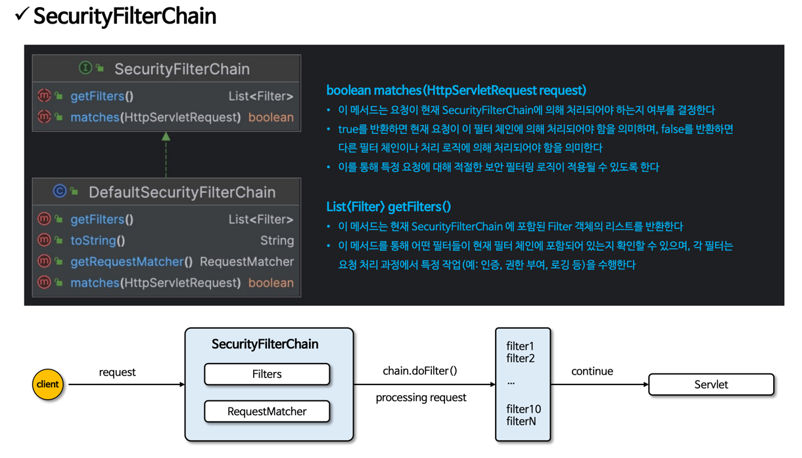

# 1. 프로젝트 생성/ 의존성 추가

시큐리티에서 기본 화면의 기본 아이디 패스워드를 제공하는 클래스(SecurityProperties)가 있다. 
<br> 이 클래스 안을 보면 static class로 User를 볼 수 있다. 이 안에 처음 우리가 시큐리티를 
<br>  
<br> 통해 로그인한 id 와 pw를 볼 수 있다. getName()과 getPassword()에 디버깅 포인트를 찍고<br>
확인해보면 UserDetailsServiceAutoConfiguration 이 곳에서 <br>

user 정보를 생성하고 최종적으로 메모리에 저장하는 InMemoryUserDetailsManager를 생성하고 있다.<br>


SpringBootWebSecurityConfiguration에서 
```
   @ConditionalOnDefaultWebSecurity
    static class SecurityFilterChainConfiguration {
        SecurityFilterChainConfiguration() {
        } 
 
        @Bean
        @Order(2147483642)
        SecurityFilterChain defaultSecurityFilterChain(HttpSecurity http) throws Exception {
            http.authorizeHttpRequests((requests) -> {
                ((AuthorizeHttpRequestsConfigurer.AuthorizedUrl)requests.anyRequest()).authenticated();
            });
            http.formLogin(Customizer.withDefaults());
            http.httpBasic(Customizer.withDefaults());
            return (SecurityFilterChain)http.build();
        }
    }
```
이 부분이 실행된다.

이 함수는 무조건 실행되는 부분이 아니라. @ConditionalOnDefaultWebSecurity를 보면
<br>
<br>


컨디셔널을 보면 DefaultWebSecurityCondition.class가 있다. 
이 조건을 확인해보면 
<br>


<br>
@ConditionalOnMissingBean과 @ConditionalOnClass의 조건이 모두 참이어야만 
SecurityFilterChainConfiguration 클래스가 동작한다.
지금은 두개다 참이다. 


# 2. SecurityBuilder/ SecurityConfigurer


소스 코드로 확인해보자.
<br>

<br>
최상위 함수형 인터페이스이며, 빌드라는 메서드가 정의돼 있음
<br>

<br>
이놈은 init과 configure라는 매서드 두개가 있음
<br>
이 두 클래스는 초기화 설정에서 중요한 역할을 한다.
<br>

브레이크 포인트를 찍어 살펴보면
<br>
<br>
HttpSecurityConfiguration.class
scope는 프로토 타입이다. 싱글톤이 아니므로 httpSecurity를 생성할 때마다 각각의 객체가 만들어진다.
<br>
많은 설정들을 하고 있는데 csrf부터 따라가보면 <br>
HttpSecurity 클래스의
<br>
csrf의 기능 <br>
 <br>
여기서 CsrfConfigurer의 클래스를 따라가보면 이게 결국은 SecurityConfigurer가 나온다.이것들을 소스 코드를 따라가보면 결국 getOrApply를 사용해서 어딘가에 적용시키고 있다.(추후 공부)
<br>
exceptionHandling도 마찬가지로 ExceptionHandlingConfigurer가 나오는데 이것도 SecurityConfigurer를 상속받고 있다.
마찬가지의 과정들을 계속 거친다.
그리고 빈 객체를 생성하고 이 빈객체들은 SpringBootWebSecurityConfiguration에서 
주입되어 사용된다. *(HttpSecurity http) 여기로 주임됨.*
그리고 여기서도 formLogin, httpBasic도 추가가 된다. (여기서도 formLogin은 FormLoginConfigurer고 httpBasic도 HttpBasicConfigurer이다)
<br>
 <br>
 <br>
build를 실행시키고 doBuild를 실행시킨다. 여기서 중요한것은 init()과 configure()이다.
<br>
init, configure가 실행되면서 아까 14개의 설정들이 설정된다.

<br>

# 3. WebSecurity / HttpSecurity
<br>
<br>
<br>

코드로 보면 HttpSecurityConfiguration에서 HttpSecurity가 생성이 되고
그와 동시에 WebSecurityConfiguration에서 <br>
 <br>
그리고 WebSecurity 객체를 만든다. WebSecurity는 HttpSecurity에서 만든 객체를 참조해야 하기 때문에
HttpSecurity객체를 먼저 만든것이다. 그리고 나서 WebSecurity가 완성이 되고 최종적으로 httpSecurity bean이<br>
완성이 되면 <br>
 <br> 
http.build()를 통해 SecurityFilterChain을 만든다. 만드는 과정을 좀 보면 build()를 하면 <br>
 <br>
이게 실행된다. 현재 httpSecurity에서는 앞의 과정들을 통해 filter들의 생성이 끝난 상태이다. <br>
이 filter들을 활용하는 단계는 DefultSecurityFilterCHain(this.requestMatcher, sortedFilters);<br>
를 생성하는 것부터 시작 된다. 지금 requestMatcher의 타입을 보면 <br>
 <br>
이것이다. 이건 모든 request에 대해 검증을 하겠다는 것이다. 이것을 통해 httpSecurity의 완성에 대한 중요한 부분은 
끝이 난다. 이 후로 WebSecurity로 가서 WebSecurityConfiguration으로 가서 
 <br>
이게 실행되는데 보면 List<SecurityFilterChain> securityFilterChains를 주입 받는 것을 확인할 수 있다.
근데 우리는 지금 <br>
 <br>
하나만 생성했다. 그럼 이 bean이 저기 들어간 것이다. 그럼 지금 <br> 


여기엔 하나의 FilterChain이 들어가 있고 그 Chain안에는 16개의 필터가 들어가 있다.
그런데 이제 this.webSecurity.addSecurityFilterChainBuilder(() -> securityFilterChain); <br>
이걸 보면 이 시큐리티필터를 어디에 저장하고 있음. <br>
이유는 webSecurity가 이 DefaultSecurityFilterChain을 활용해야해서 그런것! <br>
이유는 이 자체가 client요청을 처리하는 주체가 아니기 때문! 주체는 FilterChainProxy이다. <br>
ㅡ <br>
위 그림이 완성 됨. <br>
 <br>
그림의 맨위를 보면 SecurityFilterChains에 넣는게 보인다. 그리고 FilterChainProxy를 만드는것도 보인다. <br>
결국 이 모든 과정이 httpSecurity에서 시작해서 WebSecurity를 만드는 모든 과정이 FilterChainProxy를 만드는 과정이고 이 안에는 <br>
SecurityFilterChain이 들어가야하고 이 객체안의 여러개의 필터들을 통해 client요청들을 처리한다. 이 안의 필터들은 httpSecurity에서 만든다.


# 4. DelegatingFilterProxy / FilterChainProxy


<br>

<br>
"springSecurityFilterChain"값을 넘기고 있음. 위에서 DelegatingFilterProxy가 FilterChainProxy를 
찾을 때 <br>
"springSecurityFilterChain"을 가지고 찾는
<br>
targetBeanName확인 
 <br>
 <br>
여기서 WebSecurity가 FilterChainProxy를 완성하는데 build()하면 <br>

여기서 filterChainProxy를 생성 이 Bean을 생성할 때  

DEFAULT_FILTER_NAME 즉 "springSecurityFilterChain" 이 값을 이름으로 한다.<br>
이렇게 해서 FilterChainProxy가 완성이 됨.
<br>

요청을 날려보면 localhost:8080으로<br>
 <br>


초기화 이름은 springSecurityFIlterChain(targetBeanName)이 정해져 있다. 이 이름으로 빈을 찾음
그럼 이제 doFilter에서 위임할 필터를 찾음. 현재는 Null이다. WebpApplicationContext에서 찾음. <br>
이 이름으로 getBean()해서 가지고 온다. 그리고 invoke하면 <br>

여기로 온다.과정을 거치고 최종적으로 
 VirtualFilterChain 여기서 필터들을 가지고 있는데 <br>
 
그럼 여기서 getFilter를 통해 SecurityFilterChain을 통해 <br>

nextFilter.doFilter()를 통해 실행 시킨다.


# 사용자 정의 보안 설정하기
<br>
securityFilterChain에는 RequestMatcher, filter 목록들을 가지고 있다. <br>
<br>

