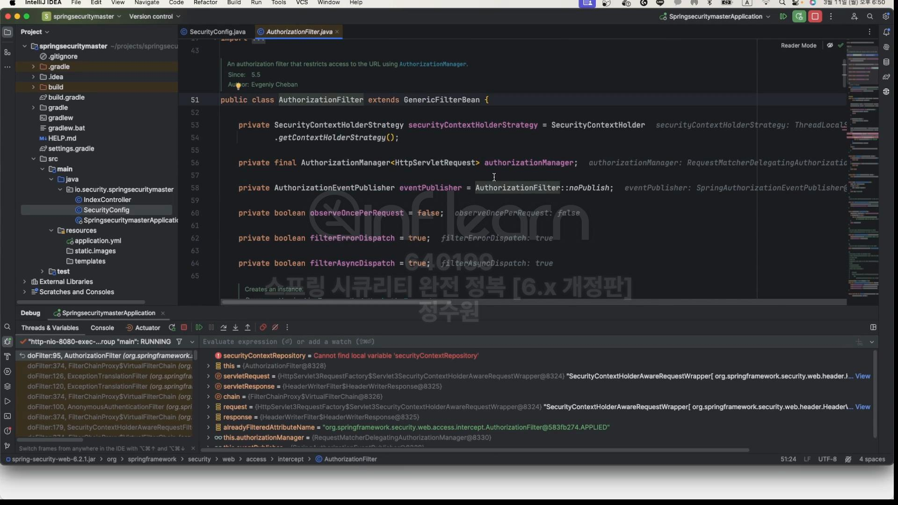
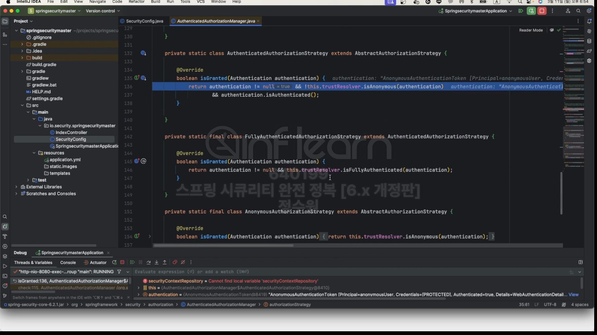
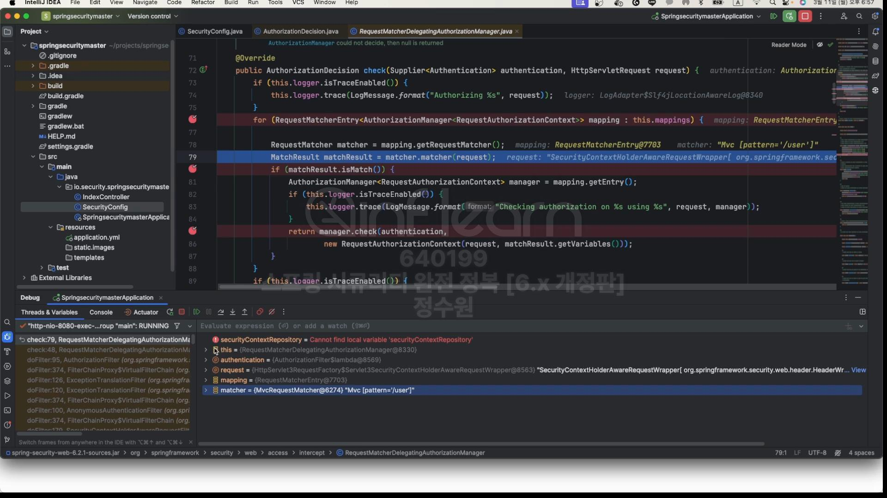

코드로 살펴보자. 
```java
@EnableWebSecurity
@EnableMethodSecurity(securedEnabled = true, jsr250Enabled = true)
@Configuration
public class SecurityConfig {

    @Bean
    public WebSecurityCustomizer webSecurityCustomizer() {
        return webSecurity -> webSecurity.ignoring().requestMatchers(PathRequest.toStaticResources().atCommonLocations());
    }

    @Bean
    public SecurityFilterChain securityFilterChain(HttpSecurity http, HandlerMappingIntrospector introspector) throws Exception {
        http
                .authorizeHttpRequests(authorize -> authorize
                        .requestMatchers("user").hasRole("USER")
                        .requestMatchers("db").access(new WebExpressionAuthorizationManager("hasRole('DB')"))
                        .requestMatchers("admin").hasAuthority("ROLE_ADMIN")
                        .anyRequest().authenticated())
                .formLogin(Customizer.withDefaults())
                .csrf(AbstractHttpConfigurer::disable);

        return http.build();
    }

//    @Bean
//    public GrantedAuthorityDefaults grantedAuthorityDefaults() {
//        return new GrantedAuthorityDefaults("MYPREFIX_");
//    }

    @Bean
    public UserDetailsService userDetailsService() {
        UserDetails user = User.withUsername("user").password("{noop}1111").roles("USER").build();
        UserDetails db = User.withUsername("db").password("{noop}1111").roles("DB").build();
        UserDetails admin = User.withUsername("admin").password("{noop}1111").roles("ADMIN", "SECURE").build();

        return new InMemoryUserDetailsManager(user, db, admin);
    }
}
```

먼저 저 각각의 설정들이 어떻게 초기화 되는지 살펴보자. <br>
자, 가즈아ㅏㅏㅏㅏㅏ!<br>


여기로 온다. 이 클래스는 <br>

여기이다. <br>
add로 오기전에 많은 과정들이 있었다. 그런데 그 과정 자체까지 알 필요는 없다. <br>
지금 중요한 부분은 
```
http
                .authorizeHttpRequests(authorize -> authorize
                        .requestMatchers("user").hasRole("USER")
                        .requestMatchers("db").access(new WebExpressionAuthorizationManager("hasRole('DB')"))
                        .requestMatchers("admin").hasAuthority("ROLE_ADMIN")
                        .anyRequest().authenticated())
                .formLogin(Customizer.withDefaults())
                .csrf(AbstractHttpConfigurer::disable);
```
여기서 설정한 설정들이 어떤 식으로 최종 mapping이 되었느냐이다. <br>

그래서 여기 오면 mappings라는 속성이 있다. <br>
이 속성에다 RequestMatcherEntry라는 속성을 만든다. <br>
그런데 이 속성을 만들다 parameter로 matcher와 manager를 넣어준다. <br>

matcher는 /user이고 manager는 AuthorityAuthorizationManager이다. <br>
그러니까 이 두개의 정보를 갖는 RequestMatcherEntry 정보를 mappings에 add하고 있다. <br>

mappings는 단순한 ArrayList이다. <br>

내부를 보니 user 패턴을 가지고 있는 requestMatcher와 이 패턴의 요청을 처리하는 클래스인 AuthorityAuthorizationManager가 있다. <br>
AuthorityAuthorizationManager는 User관한을 가지고 있다.<br>
근데 이제 우리가 총 4개의 설정들을 하였으니
```
.requestMatchers("user").hasRole("USER")
  .requestMatchers("db").access(new WebExpressionAuthorizationManager("hasRole('DB')"))
  .requestMatchers("admin").hasAuthority("ROLE_ADMIN")
  .anyRequest().authenticated())
```
mappings에는 4개의 정보가 들어가게 된다. <br>

총 4개의 정보가 저장된 모습. 이게 초기화 과정이다. 그럼 실제로 요청을 해보자. <br>

root로 요청! <br>

AuthorizationFilter로 요청이 온다. <br>

이 필터는 초기화 과정 속에서 ReuquestMatcherDelegatingAuthorizationManager를 속성으로 갖는다. 그리고 이 매니저를 사용해서 check를 한다.<br>

최종 반환값은 AuthorizationDecision값을 갖는다. <br>

여기에서 모든 권한심사가 끝난 후 AuthorizationDecision값을 반환한다. <br>
지금 이 메서드가 속한 클래스는 RequestMatcherDelegatingAuthorizationManager이다. <br>

기본 값은 DENY이다. <br>

그럼 이제 check로 왔다. authentication 객체와 request 객체를 받는다. <br>
authentication 객체는 사용자의 권한 정보를 체크하기 위해 필요하고 request 객체는 현재 요청한 요청의 url정보를 알기 위해 필요하다.<br>

여기서는 이제 for문을 돌면서 4개의 mappings를 확인한다. 그리고 순회를 하면서 현재 요청 패턴과 일치하는 entry point를 찾는다.<br>
예를들어 지금 mapping.getRequestMathcher()는 /user로 요청을 했기 때문에 <br>

user이다. 근데 지금 우리는 /로 여청을 했기 때문에 <br>

맞지 않는다. 그럼 그건 통과된다. 

이제 앞의 3개(user, db, admin)는 통과가 됐고 anyRequestMatcher에서 걸릴 것이다.<br>

true가 되고 entry를 가져오는데 그게 AuthenticatedAuthorizationManager가 된다.<br>


그리고 그 매니저를 가지고 와서 그 매니저에게 실질적인 권한 심사를 맡기게 된다. <br>


여기서 최종 심사를 하게 된다. 그런데 이 객체가 가지고 있는 전략 클래스가 있다. 그것은 AuthenticatedAuthorizationManagerStrategy이다. <br>

이게 선택된 이유는 우리가. 
```
.anyRequest().authenticated()
```
로 authenticated()를 사용했기 때문이다. <br>
이제 이 전략 클래스가 최종 심사를 하게 된다. <br>

그런데 그전에 AuthenticatedAuthorizationManger를 보면 <br>

이 매니저가 갖고있는 전략 클래스가 총 4개가 있고 그게 내부에 다 정의 돼 있다. <br>


AuthenticatedAuthorizationStrategy, FullyAuthenticatedAuthorizationStrategy, AnonymousAuthorizationStrategy, RememberMeAuthorizationStrategy 이다.<br>

보면 fully같은 경우는 인증객체가 null이 아니고 현재 인증객체가 id와 password를 통해서 인증된 객체인가를 보는것이다. <br>
Anonymous는 isAnonymous()를 통해서 인증이 안된 객체인가를 확인한다. <br>
RememberMe는 rememberMe를 통해서 인증된 객체인가를 확인한다. <br>

AuthenticatedAuthorizationStrategy는 authentication이 null이 아니고 익명 사용자가 아니면 된다. <br>
그럼 이게 fully가 됐든 rememberMe가 됐든 Anonymous가 됐든 상관없이 인증이 된 객체라면 true를 반환한다. <br>
다만 isAuthenticated()는 true가 돼야한다. <br>

지금은 granted가 false이다. 그래서 granted는 false이다.  <br>

그래서 이게 계속 리턴이 된다. <br>

이곳 filter까지 

그래서 이제 filter에서 event를 날리고 granted의 값을 보는데 false이다. 따라서 AccessDeniedException이 발생한다. <br>
그래서 예외처리를 하고 로그인 창으로 들어오게 되는것이다. 근데 우리가 만약에 <br>

인증을 성공하고 그 상태에서 /user로 접근한다면 <br>


이제 여기서 /user 패턴으로 설정된 것을 찾을것이다.



user에 해당하는 enrty를 가져온다. (mapping.getEntry()) 가져온 결과를 보니 AuthorityAuthorizationManager이다. <br>

여기로 왔다. 근데 보면 이 클래스는 내부적으로 권한 설정을 할 수 있는 api들이 있다. 아래 그림. <br>

그런데 이 클래스 자체적으로는 권한 심사를 하지 않는다. <br>

이 클래스가 자체적으로 가지고 있는 AuthoritiesAuthorizationManager가(변수 선언도 delegate) 권한 심사를 하도록 위임한다. <br>


저기 선택된 영역이 특정한 권한에 대해서 해당 요청을 허용할 것인가 거절할 것인가를 저 로직들로 처리하는 것이다. <br>

현재 사용자가 갖는 권한은 ROLE_USER이다.<br>

그리고 패턴에 입력된 권한도 ROLE_USER이다. 권한이 일치한다! 그리고 isAuthorize()호출<br>


그리고 이걸 볼 때 RoleHierarchy까지 다 확인한다. 근데 roleHierachy는 지금 Null이다.<br>

이렇게 최종적으로 AuthorityAuthorizationDecision을 반환한다. <br>


decision이 true이기 때문에 허용이 된다. <br>
나머지도 동일하다! 다만 우리가 나중에 응요할 때 

이 부분을 활용할 것이기 때문에 이부분에 주의를 기울이자.


