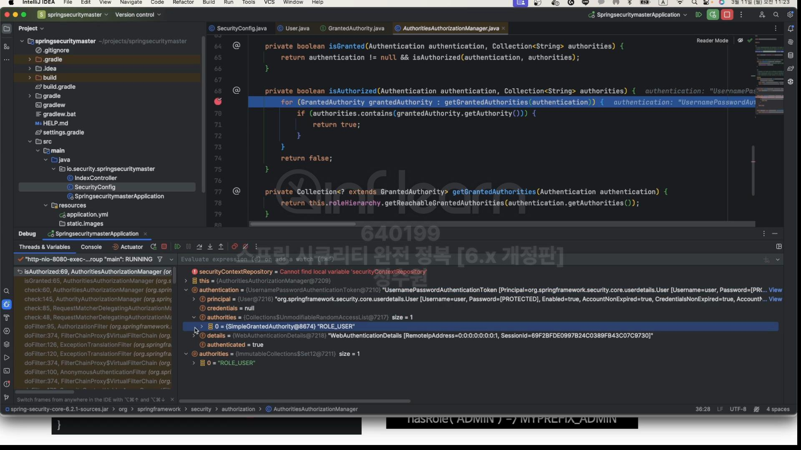

소스 코드로 확인해보자. <br>
먼저 GrantedAuthority를 살펴보자. <br>

구현체로는 SimpleGrantedAuthority가 사용된다. <br>

설정에서 보면 user 객체를 3명을 저장하고 있다.  

user, passwork, 권한을 설정하고 있는데, <br>

여기서 보면 roles를 저장하면서 권한 정보를

```java
List<GrantedAuthority> authorities = new ArrayList<>(roles.length);
```
여기에 저장하는 것을 확인할 수 있다. <br>

저장을 하면서 "ROLE_"을 붙여서 저장하는 것을 확인할 수 있다. <br>
사용자는 authorities를 가지고 있게 된다. <br>

서버를 기동해서 확인해보자. <br>

만약 /user로 요청을 하면 <br>

설정을 user 경로로 가기 위해서는 "USER"라는 권한을 필요로하게 해 뒀따. <br>
 
hasRole("USER")를 사용하면 "ROLE_USER"로 변환이 된다. <br>

.rolse("USER")를 사용하면 "ROLE_USER"로 변환이 된다. 따라서 hasRole과 .roles가 짝짝꿍이 맞아 떨어진다. <br>
따라서 저 경로로 접근을 가능하게 해준다. 그리고 그걸 가능하게 해주는 클래스가 아래에 있다. <br>

우리가 설정에서 준 권한정보

그리고 사용자가 인증을 성공해서 가지고 있는 정보는 SimpleGrantedAuthority안에 있다. <br>


그런데 만약 hasAuthority("USER")를 사용하면 앞에 "ROLE_"이 붙지 않는다. <br>
마찬가지로 roles가 아니라 authorities("USRE")를 사용하면 "ROLE_"이 붙지 않는다. <br>
그런데 ROLE_말고 다른것을 붙이고 싶다! 그럴 땐 GrantedAuthorityDefaults를 사용하면 된다. <br>
```java
@EnableWebSecurity
@EnableMethodSecurity(securedEnabled = true, jsr250Enabled = true)
@Configuration
public class SecurityConfig {

    @Bean
    public WebSecurityCustomizer webSecurityCustomizer() {
        return webSecurity -> webSecurity.ignoring().requestMatchers(PathRequest.toStaticResources().atCommonLocations());
    }

    @Bean
    public SecurityFilterChain securityFilterChain(HttpSecurity http, HandlerMappingIntrospector introspector) throws Exception {
        http
                .authorizeHttpRequests(authorize -> authorize
                        .requestMatchers("user").hasRole("USER")
                        .requestMatchers("db").hasRole("DB")
                        .requestMatchers("admin").hasRole("ADMIN")
                        .anyRequest().authenticated())
                .formLogin(Customizer.withDefaults())
                .csrf(AbstractHttpConfigurer::disable);

        return http.build();
    }

    @Bean
    public GrantedAuthorityDefaults grantedAuthorityDefaults() {
        return new GrantedAuthorityDefaults("MYPREFIX_");
    }

    @Bean
    public UserDetailsService userDetailsService() {
        UserDetails user = User.withUsername("user").password("{noop}1111").roles("USER").build();
        UserDetails db = User.withUsername("db").password("{noop}1111").roles("DB").build();
        UserDetails admin = User.withUsername("admin").password("{noop}1111").roles("ADMIN", "SECURE").build();

        return new InMemoryUserDetailsManager(user, db, admin);
    }
}
```
이렇게 하면 MYPREFIX_ ROLE_을 대체하게 된다. <br>


