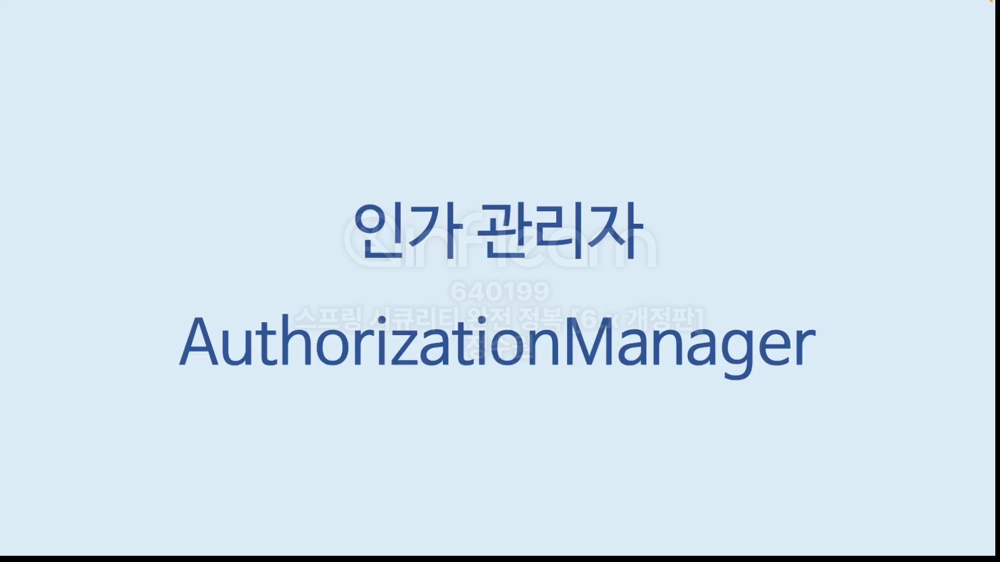
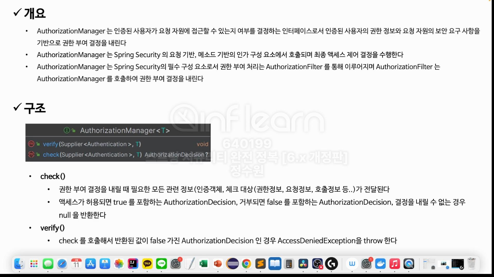
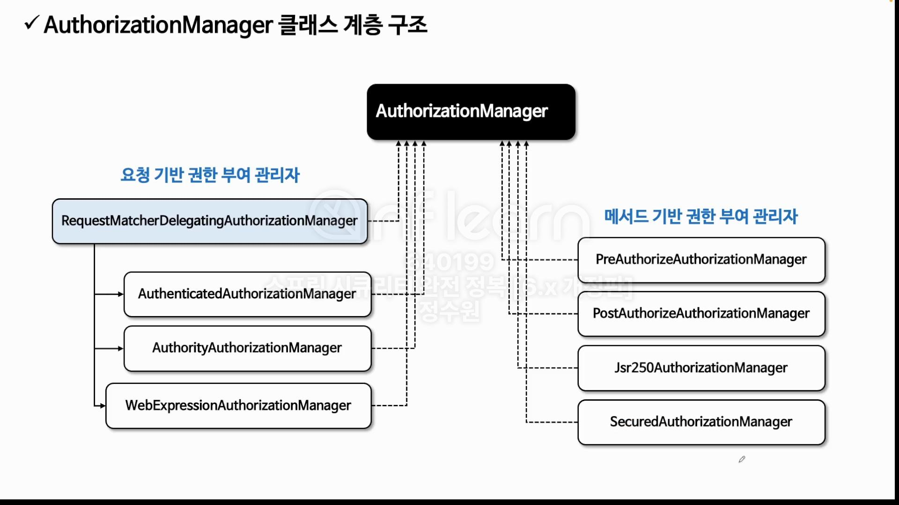
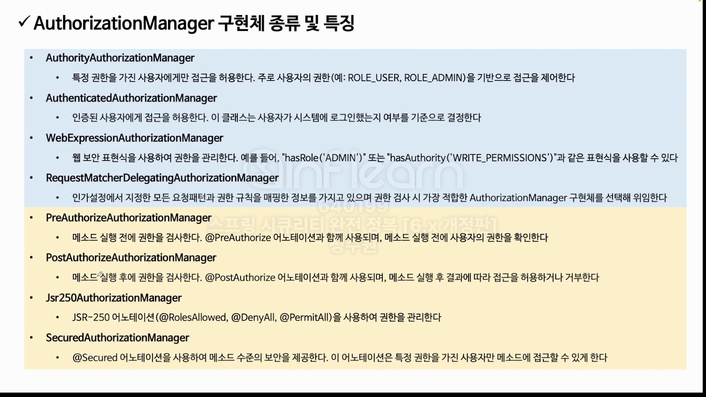
클래스 구조를 확인해 보자.  
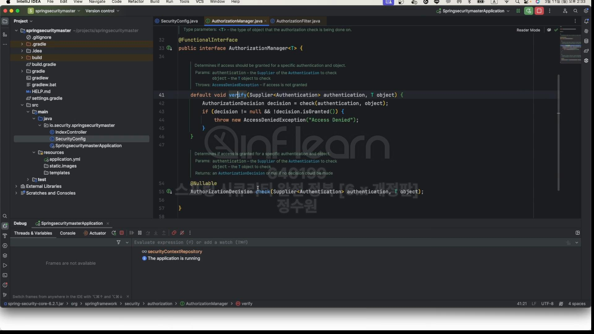
2개의 method가 정의 돼 있다.  
AuthorizationFilter는 추후 자세히 배우겠지만 먼저 요청을 받는 filter가 어떻게 권한 심사를 하는지 살펴보기 위해 살펴보기 위해 간략하게 살펴보자.  

root로 요청을 전송하면
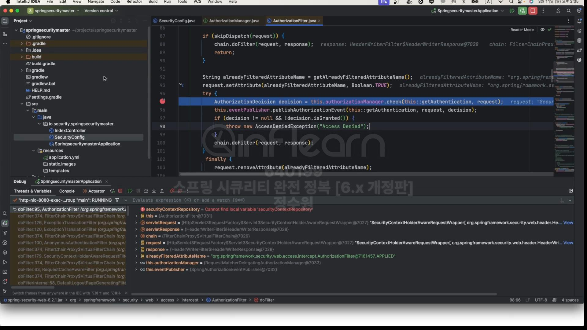
여기로 온다. filter가 요청을 받고 AuthorizationManager에게 위임하는 부분이다.  
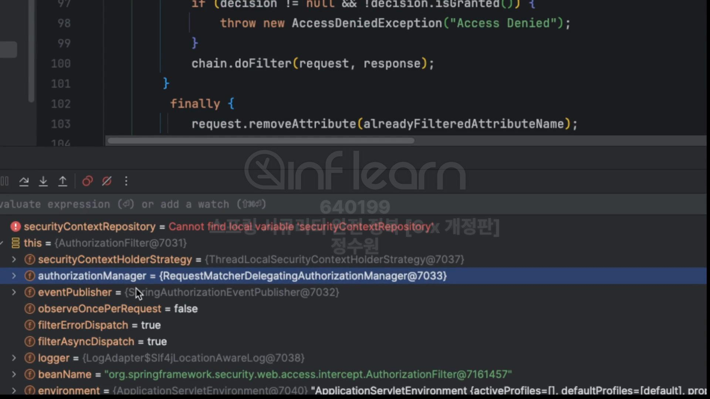
AuthorizationManager는 RequestMatcherDelegatingAuthorizationManager를 사용해서 요청을 위임한다.  
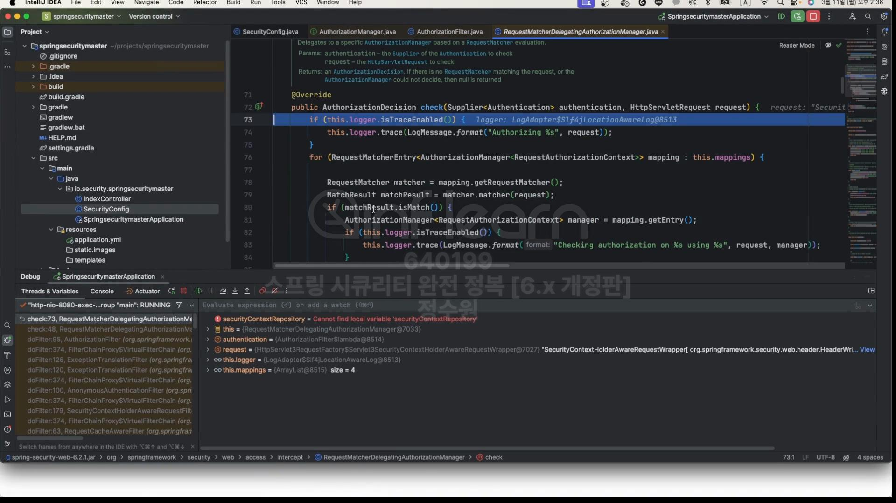
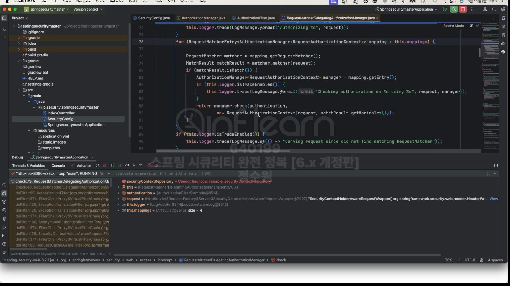 
이 클래스는 실제로 권한 심사를 하는 부분은 없다. 다만, for문을 돌면서 어떤 requestMatcher나 또는 여러가지 값들을 통해서 요청을 처리할 manager를 찾아서  
역할을 위임시켜주는 역할을 하고 있다. 
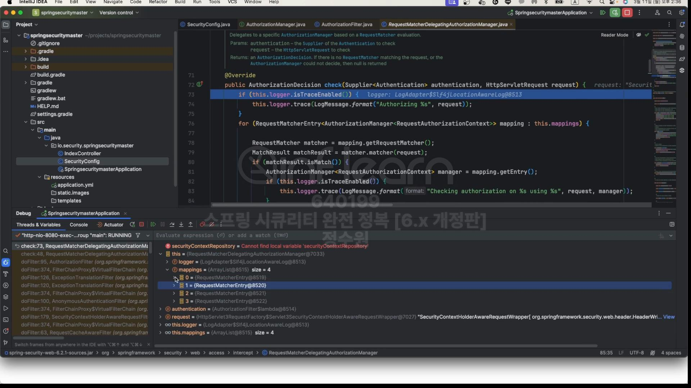
그래서 내부적으로는 mappings 구조를 가조기 있는데 이 mappins는  
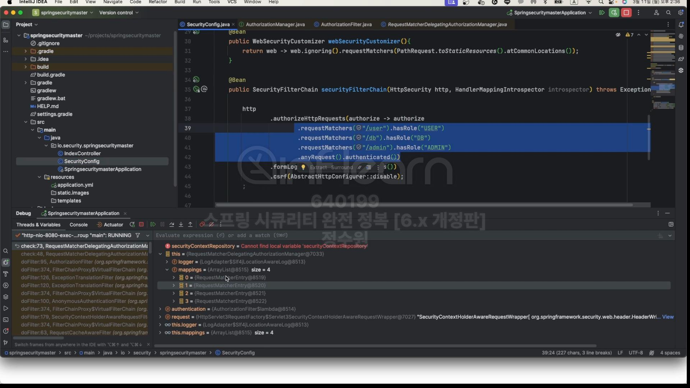
우리가 SecurityConfig설정한 Mapping 정보들을 가지고 있는 것이다.  
그럼 결국은 지금 내가 root로 요청을 했기 때문에 root의 권한심사를 하는 부분은 SecurityConfig에서 mapping하지 않았기 때문에 결국 anyRequest.authenticated()로 가게 된다.  
결국 인증을 받았냐 받지 않았느냐이다.  
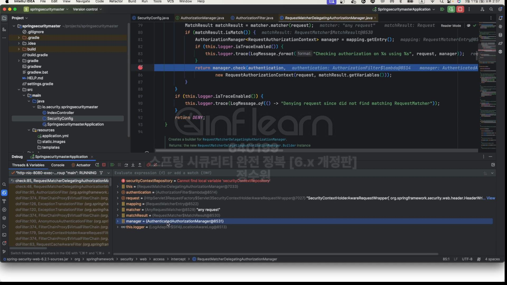
그래서 결국은 Manager가 AuthenticatedAuthorizationManager가 된다.  
결국 최종 결과에 대해서 반환하고 아래 부분으로 return 된다. 
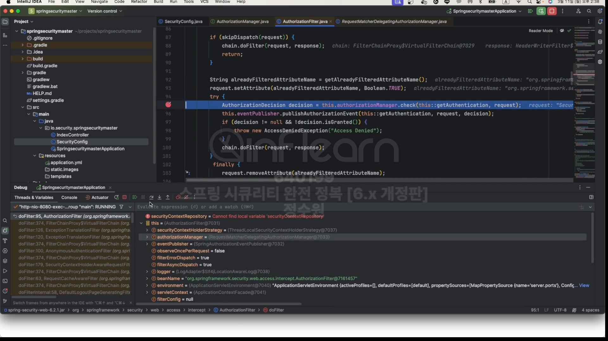
반환된 값은 결국 false를 반환한다. 인증을 받지 못했다는 의미이다.  
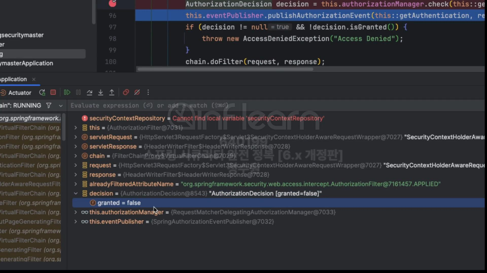

