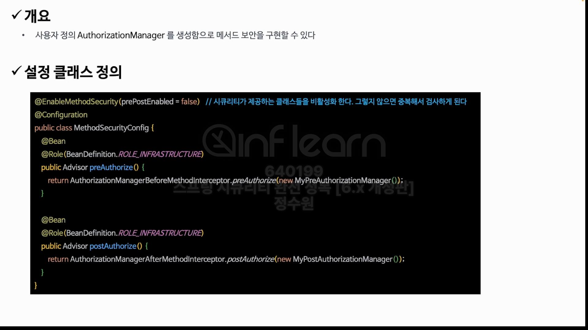
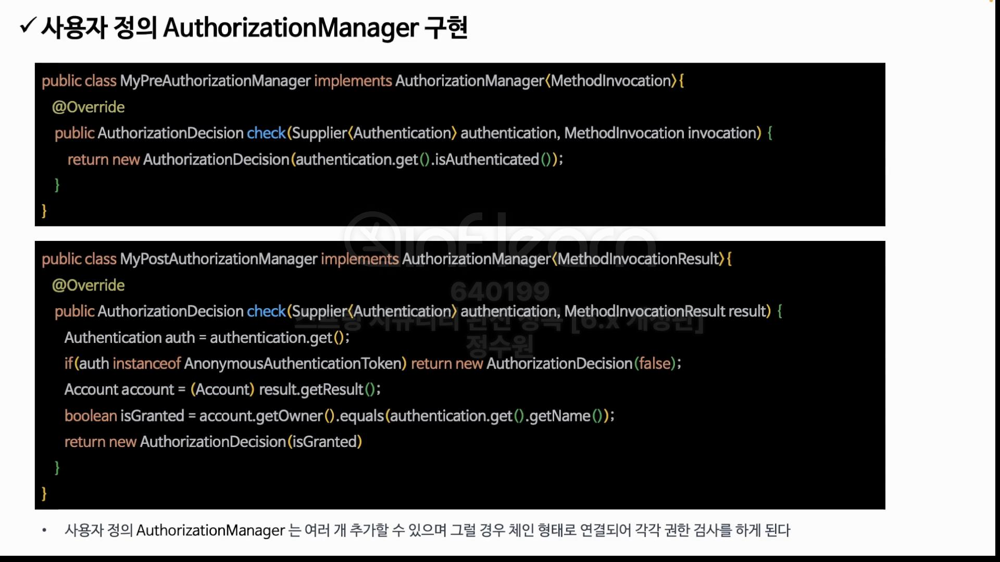
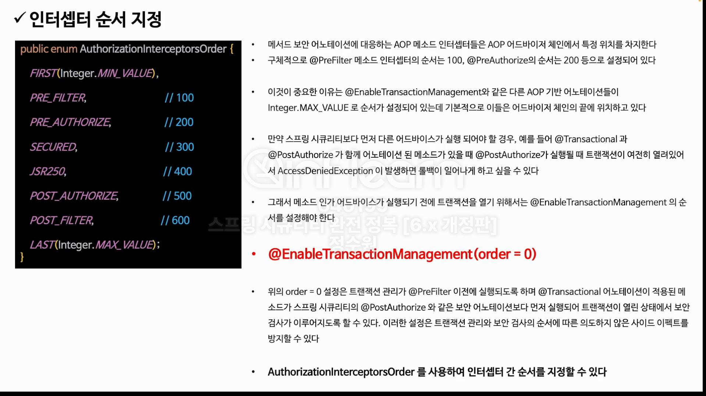

```java
@Service
public class DataService {

    @PreAuthorize(value = "")
    public String getUser() {
        return "user";
    }

    @PostAuthorize(value = "")
    public Account getOwner(String name) {
        return new Account(name, false);
    }

    public String display() {
        return "display";
    }
}
```