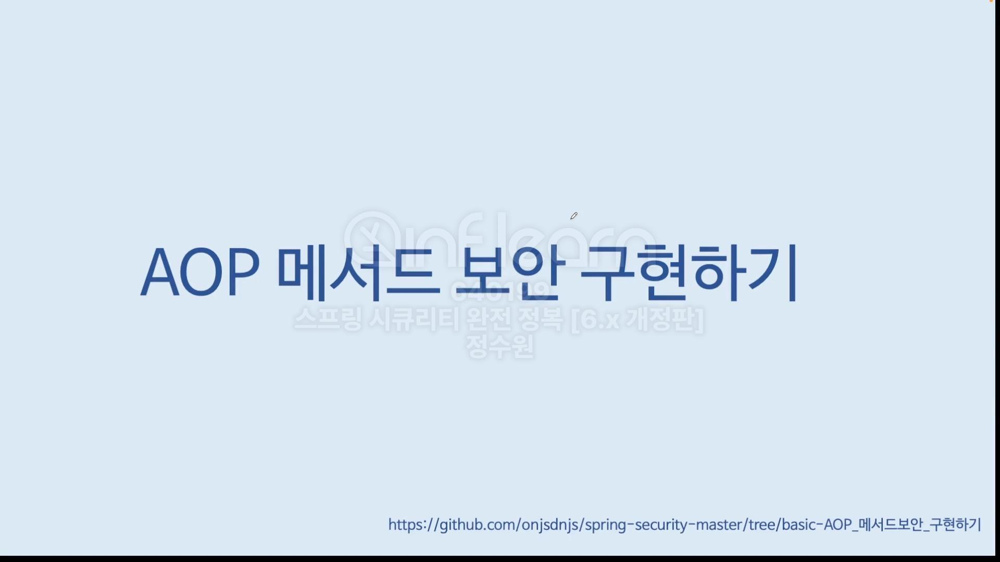
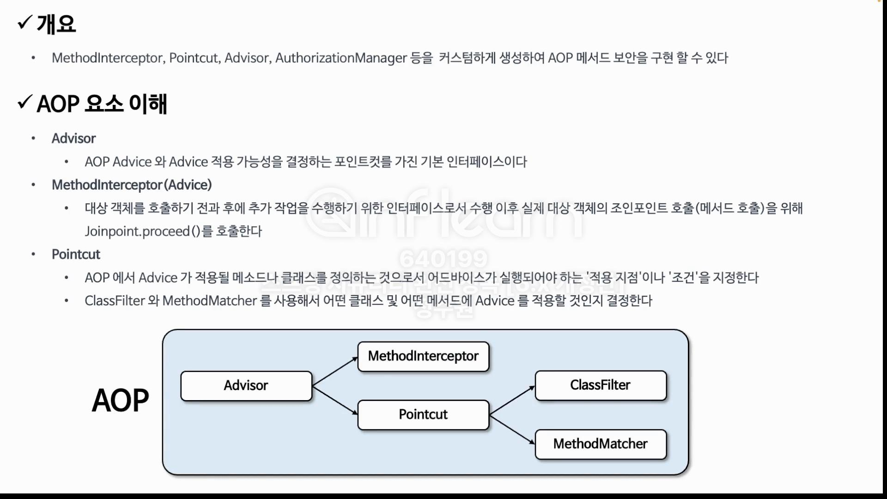
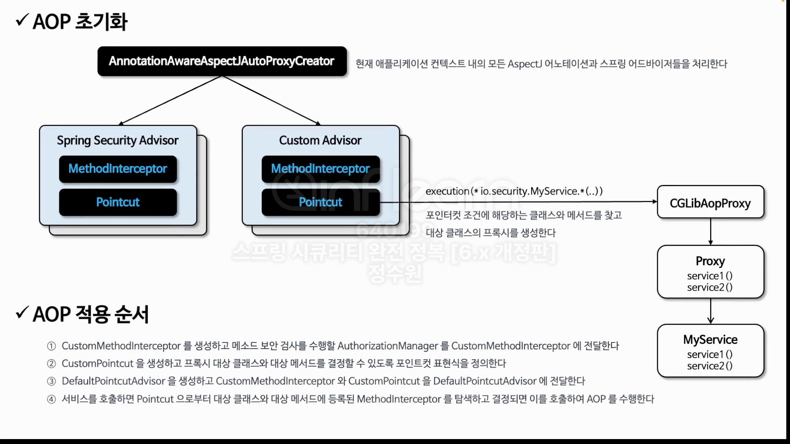
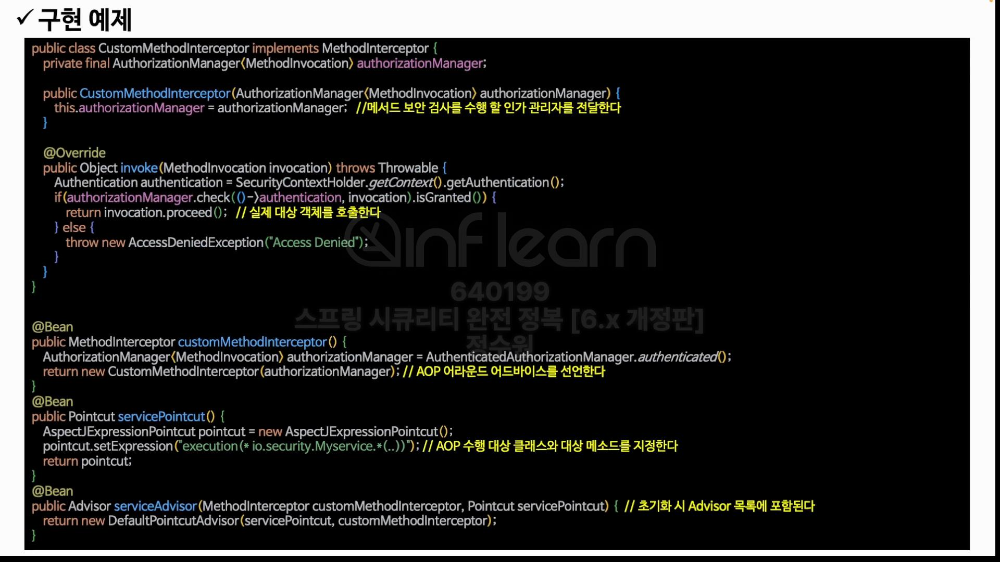

```java
public class CustomMethodInterceptor implements MethodInterceptor {
    private final AuthorizationManager<MethodInvocation> authorizationManager;

    public CustomMethodInterceptor(AuthorizationManager<MethodInvocation> authorizationManager) {
        this.authorizationManager = authorizationManager;
    }

    @Override
    public Object invoke(MethodInvocation invocation) throws Throwable {
        Authentication authentication = SecurityContextHolder.getContextHolderStrategy().getContext().getAuthentication();
        if (authorizationManager.check(() -> authentication, invocation).isGranted()) {
            return invocation.proceed();
        }

        throw new AccessDeniedException("Access Denied");
    }
}

```

```java
@Configuration
@EnableMethodSecurity(prePostEnabled = false)
public class MethodSecurityConfig {

    @Bean
    public MethodInterceptor methodInterceptor() {
        AuthorizationManager<MethodInvocation> authorizationManager = new AuthenticatedAuthorizationManager<>();

        return new CustomMethodInterceptor(authorizationManager);
    }
    // MethodInterceptor 타고 들어가보면 Interceptor가 Advice를 구현하고 있다. 따라서 MethodInterceptor가 그자체로 Advice이다.

    @Bean
    public Pointcut pointcut() {
        AspectJExpressionPointcut pointcut = new AspectJExpressionPointcut();
        pointcut.setExpression("execution(* io.security.springsecuritymaster.DataService.*(..))");
        return pointcut;
    }

    @Bean
    public Advisor serviceAdvisor() {
        return new DefaultPointcutAdvisor(pointcut(), methodInterceptor());
    }
}

```