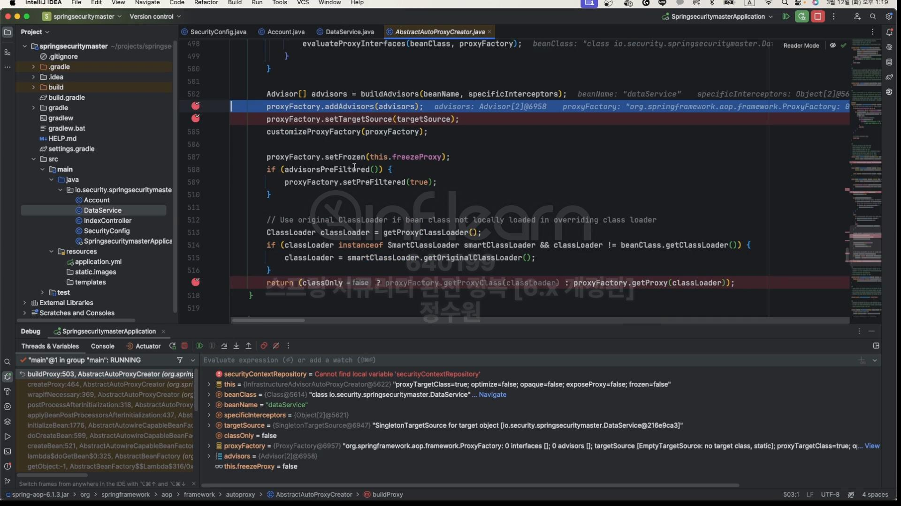
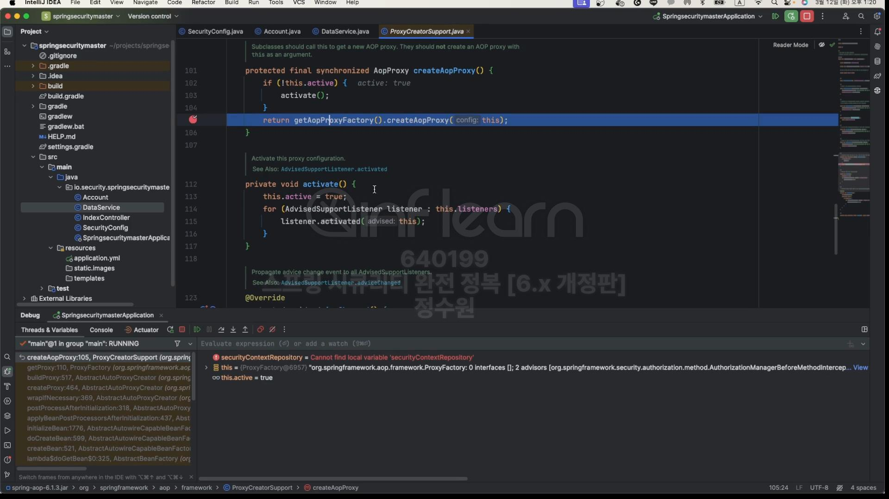
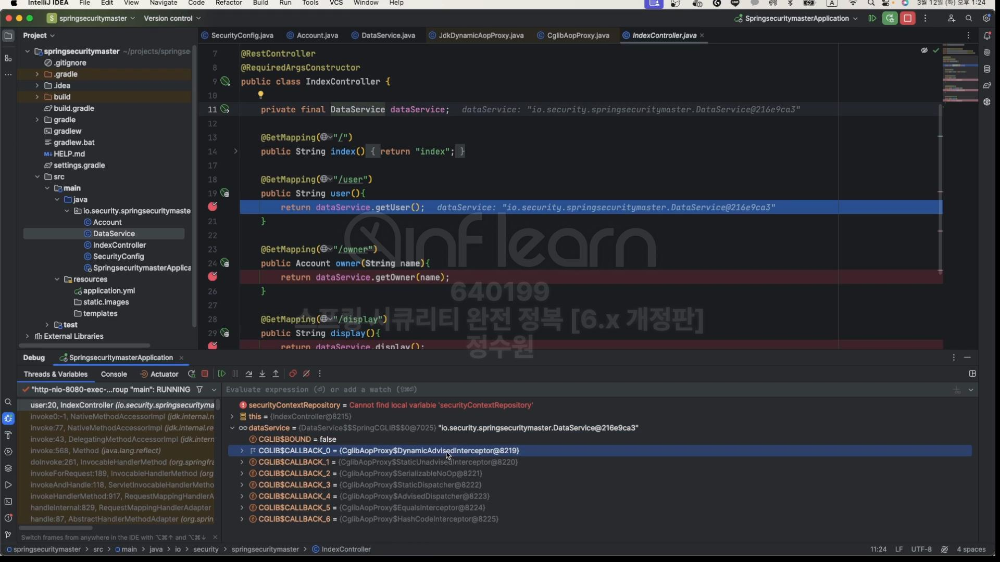
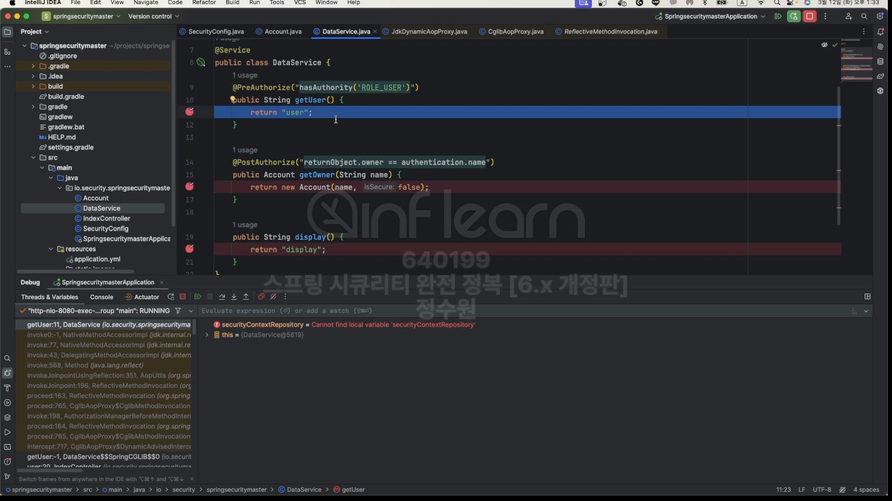

코드로 보자. <br>
```java
@Getter
@AllArgsConstructor
public class Account {
    private String owner;
    private boolean isSecure;
}

```

```java
@Service
public class DataService {

    @PreAuthorize("hasAuthority('ROLE_USER')")
    public String getUser() {
        return "user";
    }

    @PostAuthorize("returnObject.onwer == authentication.name")
    public Account getOwner(String name) {
        return new Account(name, false);
    }

    public String display() {
        return "display";
    }
}
```

```java
@EnableWebSecurity
@EnableMethodSecurity(securedEnabled = true, jsr250Enabled = true)
@Configuration
public class SecurityConfig {

    @Bean
    public WebSecurityCustomizer webSecurityCustomizer() {
        return webSecurity -> webSecurity.ignoring().requestMatchers(PathRequest.toStaticResources().atCommonLocations());
    }

    @Bean
    public SecurityFilterChain securityFilterChain(HttpSecurity http, HandlerMappingIntrospector introspector) throws Exception {
        http
                .authorizeHttpRequests(authorize -> authorize
                        .anyRequest().authenticated())
                .formLogin(Customizer.withDefaults())
                .csrf(AbstractHttpConfigurer::disable);

        return http.build();
    }

    @Bean
    public AuthorizationManager<RequestAuthorizationContext> authorizationManager(HandlerMappingIntrospector introspector) {
        List<RequestMatcherEntry<AuthorizationManager<RequestAuthorizationContext>>> mappings = new ArrayList<>();

        RequestMatcherEntry<AuthorizationManager<RequestAuthorizationContext>> requestMatcherEntry1 =
                new RequestMatcherEntry<>(new MvcRequestMatcher(introspector, "/user"),
                        AuthorityAuthorizationManager.hasAuthority("ROLE_USER"));

        RequestMatcherEntry<AuthorizationManager<RequestAuthorizationContext>> requestMatcherEntry2 =
                new RequestMatcherEntry<>(new MvcRequestMatcher(introspector, "/db"),
                        AuthorityAuthorizationManager.hasAuthority("ROLE_DB"));

        RequestMatcherEntry<AuthorizationManager<RequestAuthorizationContext>> requestMatcherEntry3 =
                new RequestMatcherEntry<>(new MvcRequestMatcher(introspector, "/admin"),
                        AuthorityAuthorizationManager.hasAuthority("ROLE_ADMIN"));

        RequestMatcherEntry<AuthorizationManager<RequestAuthorizationContext>> requestMatcherEntry4 =
                new RequestMatcherEntry<>(AnyRequestMatcher.INSTANCE, new AuthenticatedAuthorizationManager<>());

        mappings.add(requestMatcherEntry1);
        mappings.add(requestMatcherEntry2);
        mappings.add(requestMatcherEntry3);
        mappings.add(requestMatcherEntry4);

        return new CustomRequestMatcherDelegatingAuthorizationManager(mappings);
    }

    @Bean
    public UserDetailsService userDetailsService() {
        UserDetails user = User.withUsername("user").password("{noop}1111").roles("USER").build();
        UserDetails db = User.withUsername("db").password("{noop}1111").roles("DB").build();
        UserDetails admin = User.withUsername("admin").password("{noop}1111").roles("ADMIN", "SECURE").build();

        return new InMemoryUserDetailsManager(user, db, admin);
    }
}
```

초기화 과정부터 살펴보자.초기화 과정은 AOP과정을 거치기 때문에 전체적인 과정이 조금 복잡할 수 있다. <br>

이 클래스로 온다. 

실제 구현체는 InfrastructureAdvisorAutoProxyCreator이다. <br>
스프링이 초기화 되면서 전체 빈을 검사하게 되고 전체 빈 중에서 보안이 설정된 빈을 검색하고 만약 있다면 그 빈을 프록시 객체로 생성하는 과정이다. <br>
이 과정은 <br>

1번 과정이다. <br>

여기서 우리는 2개에 method 권한을 설정했다. 따라서 이 InfrastructureAdvisorAutoProxyCreator가 저 빈을 찾을것이다.<br>
찾고나서 보안이 설정된 저 method에 advice를 등록할 것이다. 

specificInterceptors를 보니 역시나 2개가 들어가 있다. <br>

그리고 이제 createProxy해서 실제 proxy 객체를 만든다음에 리턴한다. <br>
생성할 때 보면 bean의 클래스와 beanName, Interceptor그리고 타겟 소스를 넘겨준다. <br>

buildProxy로 간다. <br>

전체적인 과정을 볼 수는 없고 아래로 내려가서 아래로 간다. <br>

어드바이저를 추가하고 <br>

targetSource를 추가하는데 targetSource는 DataService이다. <br>

마지막으로 ProxyFactory를 통해서 getProxy한다. 여기서 실제 proxy 객체가 생성이 된다. 기본적으로 CGLIB 방식을 사용한다. <br>

createAopProxy를 들어가서 보자. <br>

아래로 타고 들어간다.

proxy 객체를 생성해야 하는데 2가지 방식이 ㅗ인다. 하나는 JdkDynamicAopProxy이고 다른 하나는 ObjenesisCglibAppProxy이다. <br>

조건을 보자. JdkDynamicAopProxy의 경우 먼저 안으로 들어가 보자.<br>

JdkDynamicAopProxy의 경우 java api에 Proxy라는 클래스가 있다. <br>

java.lang.reflect에 있는 Proxy 확인

그러니까 이 Proxy를 통해서 Proxy를 생성하는 것이다. 

그러니까 이 방식으로 하는 것이고 다른 하나는 CGLIB방식으로 하는 것인데 조건은 
```
if (targetClass.isInterface() || Proxy.isProxyClass(targetClass) || ClassUtils.isLambdaClass(targetClass)) {
```
이것이다. 

근데 지금 DataService는 클래스라서 interface가 아니다.
또한 Proxy타입이 proxy인 경우인데, 현재 DataService는 프록시 타입이 아니다 따라서 이것도 x
또한 lambda class도 아니라서 CGLIB로 생성이 된다. <br>

CGLIB를 통해서 proxy 객체를 만드는 코드는 양이 방대하다. <br>

어쨋든 기본은 CGLIB를 통해서 proxy 객체를 만든다. <br>


proxy객체가 CGLIB로 생성된 것을 확인할 수 있다. <br>

여기보면 속성들이 나오는데 이게 뭐냐면 이제 사용자가 proxy 객체를 호출하게 되면 이 proxy 객체는 내부적으로 callback 객체들을 가지고 있고 이 callback <br>
객체들을 호출해주는 것이다. 이 proxy 객체가 호출될 때마다 CALLBACK안에 있는 Advice들이 호출되는 방식으로 구성 돼 있는것이다. <br>
이렇게 초기화 설정이 끝이 난다. <br>

<br>

이제 PreAuthorize 전에 평가하는 과정을 보자. <br>


dataService가 proxy로 주입돼 있는 것을 확인할 수 있다. <br>

이 Proxy 객체가 처음 호출하는 CALLBACK을 보면 DynamicAdvisodInterceptor를 호출한다. <br>
원래 같으면 아래게 바로 호출 되야 하는데 <br>

근데 이제는 @PreAuthorize에 의해서 인터셉터가 작동하고 모든 처리가 끝나면 getUser를 호출할지 아니면, 거부할지가 결정난다. <br>
보자! DynamicAdvisodInterceptor로 왔다. <br>
여기서 권한 심사를 위한 처리를 하는것이다. <br>

처음에 하는 것은 AuthorizationManagerBeforeMethodInterceptor를 통해서 권한 심사를 해야한다. <br>
 
그래서 DefaultAdvisorChainFactory로 부터 Advice 정보를 가져와야 한다. <br>

advised로 부터 chain이 하나 return됐는데 이 chain이 AuthorizationManagerBeforeMethodInterceptor이다. <br>
즉, 아래 코드를 실행하기 위한 <br>

advice를 가져온 것이다. 참고로 현재 advised를 보면<br>

methodCache로 7개가 들어있다. 이건 현재 DataService가 가지고 있는 모든 method들을 담아 넣은 것이다. <br>

그런데 예를들어 getUser를 처리하는 인터셉터가 AuthorizationManagerBeforeMethodInterceptor라고 지정 돼 있다. <br>
그 말은 proxy객체가 이 getUser를 처리하기 위해 어떤 advice가 선택 될것인가가 저장 돼 있는 것이다. <br>

마찬가지로 getOwner는 AuthorizationManagerAfterMethodInterceptor가 처리한다라고 methodCache에 담겨져 있다.<br>

그래서 이런것들을 꺼내와서 ChlibMethodInvocation에서 처리하는 것이다. <br>


invoke를 하면 이제 AuthorizationManagerAfterMethodInterceptor.invoke()로 넘어온다. <br>

여기서부터는 springSecurity 영역이다. <br>

여기서부터 권한 심사를 한다. <br>

attemptAuthorization(mi)가 정상적으로 끝나게되면 밑으로 내려가 mi.proceed()가 실행되는데 이 부분이 빈을 호출하는 부분이다. <br>
따라서 실패하면 빈을 호출하지 못한다. <br>

여기는 심플하다. <br>

authorizationManager는 PreAuthorizeAuthorizationManager이다. <br>


근데 이부분은 <br>

동그라미친 부분이다. 근데 이부분은 참고만해도 상관이 없다. <br>

true이다. <br>


승인되어서 메서드 호출이 가능해졌다. <br>


mi안에는 targetClass등이 들어있다.


처리가 쭉 끝나면 비로소 아래로 간다. <br>


postAuthorize는 생략.. 궁금하면 강의 17:41부터


  


