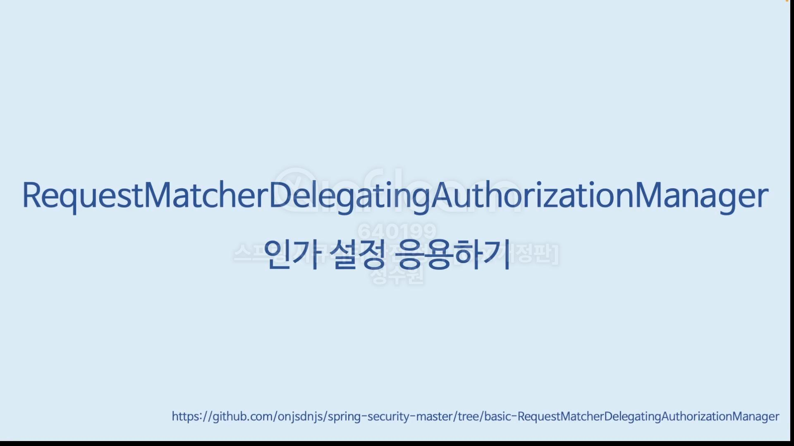
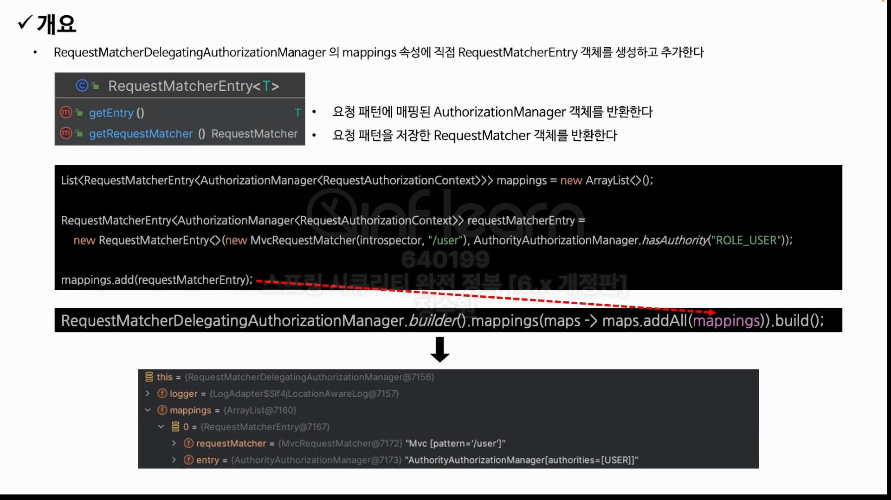
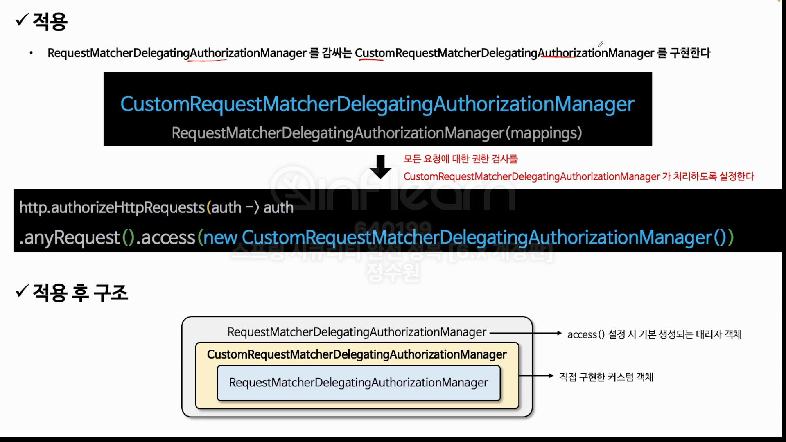
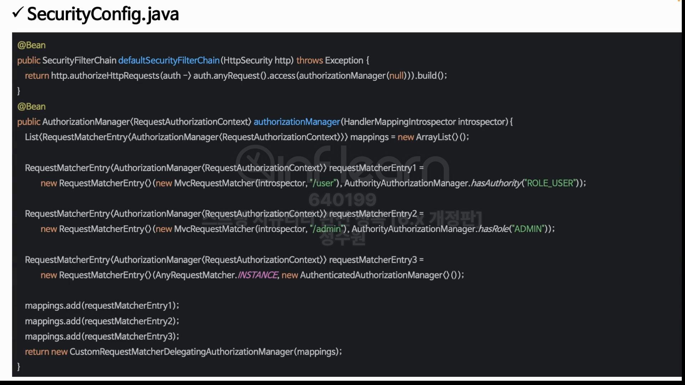
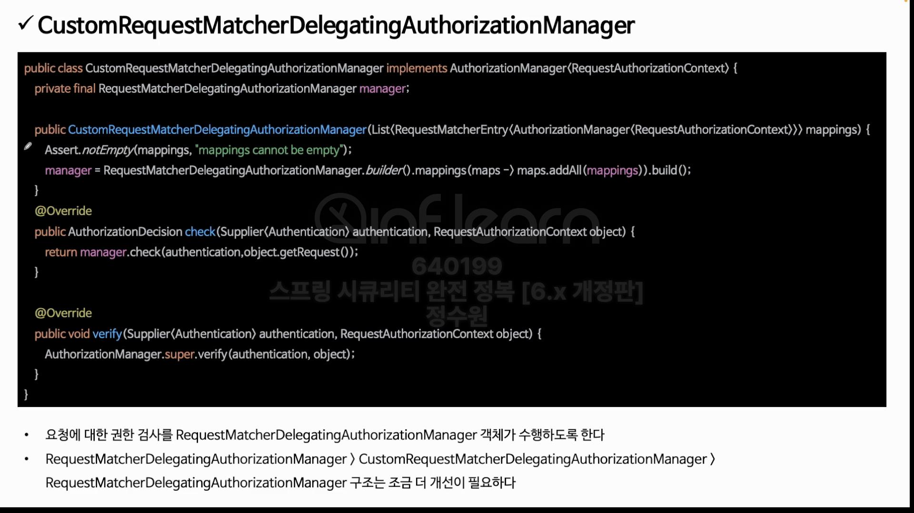
코드를 작성하자.
```java
public class CustomRequestMatcherDelegatingAuthorizationManager implements AuthorizationManager<RequestAuthorizationContext> {
    RequestMatcherDelegatingAuthorizationManager manager;

    public CustomRequestMatcherDelegatingAuthorizationManager(List<RequestMatcherEntry<AuthorizationManager<RequestAuthorizationContext>>> mappings) {
        manager = RequestMatcherDelegatingAuthorizationManager.builder()
                .mappings(maps -> maps.addAll(mappings)).build();
    }

    @Override
    public AuthorizationDecision check(Supplier<Authentication> authentication, RequestAuthorizationContext object) {
        return manager.check(authentication, object.getRequest());
    }

    @Override
    public void verify(Supplier<Authentication> authentication, RequestAuthorizationContext object) {
        AuthorizationManager.super.verify(authentication, object);
    }
}
```

```java
@EnableWebSecurity
@EnableMethodSecurity(securedEnabled = true, jsr250Enabled = true)
@Configuration
public class SecurityConfig {

    @Bean
    public WebSecurityCustomizer webSecurityCustomizer() {
        return webSecurity -> webSecurity.ignoring().requestMatchers(PathRequest.toStaticResources().atCommonLocations());
    }

    @Bean
    public SecurityFilterChain securityFilterChain(HttpSecurity http, HandlerMappingIntrospector introspector) throws Exception {
        http
                .authorizeHttpRequests(authorize -> authorize
                        .anyRequest().access(authorizationManager(null)))
                .formLogin(Customizer.withDefaults())
                .csrf(AbstractHttpConfigurer::disable);

        return http.build();
    }

    @Bean
    public AuthorizationManager<RequestAuthorizationContext> authorizationManager(HandlerMappingIntrospector introspector) {
        List<RequestMatcherEntry<AuthorizationManager<RequestAuthorizationContext>>> mappings = new ArrayList<>();

        RequestMatcherEntry<AuthorizationManager<RequestAuthorizationContext>> requestMatcherEntry1 =
                new RequestMatcherEntry<>(new MvcRequestMatcher(introspector, "/user"),
                        AuthorityAuthorizationManager.hasAuthority("ROLE_USER"));

        RequestMatcherEntry<AuthorizationManager<RequestAuthorizationContext>> requestMatcherEntry2 =
                new RequestMatcherEntry<>(new MvcRequestMatcher(introspector, "/db"),
                        AuthorityAuthorizationManager.hasAuthority("ROLE_DB"));

        RequestMatcherEntry<AuthorizationManager<RequestAuthorizationContext>> requestMatcherEntry3 =
                new RequestMatcherEntry<>(new MvcRequestMatcher(introspector, "/admin"),
                        AuthorityAuthorizationManager.hasAuthority("ROLE_ADMIN"));

        RequestMatcherEntry<AuthorizationManager<RequestAuthorizationContext>> requestMatcherEntry4 =
                new RequestMatcherEntry<>(AnyRequestMatcher.INSTANCE, new AuthenticatedAuthorizationManager<>());

        mappings.add(requestMatcherEntry1);
        mappings.add(requestMatcherEntry2);
        mappings.add(requestMatcherEntry3);
        mappings.add(requestMatcherEntry4);

        return new CustomRequestMatcherDelegatingAuthorizationManager(mappings);
    }

    @Bean
    public UserDetailsService userDetailsService() {
        UserDetails user = User.withUsername("user").password("{noop}1111").roles("USER").build();
        UserDetails db = User.withUsername("db").password("{noop}1111").roles("DB").build();
        UserDetails admin = User.withUsername("admin").password("{noop}1111").roles("ADMIN", "SECURE").build();

        return new InMemoryUserDetailsManager(user, db, admin);
    }
}

```
실행해보자. <br>
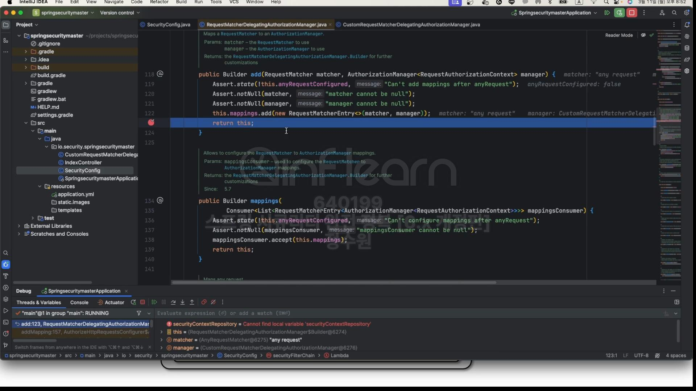
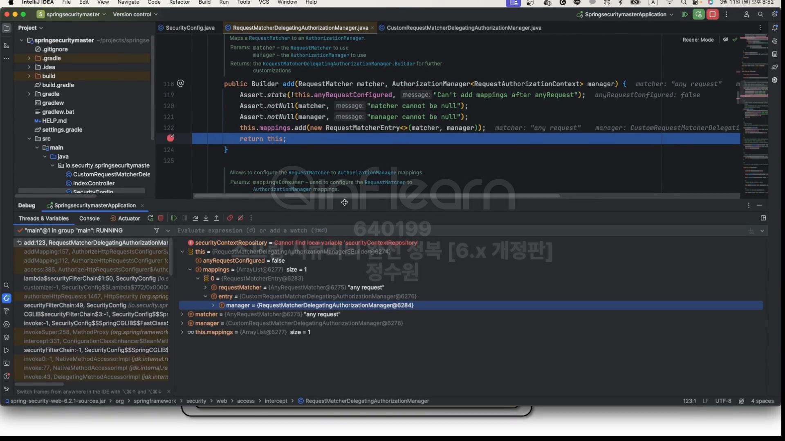
내가 anyRequest밖에 하지 않았으니까 당연히 하나 들어가 있다. <br>
이 상태에서 요청을 해보자. 
 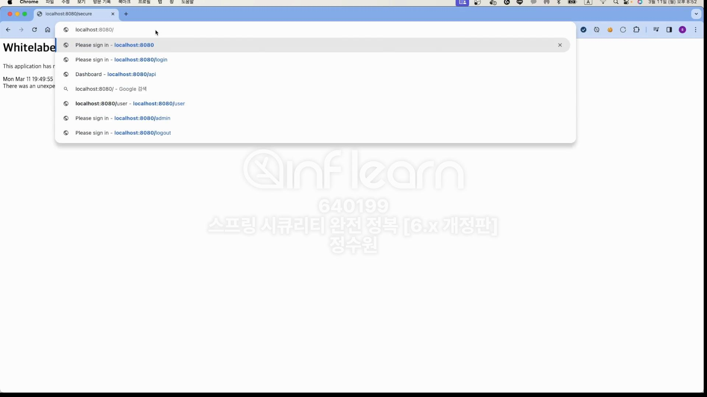
/로 접속 시도
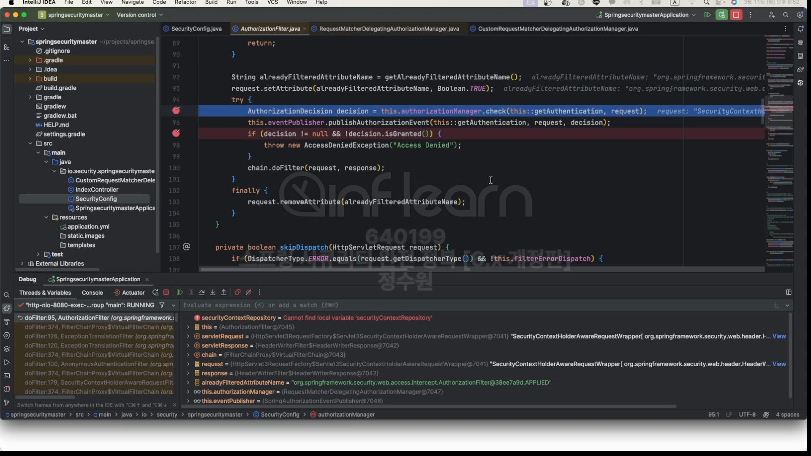
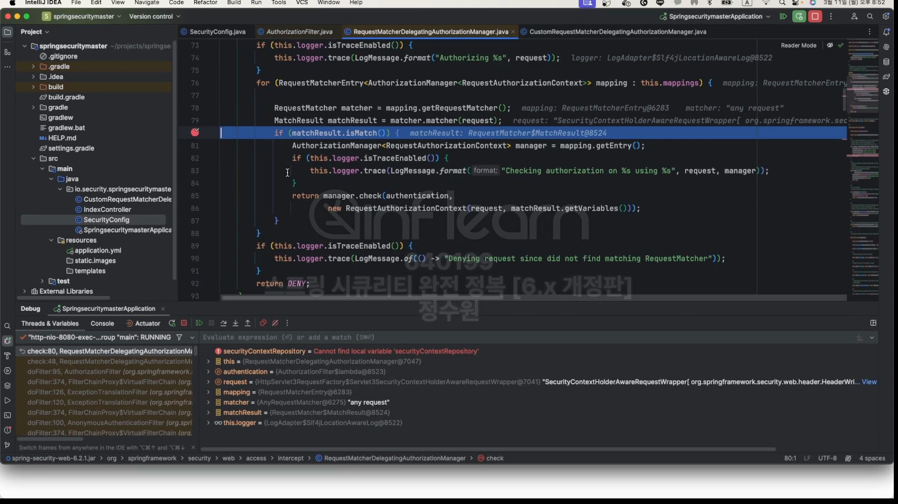
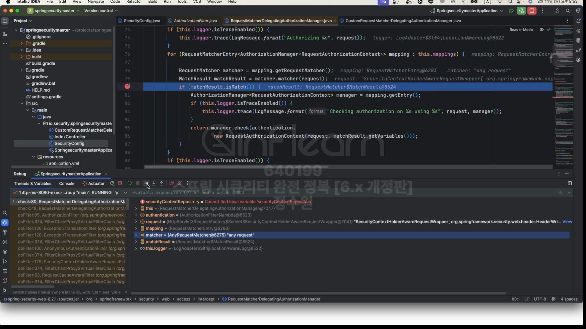
isMatch는 무조건 true이다 왜냐 모든 요청에 대해 받게 설정했기 때문에
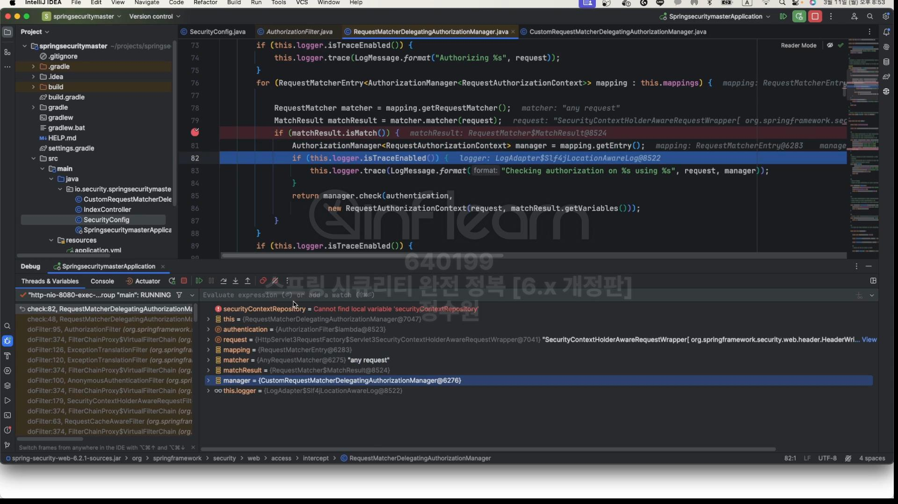
manager는 CustomRequestMatcherDelegatingAuthorizationManger이다. 
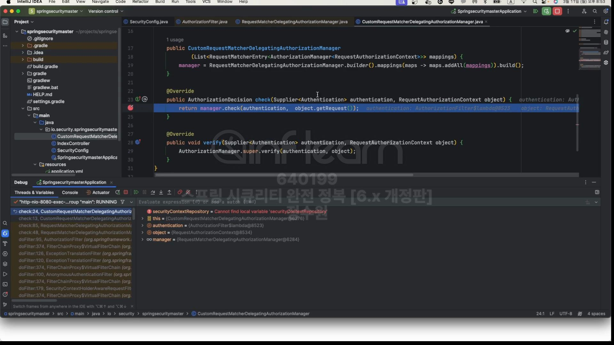
여기로 오게 된다. <br>
그럼 이제 이 manager가 갖는 mappings가 있을것이다! 그런것이 바로
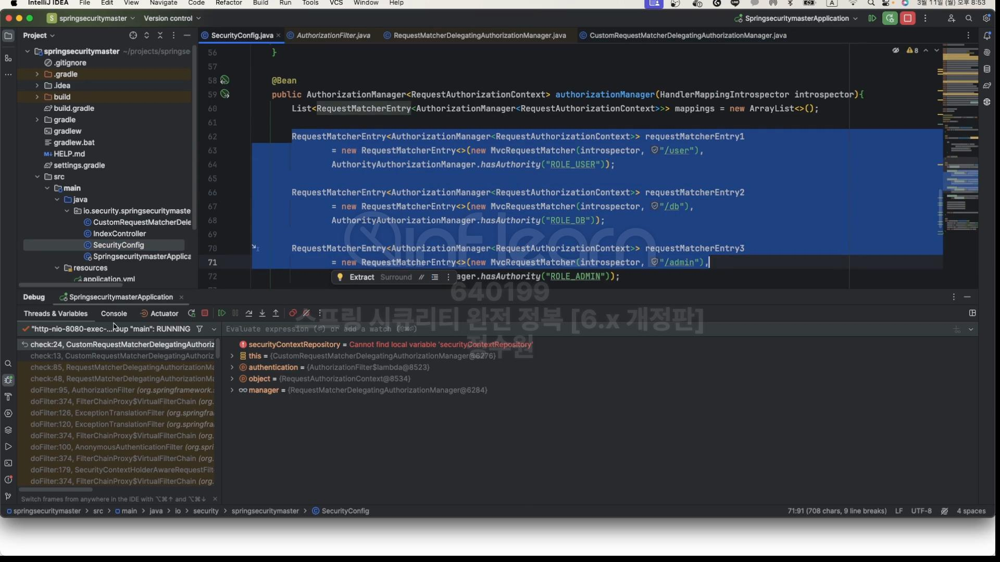
이런 정보들이다. <br>
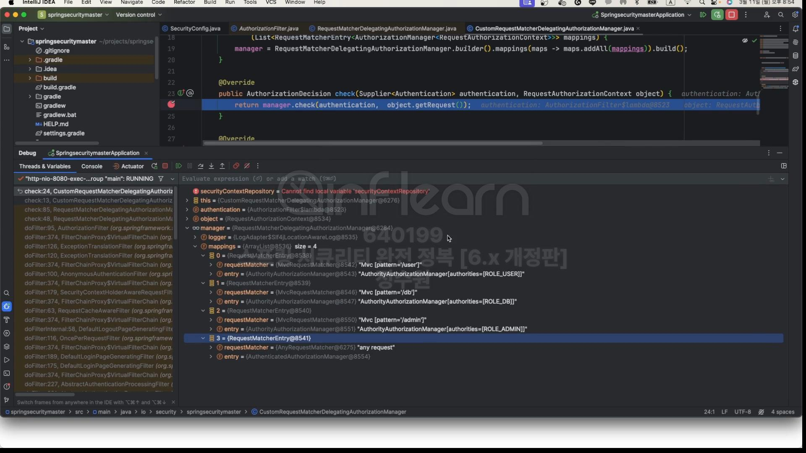
확인가능 근데 이제 이 manager도 결국은 requestMatcher 클래스 객체이기 때문에
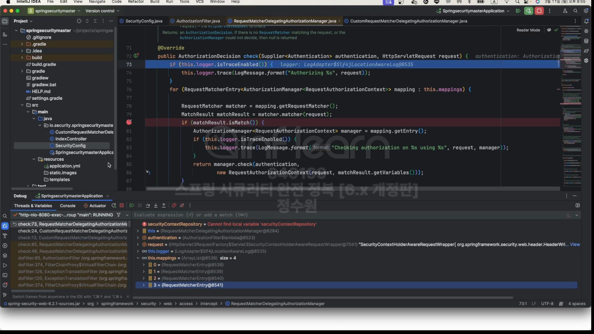
이 안으로 들어온다. 그리고 여기서는 4개의 requestMatcherEntry들이 들어있기 때문에 처리를 잘 하게 된다. 
<br>
여기서부터는 공부했던 내용과 비슷하다.
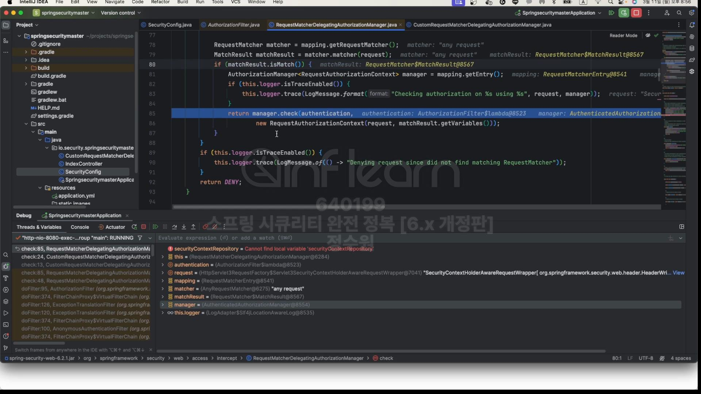
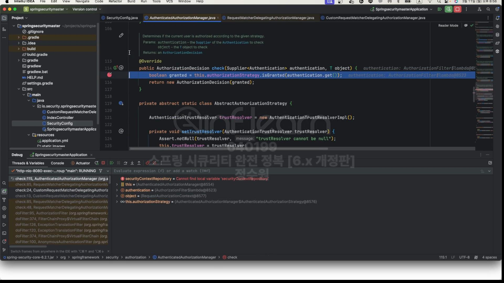
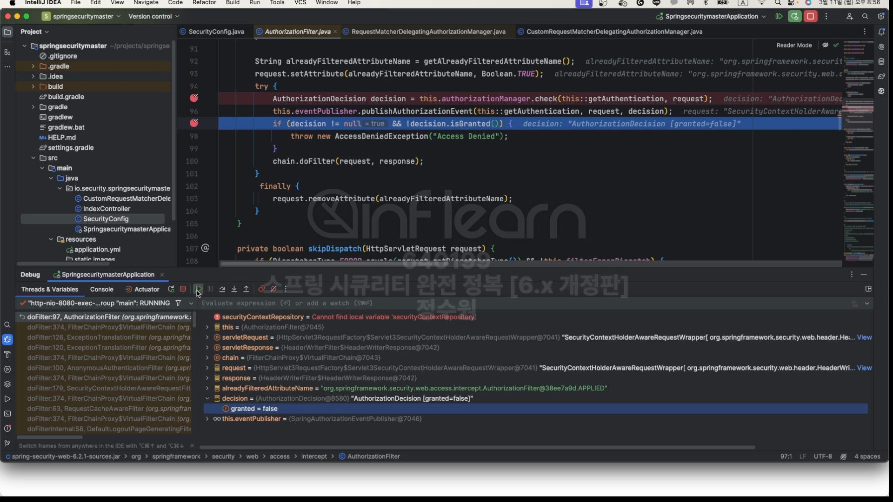
false가 나온다. 

이번엔 admin
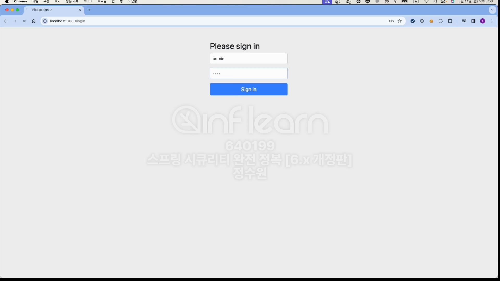
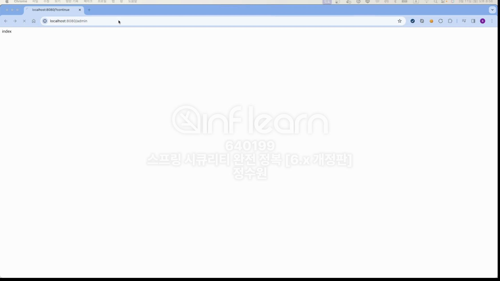
/admin 요청
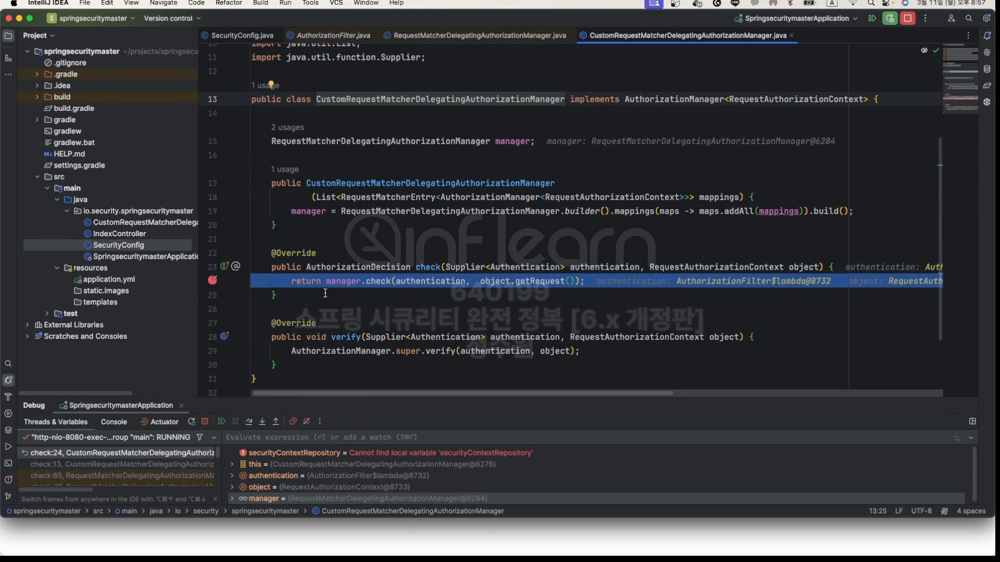
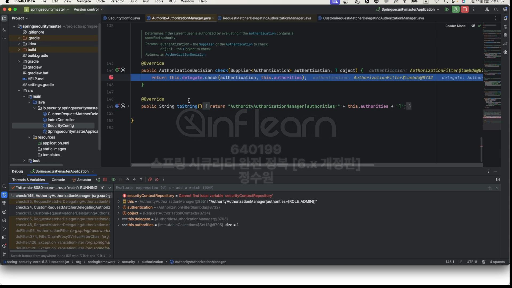
