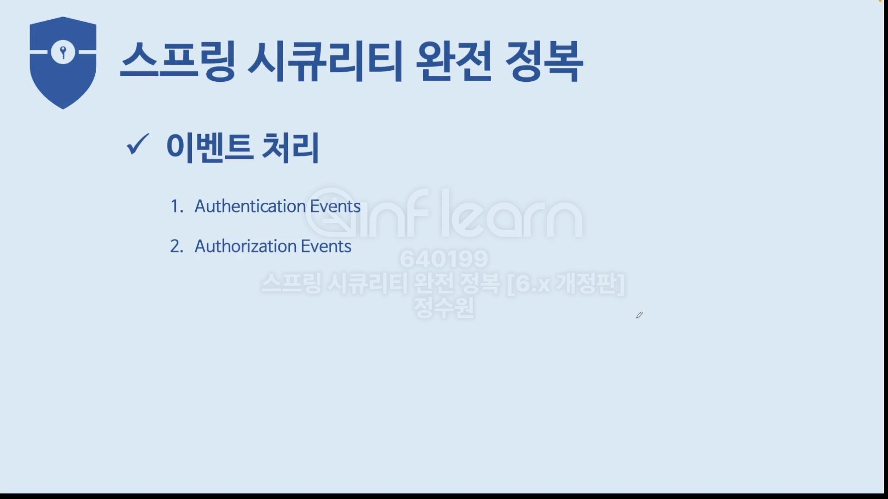
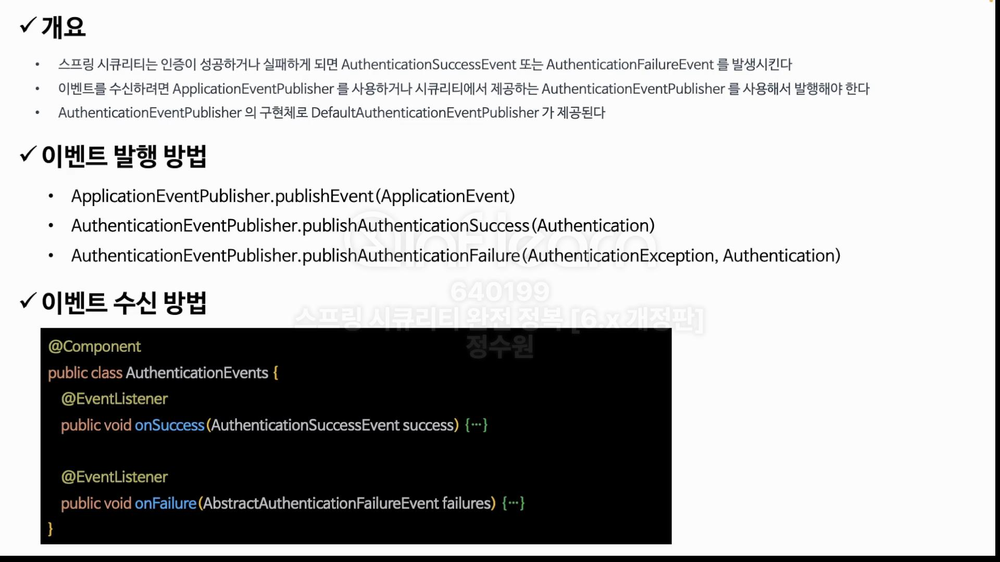
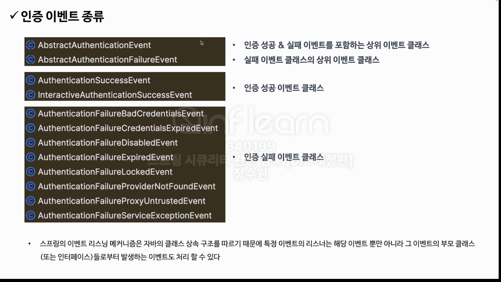
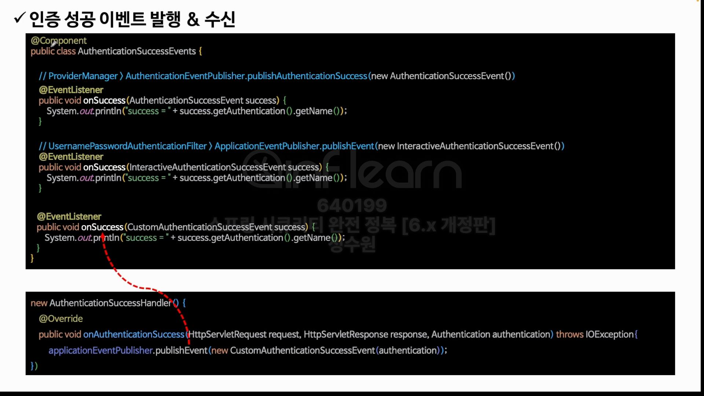
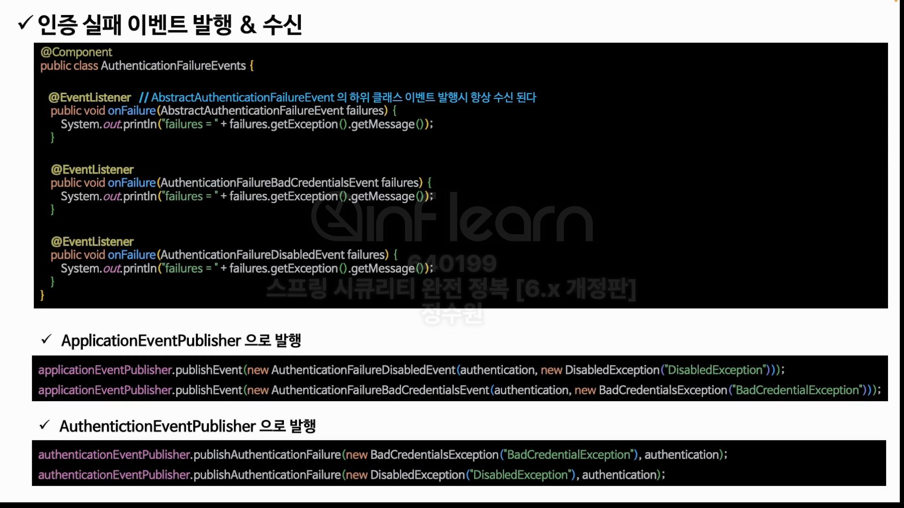

ProviderManager가 인증을 처리하는 과정에서 AuthenticationEventPublisher.publishAuthenticationSuccess를 날린다는 의미  

applicationEventPublisher는 spring framework에서 제공하는 발행 클래스이다.  
authenticationEventPublisher는 security에서 제공하는 발행 클래스이다. 

여기까지만, 필요하면 뒷내용 다시 학습.
