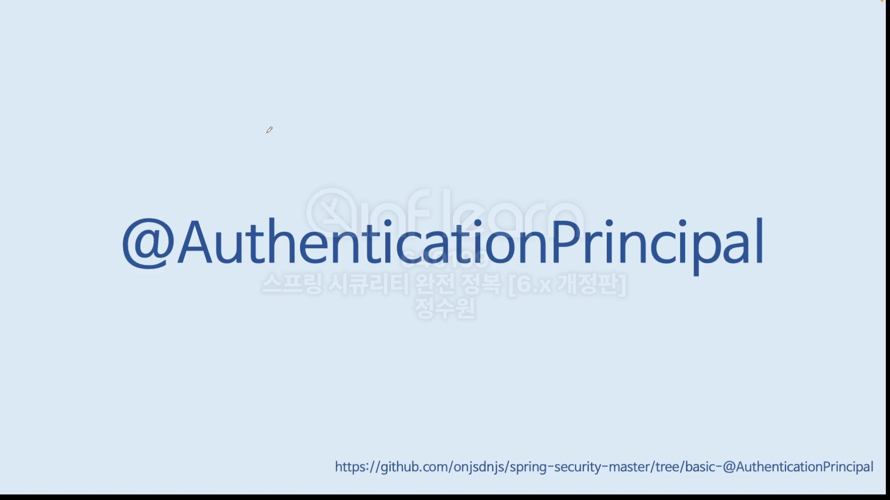
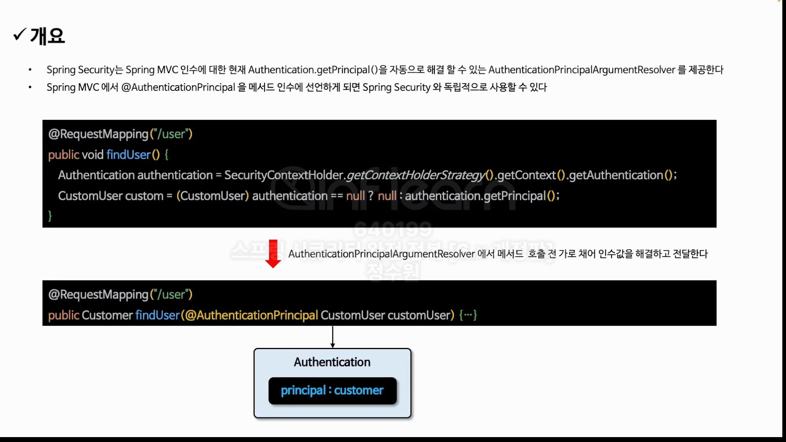
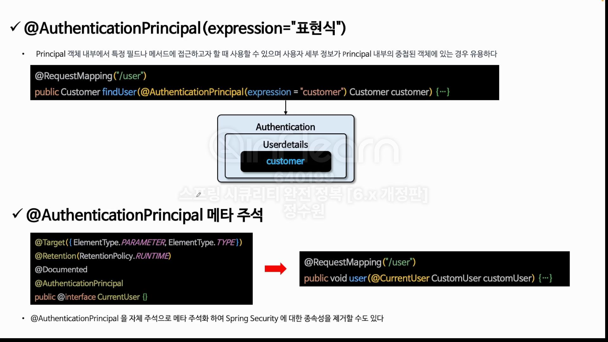
```java
@EnableWebSecurity
@Configuration
public class SecurityConfig {

    @Bean
    public WebSecurityCustomizer webSecurityCustomizer() {
        return webSecurity -> webSecurity.ignoring().requestMatchers(PathRequest.toStaticResources().atCommonLocations());
    }

    @Bean
    public SecurityFilterChain securityFilterChain(HttpSecurity http, HandlerMappingIntrospector introspector) throws Exception {
        http
                .authorizeHttpRequests(authorize -> authorize
                        .requestMatchers("/user").hasAuthority("ROLE_USER")
                        .requestMatchers("/db").hasAuthority("ROLE_DB")
                        .requestMatchers("/admin").hasAuthority("ROLE_ADMIN")
                        .anyRequest().permitAll())
                .formLogin(Customizer.withDefaults())
                .csrf(AbstractHttpConfigurer::disable);

        return http.build();
    }

    @Bean
    public UserDetailsService userDetailsService() {
        UserDetails user = User.withUsername("user").password("{noop}1111").roles("USER").build();
        UserDetails db = User.withUsername("db").password("{noop}1111").roles("DB").build();
        UserDetails admin = User.withUsername("admin").password("{noop}1111").roles("ADMIN", "SECURE").build();

        return new InMemoryUserDetailsManager(user, db, admin);
    }
}
```
```java
@RestController
@RequiredArgsConstructor
public class IndexController {
    AuthenticationTrustResolver trustResolver = new AuthenticationTrustResolverImpl();

    @GetMapping("/")
    public String index() {
        Authentication authentication = SecurityContextHolder.getContextHolderStrategy().getContext().getAuthentication();
        // 만약 인증을 받지 못한 상태라면 authentication은 anonymous authentication일것이다.
        // 따라서 이걸 구분할 필요가 있다. trustResolver를 사용하자.
        return trustResolver.isAnonymous(authentication) ? "anonymous" : "authenticated";
    }
}
```
/로 접근해보자. <br>
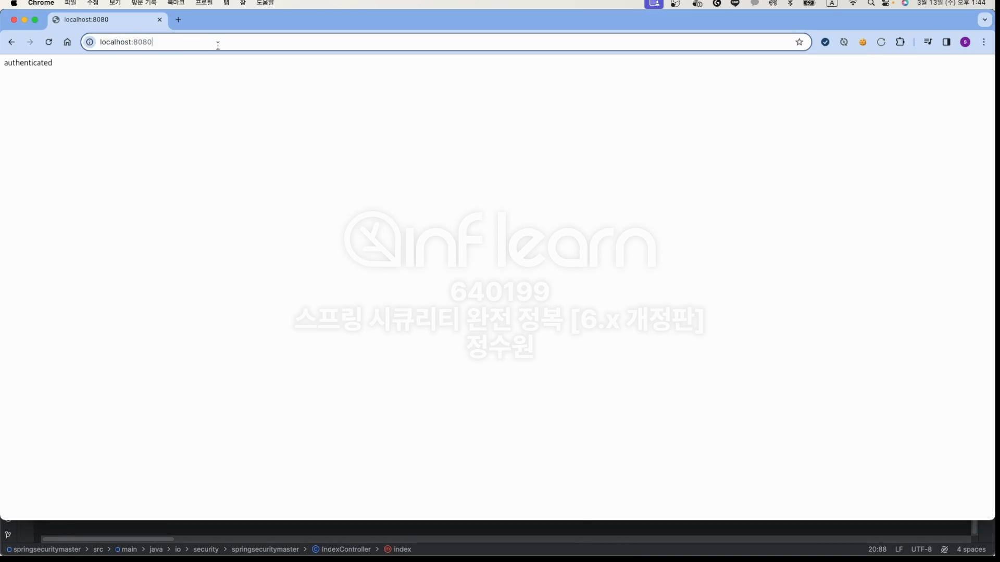
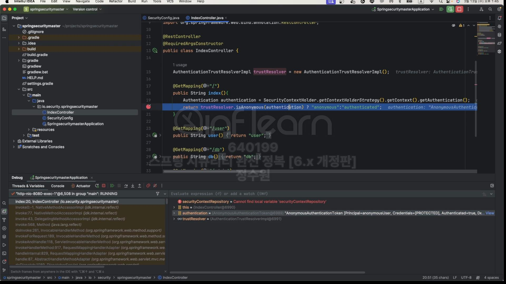
인증을 받아보자.

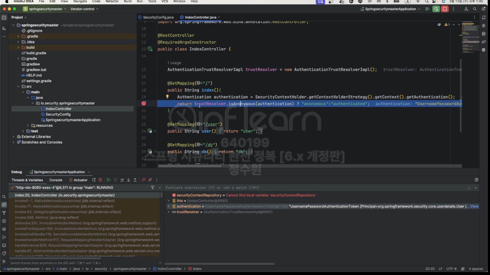

이번엔 annotation을 사용해보자. <br>
```java
@RestController
@RequiredArgsConstructor
public class IndexController {
    AuthenticationTrustResolver trustResolver = new AuthenticationTrustResolverImpl();

    @GetMapping("/")
    public String index() {
        Authentication authentication = SecurityContextHolder.getContextHolderStrategy().getContext().getAuthentication();
        // 만약 인증을 받지 못한 상태라면 authentication은 anonymous authentication일것이다.
        // 따라서 이걸 구분할 필요가 있다. trustResolver를 사용하자.
        return trustResolver.isAnonymous(authentication) ? "anonymous" : "authenticated";
    }

    @GetMapping("/user")
    public User user(@AuthenticationPrincipal User user) {
        return user;
    }

    @GetMapping("/user2")
    public String user(@AuthenticationPrincipal(expression = "username") String user) {
        return user;
    }
}
```
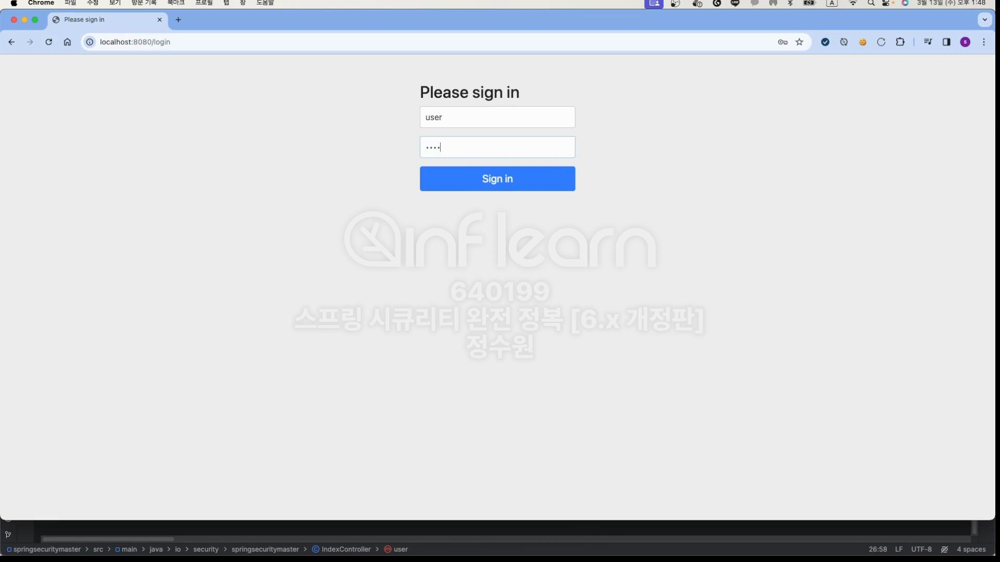
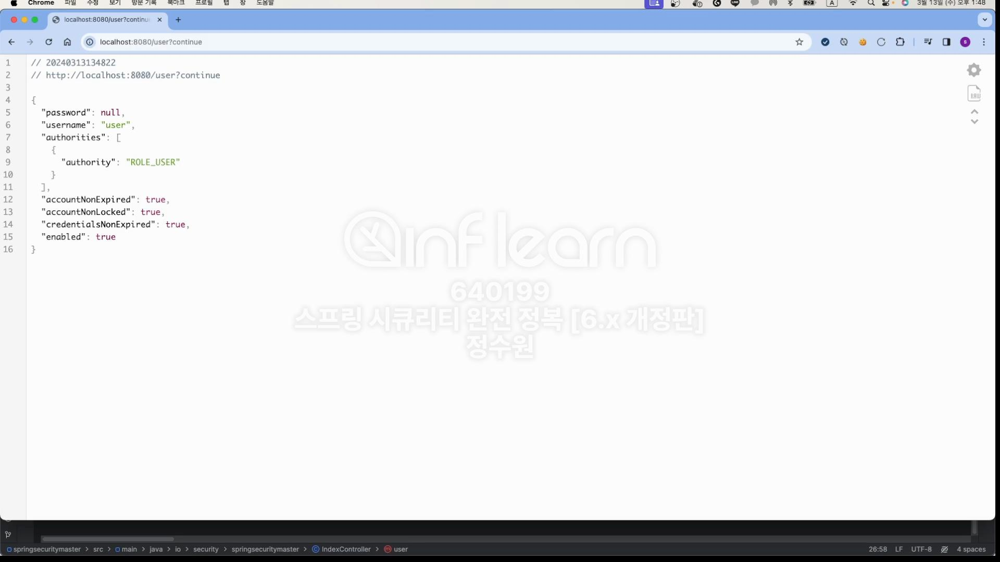
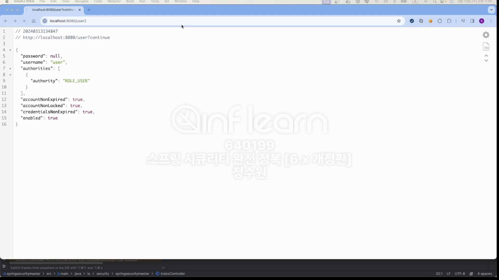
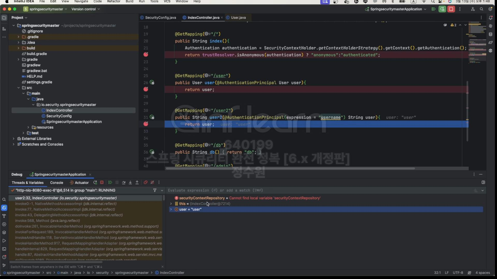
<br>

이번엔 메타 주석을 활용해보자. <br>
```java
@Target({ElementType.PARAMETER, ElementType.ANNOTATION_TYPE})
@Retention(RetentionPolicy.RUNTIME)
@Documented
@AuthenticationPrincipal
public @interface CurrentUser {

}

```
```java
@Target({ElementType.PARAMETER, ElementType.ANNOTATION_TYPE})
@Retention(RetentionPolicy.RUNTIME)
@Documented
@AuthenticationPrincipal(expression = "#this == 'anonymousUser'?null : username")
// this는 principal 자체를 의미
public @interface CurrentUsername {

} 
```
```java
  @GetMapping("/currentUser")
public User currentUser(@CurrentUser User user) {
    return user;
}

@GetMapping("/currentUser")
public String currentUsername(@CurrentUsername String user) {
    return user;
}
```

근데 만약 
```java
@Target({ElementType.PARAMETER, ElementType.ANNOTATION_TYPE})
@Retention(RetentionPolicy.RUNTIME)
@Documented
@AuthenticationPrincipal(expression = "username")
// this는 principal 자체를 의미
public @interface CurrentUsername {

} 
```
이렇게만 하면
이렇게 오류가 난다.
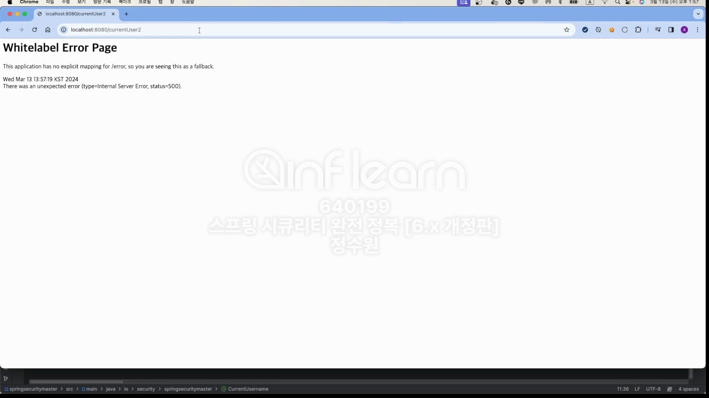
익명 사용자는 기본적으로 "anonymous"라고 문자열이 들어감 근데 거기에는 username이라는 필드가 없기 때문에 오류를 발생시킨다. 