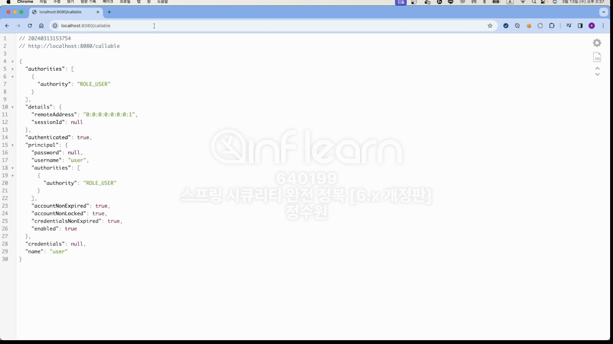

```java
@RestController
@RequiredArgsConstructor
public class IndexController {
    @GetMapping("/")
    public String index() {
        return "index";
    }

    @GetMapping("/user")
    public String user() {
        return "user";
    }

    @GetMapping("/db")
    public String db() {
        return "db";
    }

    @GetMapping("/admin")
    public String admin() {
        return "admin";
    }

    @GetMapping("/callable")
    public Callable<Authentication> call() {
        SecurityContext securityContext = SecurityContextHolder.getContextHolderStrategy().getContext();
        System.out.println("securityContext = " + securityContext);
        System.out.println("Parent Thread = " + Thread.currentThread().getName());

        return new Callable<Authentication>() {
            @Override
            public Authentication call() throws Exception {
                SecurityContext securityContext = SecurityContextHolder.getContextHolderStrategy().getContext();
                System.out.println("securityContext = " + securityContext);
                System.out.println("Child Thread = " + Thread.currentThread().getName());

                return securityContext.getAuthentication();
            }
        };
    }
}
```




콘솔 출력 확인

```java
@Service
public class AsyncService {

    @Async
    public void asyncMethod() {
        SecurityContext securityContext = SecurityContextHolder.getContextHolderStrategy().getContext();
        System.out.println("securityContext = " + securityContext);
        System.out.println("Child Thread = " + Thread.currentThread().getName());
    }
}
```

```java
@RestController
@RequiredArgsConstructor
public class IndexController {
    private final AsyncService asyncService;

    @GetMapping("/")
    public String index() {
        return "index";
    }

    @GetMapping("/user")
    public String user() {
        return "user";
    }

    @GetMapping("/db")
    public String db() {
        return "db";
    }

    @GetMapping("/async")
    public Authentication async() {
        SecurityContext securityContext = SecurityContextHolder.getContextHolderStrategy().getContext();
        System.out.println("securityContext = " + securityContext);
        System.out.println("Parent Thread = " + Thread.currentThread().getName());

        asyncService.asyncMethod();

        return securityContext.getAuthentication();
    }
}
```

```java
@SpringBootApplication
@EnableAsync
public class SpringsecuritymasterApplication {

    public static void main(String[] args) {
        SpringApplication.run(SpringsecuritymasterApplication.class, args);
    }

}
```


부모와 자식의 SecurityContext가 공유가 안되고 있다.<br>
일반적인 비동기 SecurityContext 과정에서는 특별한 장치를 해주어야 비동기 공유를 할 수 있다. <br>

```java
@EnableWebSecurity
@Configuration
public class SecurityConfig {

    @Bean
    public WebSecurityCustomizer webSecurityCustomizer() {
        return webSecurity -> webSecurity.ignoring().requestMatchers(PathRequest.toStaticResources().atCommonLocations());
    }

    @Bean
    public SecurityFilterChain securityFilterChain(HttpSecurity http, HandlerMappingIntrospector introspector) throws Exception {
        http
                .authorizeHttpRequests(authorize -> authorize
                        .requestMatchers("/user").hasAuthority("ROLE_USER")
                        .requestMatchers("/db").hasAuthority("ROLE_DB")
                        .requestMatchers("/admin").hasAuthority("ROLE_ADMIN")
                        .anyRequest().permitAll())
                .formLogin(Customizer.withDefaults())
                .csrf(AbstractHttpConfigurer::disable);

        SecurityContextHolder.setStrategyName(SecurityContextHolder.MODE_INHERITABLETHREADLOCAL);
        
        return http.build();
    }

    @Bean
    public UserDetailsService userDetailsService() {
        UserDetails user = User.withUsername("user").password("{noop}1111").roles("USER").build();
        UserDetails db = User.withUsername("db").password("{noop}1111").roles("DB").build();
        UserDetails admin = User.withUsername("admin").password("{noop}1111").roles("ADMIN", "SECURE").build();

        return new InMemoryUserDetailsManager(user, db, admin);
    }
}
```
이렇게 해주면 된다. <br>

과정이 궁금하다면 21:00 이후로 보자.