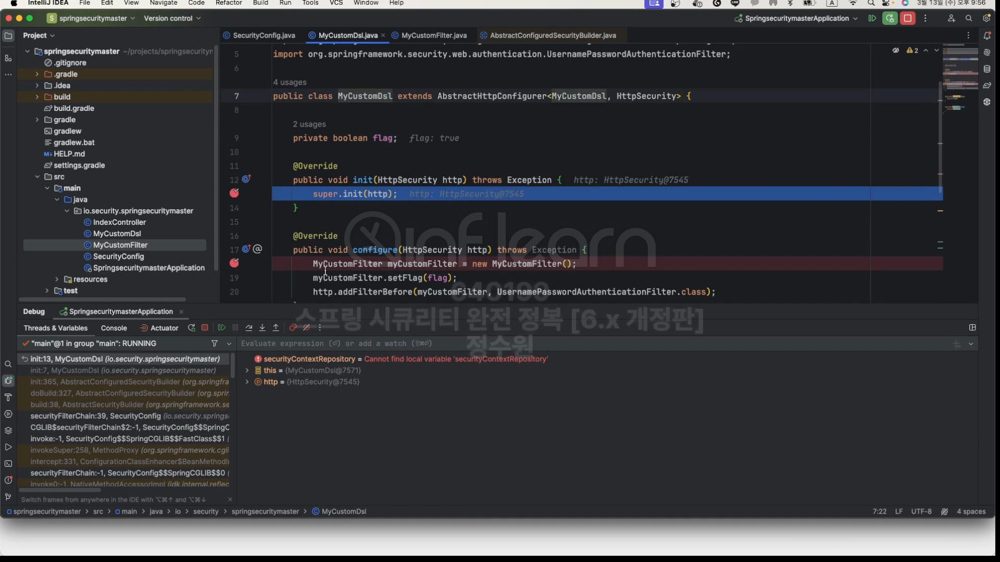

```java
public class MyCustomFilter extends OncePerRequestFilter {
    private boolean flag;

    @Override
    protected void doFilterInternal(HttpServletRequest request, HttpServletResponse response, FilterChain filterChain) throws ServletException, IOException {
        if (flag) {
            try {
                String username = request.getParameter("username");
                String password = request.getParameter("password");

                request.login(username, password);
            } catch (Exception e) {
                System.out.println(e.getMessage());
            }
        }

        filterChain.doFilter(request, response);
    }

    public void setFlag(boolean flag) {
        this.flag = flag;
    }
}

```

```java
import org.springframework.security.web.servletapi.SecurityContextHolderAwareRequestFilter;

public class MyCustomDsl extends AbstractHttpConfigurer<MyCustomDsl, HttpSecurity> {
    private boolean flag;

    @Override
    public void init(HttpSecurity http) throws Exception {
        super.init(http);
    }

    @Override
    public void configure(HttpSecurity http) throws Exception {
        MyCustomFilter myCustomFilter = new MyCustomFilter();
        myCustomFilter.setFlag(flag);
        http.addFilterAfter(myCustomFilter, SecurityContextHolderAwareRequestFilter.class);
    }

    public void setFlag(boolean flag) {
        this.flag = flag;
    }

    public static MyCustomDsl customDsl() {
        return new MyCustomDsl();
    }
}
```

```java
@EnableWebSecurity
@Configuration
public class SecurityConfig {

    @Bean
    public WebSecurityCustomizer webSecurityCustomizer() {
        return webSecurity -> webSecurity.ignoring().requestMatchers(PathRequest.toStaticResources().atCommonLocations());
    }

    @Bean
    public SecurityFilterChain securityFilterChain(HttpSecurity http) throws Exception {
        http
                .authorizeHttpRequests(authorize -> authorize
                        .requestMatchers("/user").hasAuthority("ROLE_USER")
                        .requestMatchers("/db").hasAuthority("ROLE_DB")
                        .requestMatchers("/admin").hasAuthority("ROLE_ADMIN")
                        .anyRequest().authenticated())
                .formLogin(Customizer.withDefaults())
                .with(MyCustomDsl.customDsl(), dsl -> dsl.setFlag(true))
        ;

        return http.build();
    }

    @Bean
    public UserDetailsService userDetailsService() {
        UserDetails user = User.withUsername("user").password("{noop}1111").roles("USER").build();
        UserDetails db = User.withUsername("db").password("{noop}1111").roles("DB").build();
        UserDetails admin = User.withUsername("admin").password("{noop}1111").roles("ADMIN", "SECURE").build();

        return new InMemoryUserDetailsManager(user, db, admin);
    }
}
```
동작을 보자. <br>

이곳은 여러 초기화 설정 클래스들이 생성이 된 후, 각 설정 클래스들의 Init과 Configure들을 설정하는 곳이다. <br>

지금 14개의 설정 클래들이 들어와있는데 0~12는 spring security에서 설정한 클래스들이다. 그리고 우리가 설정한 클래스가 마지막으로 들어가있다.<br>

그렇기 때문에 configure.init()을 호출하게 되면 <br>

이곳으로 와서 초기화 작업들을 하게 되는 것이고 <br>

그 다음에 configure로 오게 된다. 이렇게 초기화 과정이 마무리된다. <br>
```
http.addFilterAfter(myCustomFilter, SecurityContextHolderAwareRequestFilter.class);
```
이 부분이 조금 중요한게 
```
request.login(username, password);
```
이것을 사용하려면 security에서 제공하는 wrapper 클래스를 사용해야한다. 근데 그건 SecurityContextHolderAwareRequestFilter 뒤에 와야한다. <Br>


