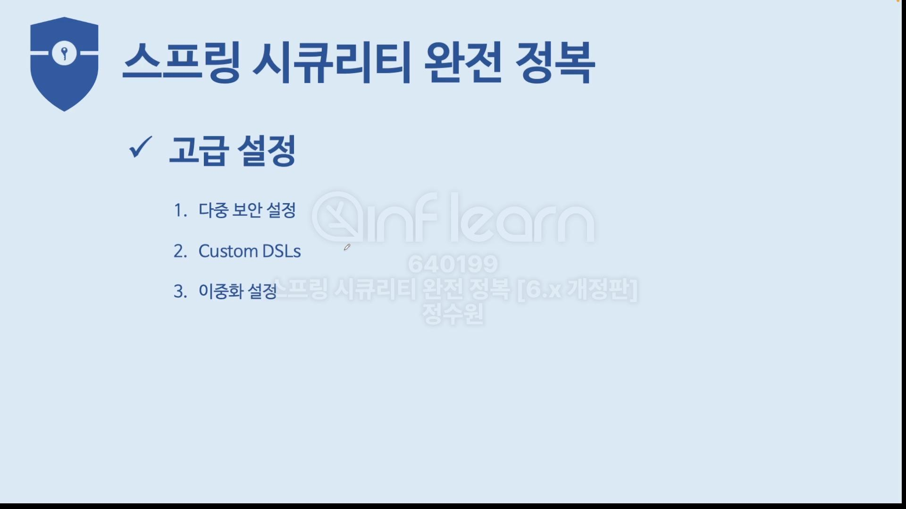
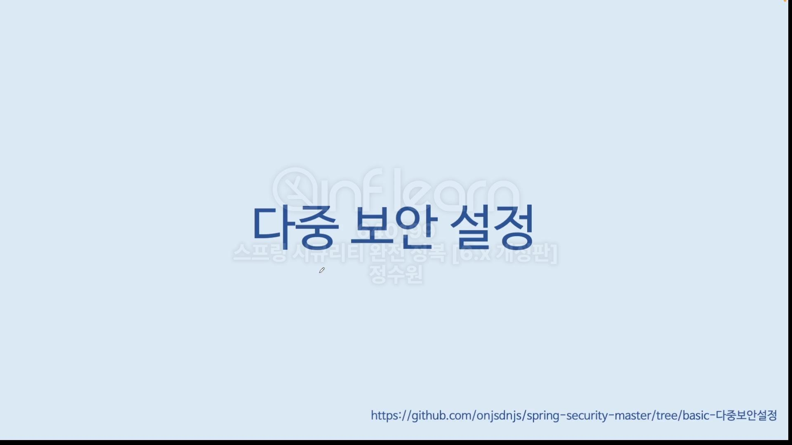
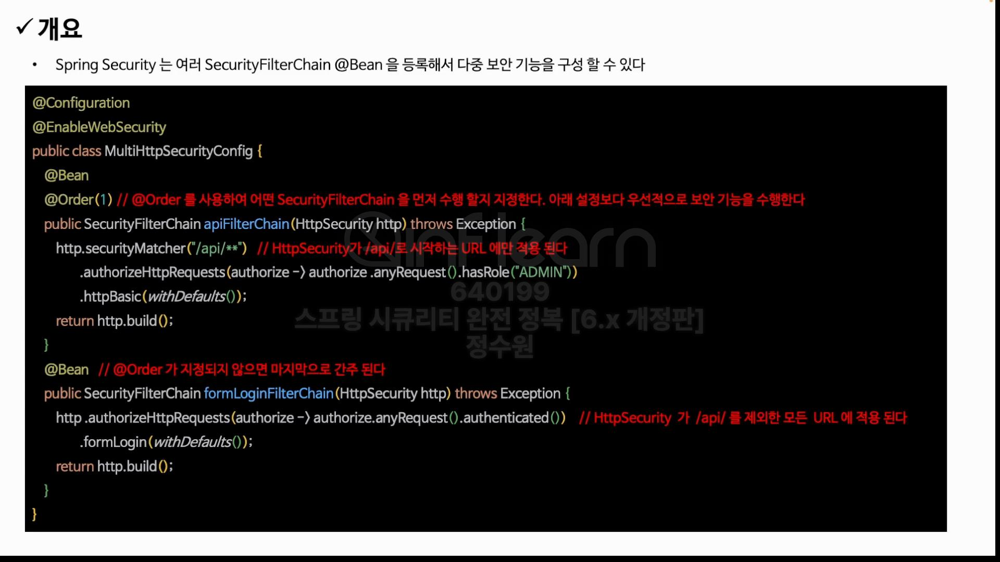
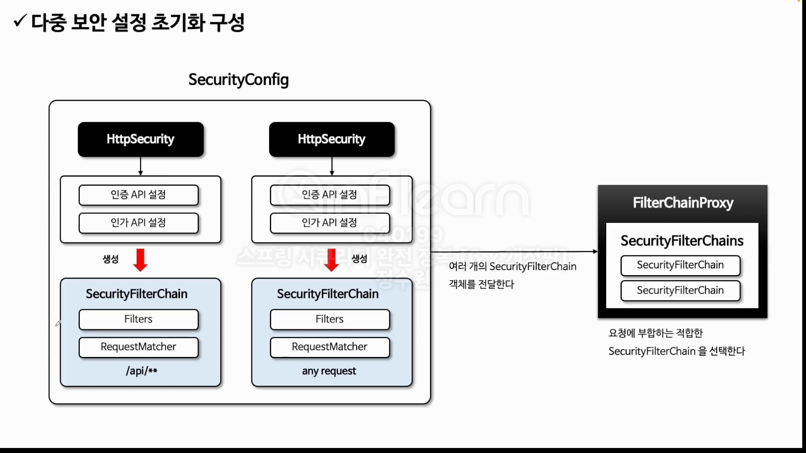
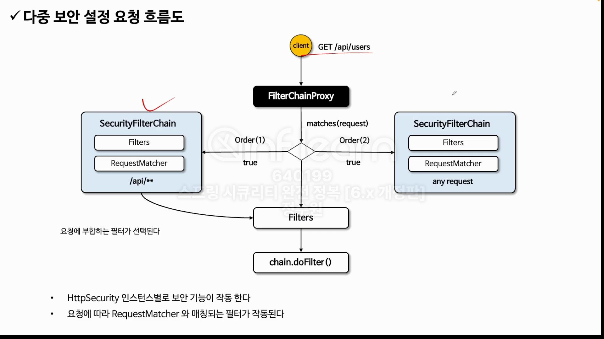
```java
@EnableWebSecurity
@Configuration
public class SecurityConfig {

    @Bean
    public WebSecurityCustomizer webSecurityCustomizer() {
        return webSecurity -> webSecurity.ignoring().requestMatchers(PathRequest.toStaticResources().atCommonLocations());
    }

    @Bean
    public SecurityFilterChain securityFilterChain(HttpSecurity http) throws Exception {
        http
                .authorizeHttpRequests(authorize -> authorize
                        .anyRequest().authenticated())
                .formLogin(Customizer.withDefaults());

        return http.build();
    }

    @Bean
    @Order(1)
    public SecurityFilterChain securityFilterChain2(HttpSecurity http) throws Exception {
        http
                .securityMatchers((matchers) -> matchers.requestMatchers("/api/**"))
                .authorizeRequests(authorize -> authorize
                        .anyRequest().permitAll());

        return http.build();
    }

    @Bean
    public UserDetailsService userDetailsService() {
        UserDetails user = User.withUsername("user").password("{noop}1111").roles("USER").build();
        UserDetails db = User.withUsername("db").password("{noop}1111").roles("DB").build();
        UserDetails admin = User.withUsername("admin").password("{noop}1111").roles("ADMIN", "SECURE").build();

        return new InMemoryUserDetailsManager(user, db, admin);
    }
}
```
동작을 보자. <br>
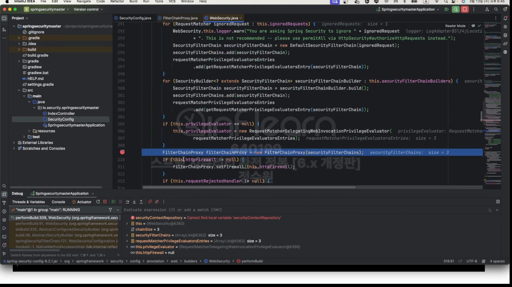
초기화 과정에서 WebSeuciry가 FilterChainProxy bean을 만들기 위해서 FilterChainProxy을 만들 때 SecurityFilterChains라는 속성을 넘겨준다. <br>
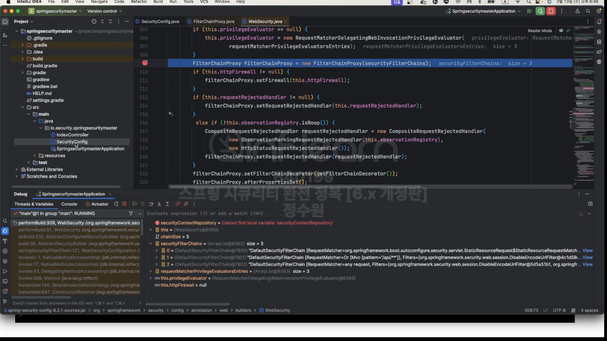
3개가 들어가 있다. (정적자원을 관리하는 filterchain-webSecurityCustomizer 포함 돼 있음)
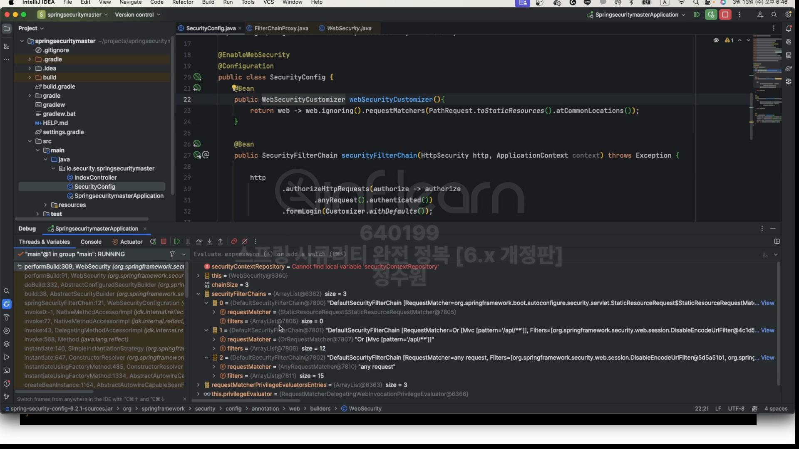
filterChains가 여러개일 경우 자기가 가지고 있는 filterchain중 하나를 선택해서 client 요청을 처리한다. <br>
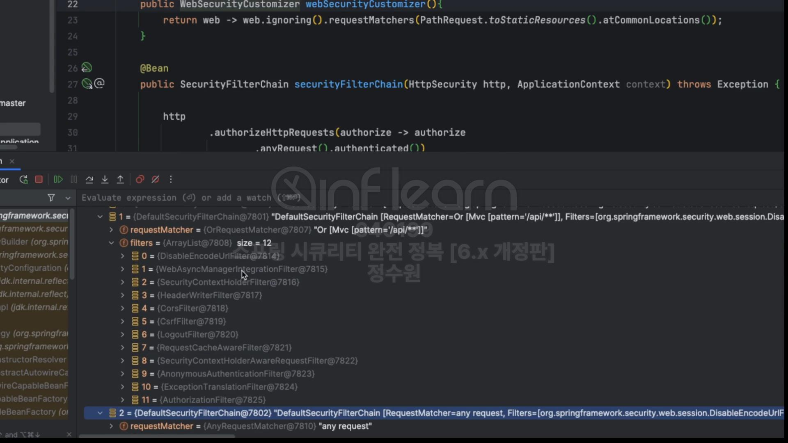
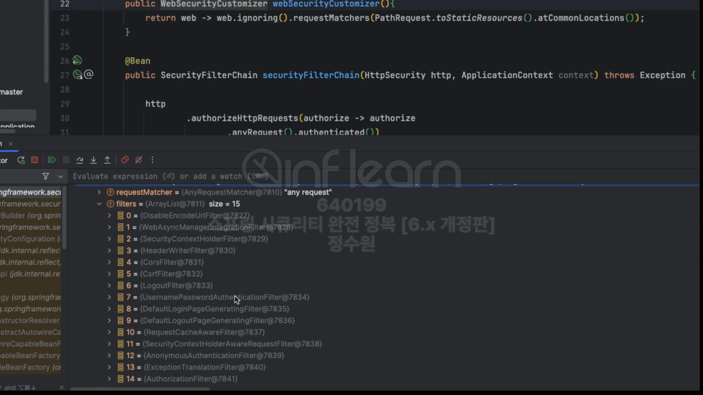
1번은 12개 2번은 15개 필터.
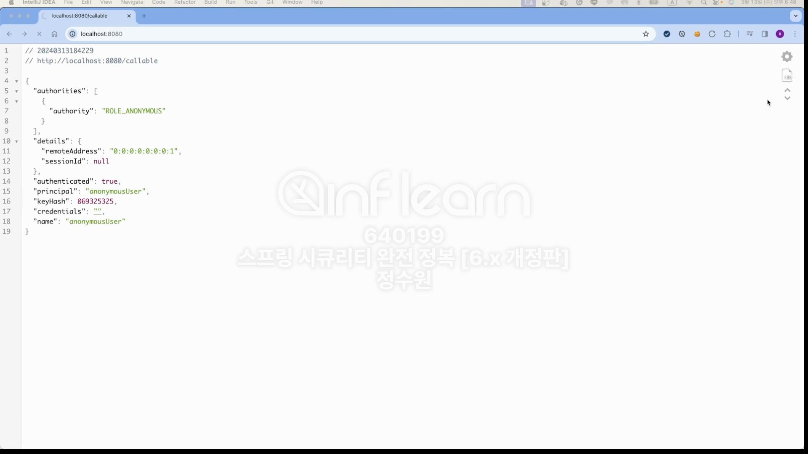
root로 요청!<br>
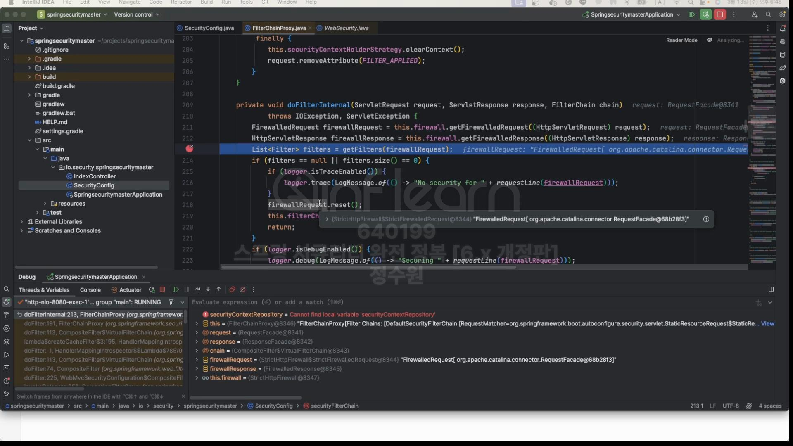
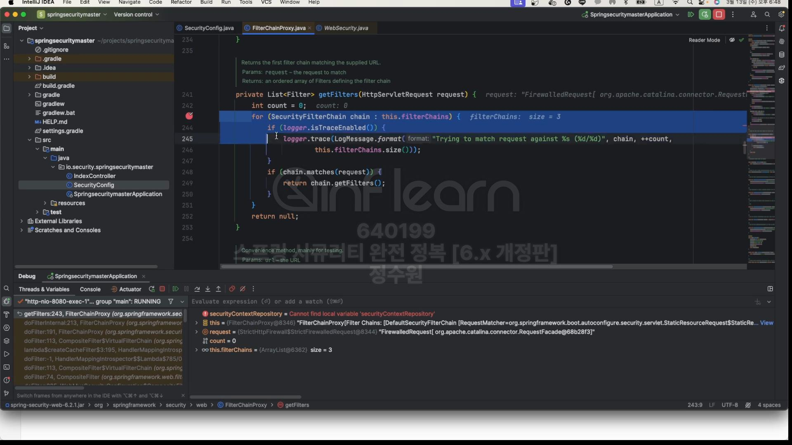
filter를 가지고 올 때 적합한 필터를 선택하는 과정이 있다. <br>
이런 성질 때문에 하나의 filterChains가 선택이 된다. 따라서 Order의 순서를 바꾼다면 문제가 발생하는 것이다.