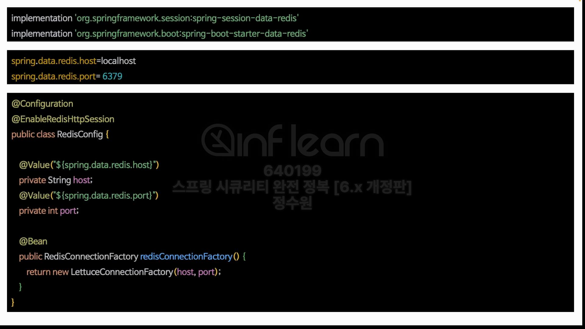
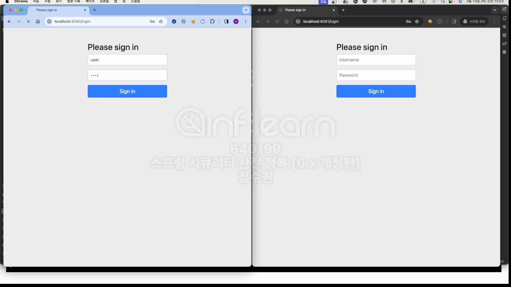

테스트를 해보자. <br>
2개의 서버가 필요하기 때문에 <br>

서버를 하나 복사해주고 두번째 application에는 8081 port를 추가해주자. <br>

Program Aruguments에 --server.port=8081 추가

8080과 8081을 모두 실행시켜준다. <br>

두 곳에 접속을 해보면 각각 sessionId가 생긴것을 확인할 수 있다. 두 값이 다르다. <br>
8080에서 인증을 수행해보자. <br>


인증완료. 그리고 이 서버를 강제로 종료해보자. <br>
그러면 당연히 8080은 접속이 안될것이다. 그 다음 이 쿠키를 8081에 적용시켜서 접속을 해보자. <br>

session id를 복사하자. <br>

그리고 8081에 복사시키고 다시 접속을 하면 당연히 동작하지 않는다. <br>
이 문제를 해결하기 위해 redis를 사용해서 문제를 해결하자. <br>

```yml
spring:
  application:
    name: springsecuritymaster

  data:
    redis:
      host: localhost
      port: 6379
```

```java
@Configuration
@EnableRedisHttpSession
public class RedisConfig {

    @Value("${spring.data.redis.host}")
    private String host;

    @Value("${spring.data.redis.host}")
    private int port;

    @Bean
    public RedisConnectionFactory redisConnectionFactory() {
        return new LettuceConnectionFactory(host, port);
    }

}
```

```shell
docker run --name redis -p 6379:6379 -d redis
```
redis를 실행시킨다. <br>

이렇게 하면 서로 연동이 된다. <br>

뒷 부분 좀 더 자세한 내용은 다시 강의 참고.
쉽게 redis를 import 받지 않으면 세션을 각각의 톰캣 WAS에서 받고 redis로 session을 얻으면 SessionRepositoryFilter에서 받게 된다.<br>
이건 security는 아니고 session Library에 있는것! 즉 RedisSession에서 받아오게 됨.

