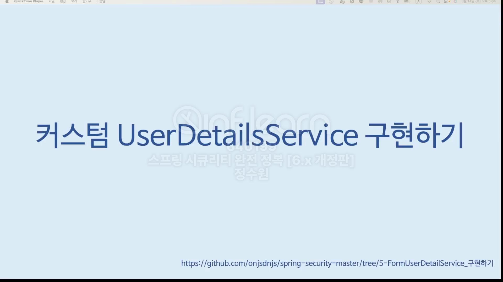
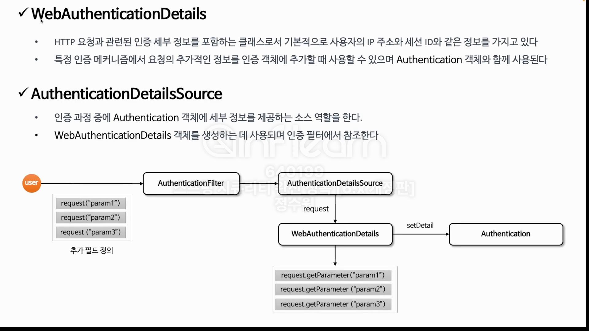
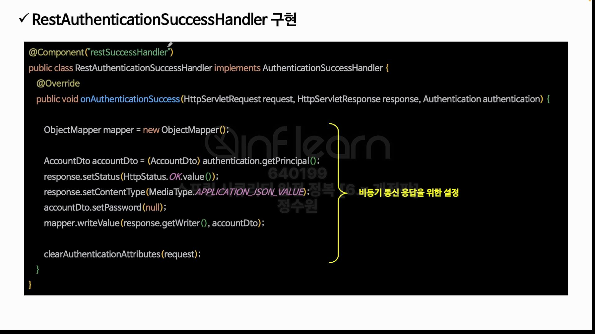

```shell
docker run --name springboot-postgres -e POSTGRES_USER=postgres -e POSTGRES_PASSWORD=pass -d postgres
```



 authenticationprovider를 지정하면 userdetailsservice를 지정할 필요 없음.


로그아웃은 이렇게 하는게 좋은 방식은 아님. 커스텀 로그아웃 다시 확인.


<br>





<br>


<br>


<br>


<br>


<br>


<br>


<br>





<br>


