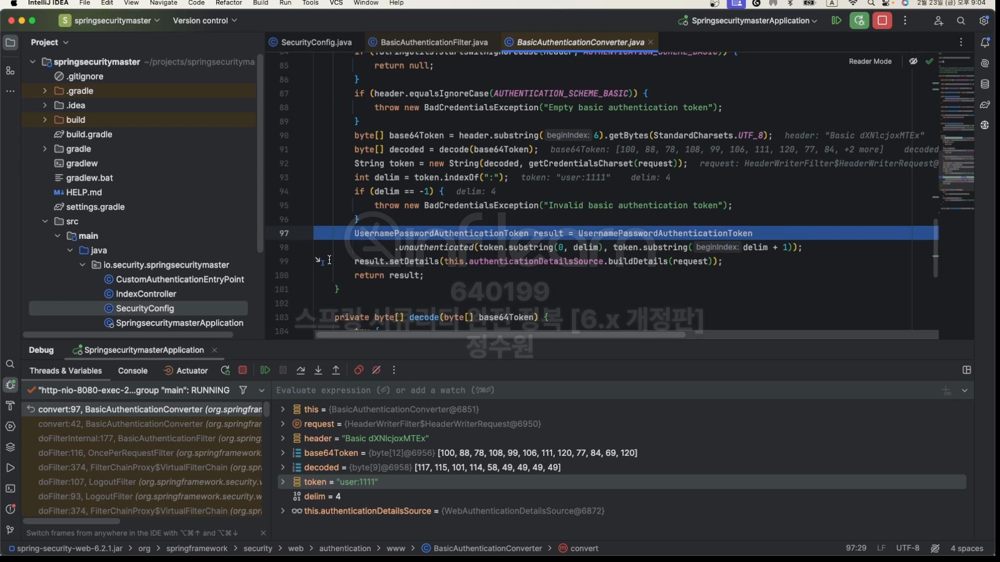
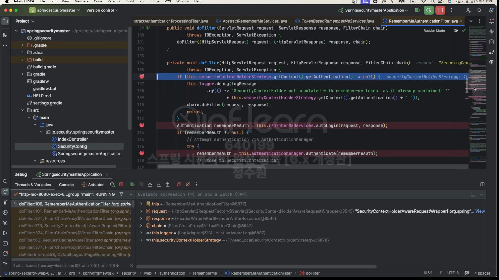

 
과정을 살펴보자. extends OncePerRequestFilter는 요청에 대해 한번만 수행하는 Filter이다.
 
 
저걸 상속받으면 doFilterInternal로 들어온다.  
authenticationConverter가 있다. 들어가서 확인해보자.  
  
authRequest가 null이기 때문에 반환하지 않는다. (로그인 정보를 입력하지 않을시) 
정보를 입력했다면  
  
요청 헤더에 실려서 옴  

"Basic (문자열)" 입력 된 값이 실려 있는게 보인다.  
  
그리고 값들을 추출해서 UsernamePasswordAuthenticationToken에 저장하고 있다.  
그리고 return받은 값으로 인증처리를 한다.  
  
authenticationIsRequired를 살펴보면  
 
현재 객체내에 인증 객체가 있는지 모는것임. 시큐리티 컨텍스트 안에 인증 객체가 만약에 있다면, 인증할 필요가 없다고 
판단하고 인증 처리를 넘기지만, 없으면 인증을 처리한다. 
  
인증을 처리하고 SecurityContext에 저장하고 기타 인증 처리를 한다. 
그리고 securityContextRepository에 저장하고 이건 시큐리티 컨텍스트가 아니고 RequestAttributeSecurtiyContextRepository 
요청 컨텍스트임 그러니까 요청 범위내에 시큐리티 컨텍스트를 저장한다. 이렇게 하면 인증을 처리가 된것이다. 
그래서 한번 요청이 끝나면 이 요청은 없어진다. 그래서 다시 이 과정을 거쳐야한다.  
그럼 한번 다시 요청을 해보자. 
원래라면 요청을 할 때마다 창이 떠서 아이디와 패스워드를 넣고 요청을 해야하고 서버는 헤더를 통해서 다시 인증처리를 
해야하는데, 지금같은 경우에는 브라우저에서 요청 헤더에  

Authorization에 헤더값이 지정되 있기 때문에 별도로 창이 뜨지 않고 바로 간다. 
  
그래서 여기에서 인증처리를 할것인지 안할것인지만 판단하면 된다. 
아까처럼  
 
시큐리티 컨텍스트 창에서 인증객체를 가져 오는데, 얘가 null이 아니면 인증을 할 필요가 없다. 
세션이면 널이 아니라서 인증할 필요가 없는데, 여기서는 request라서 다시 null이된다. 그렇기 때문에 
또 인증 과정을 거쳐야한다.
 
  
  
  
  
rememberMe 속성을 넣는다. 넣었더니  
  
속성이 생겼다. 그리고 속성 name도 remember라고 써서 remember로 박혀있다. 이제 쿠키가 생성되는지 보자.  
  
 
쿠키가 생긴것을 확인할 수 있다.

그런데 JSessionId를 삭제하고 rememberme만 남기고 새로고침을 해도 인증이 정상적으로 이루어진다.  
자 그러면 이게 정말 그런지 서버를 다시 기동해보고 모든 쿠키 지운 다음에 인증을 다시 해보면 rememberme를 체크하지 않고
JSessionId를 지우고 다시 로그인해보면 다시 또 인증을 받아야한다.  
근데 .alwaysRemember(true) 속성은 체크박스를 체크하지 않아도 무조건 쿠키를 생기게 한다. 근데 이건 좀... 
  
  
코드로 한번 확인해보자. 
  Start! 
앞의 과정을 통화하고 이제 인증을 성공해서 
   
  
여기서 rememberMeService.loginSuccess가 있다. 

여기서 parameter는 remember이다. 이 파라미터가 요청 정보의 파라미터와 동일한지 봄(여기선 동일)  
  
여기서 이제 쿠키를 만들고 전달하는 여러가지 작업들을 한다. 
  
이 작업들을 하는것.  
  
리스폰스로 전달하는것이 보인다. 
이제 다시 로그인을 하면 우리가 checkbox에 설정을 해놨기 때문에 
 
여기로 들어와서  this.securityContextHolderStrategy.getContext().getAuthentication()이 null이 아니라서 
자동인증을 수행하지 않는다.  
어떻게 하면 null이 될까?  JSESSIONID를 날려주면 된다. 그런데 다시 인증을 받아야함에도 remember라는 쿠키 때문에 
인증이 수행이 돼버린다. 

null이라서 아래로 넘어간다.

   
최종적으로 autologin이 완성이 된다.

  
  
  
  

테스트 해보자  
  

