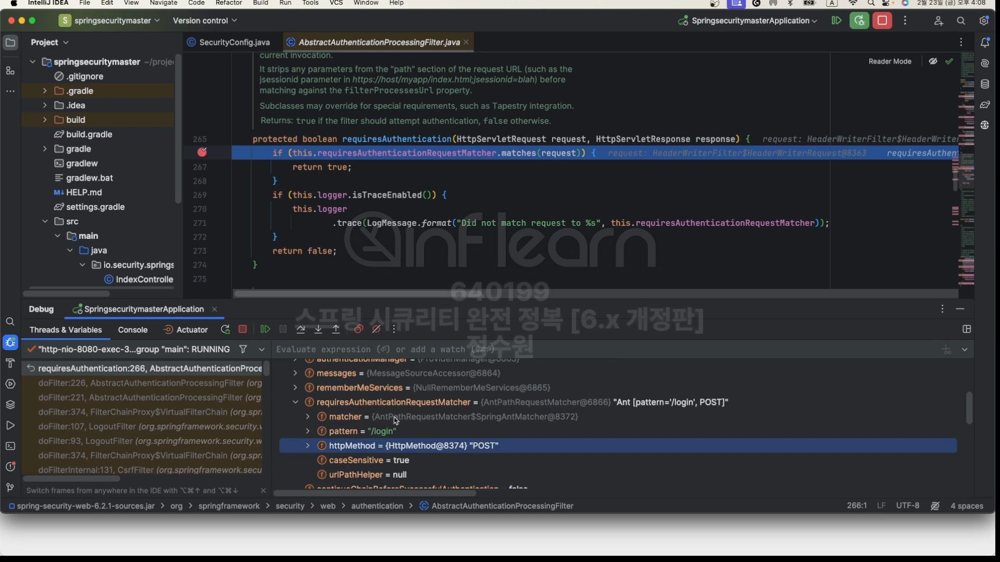
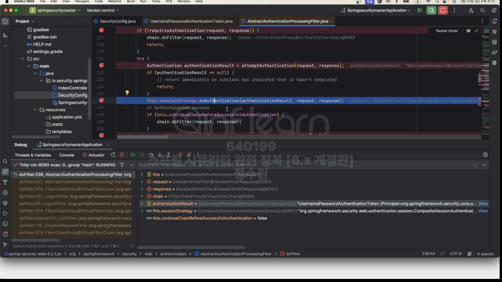
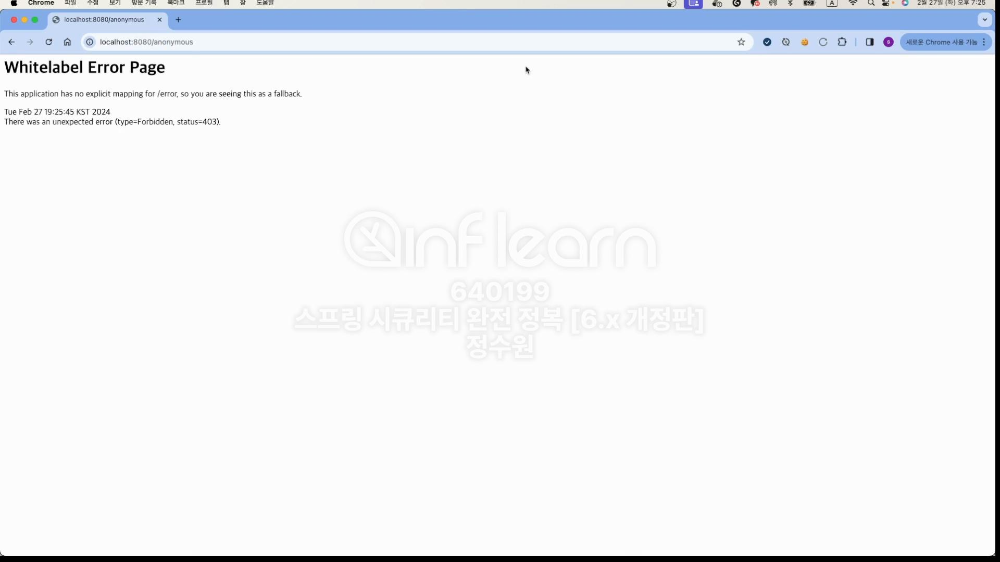

# 1. 폼 인증 - formLogin()
 

  
.failureHandler(AuthenticationFailureHandler) 
.successHandler(AuthenticationSuccessHandler) 
이게 맞는거임.
 

Customizer.withDefaults()가 보인다.  
  
여기서 어떤 api를 우리가 원하는 어떤 값으로 커스터마이징하고자 할 때 사용한다.  
  
저기 보면 usernameParameter, passwordParamter가 보인다. 이 값은  
  
여기에 즉, 로그인 화면에서 값을 넘기는 name에 사용된다. 그리고 action = "/loginProc" 또한 우리가 설정한 값이다.  
.defaultSuccessUrl의 true, false의 차이는 로그인이 성공했을 때 어디로 갈지의 차이다.  
true로 주면 어떤 경우에도 defaultSuccessUrl로 가고 false로 주면 로그인을 신청했던 경로로 간다.  
successHandler와 failureHandler는 이걸 깊이 파고들기 전에 사실은 defaultSuccessUrl과 failureUrl에서  
  
  
여기서 쓰고 있다. 그래서 우리가 만약 successHandler와 failureHandler를 정의 했다면 이게 우선시 된다.  

 
흐름을 잠깐 살펴보면 맨 처음

 
form로그인을 해서 여기로 왔다. 제일 먼저 FormLoginConfigurer<>()를 생성한다.  
  
여기로 가보면 가장 먼저 UsernamePasswordAuthenticationFilter 즉, 인증을 처리하는 필터가 필요하니 그걸 생성한다.  
그걸 부모에 전달한다. 부모 클래스는 AbstractAuthenticationFilterConfigurer이다. 그리고 이 부모 클래스에서  

defaultHandler가 지정돼 있고.  
  
기본적인 login 경로가 지정 돼 있다. 주의 깊게 봐야할 것이 init과 configure이다.  
  
  
 
init에선 updateAUthenticationDefaults()가 실행된다.  
  
loginProcessingUrl, failureUrl같은것들 설정.  
  

이번엔 configure  
  
configure에서 보통 인증필터 포함해서 여러가지 인증이나 인가 관련된 핵심적인 클래스, 객체들을 만들고  
공유하며 설정한다. 여기서 this.authFilter는 아까 FormLoginConfigurer에서 new UsernamePasswordAuthenticationFilter로 전달해준  
필터이다. 이 authFilter에다가 여러가지 설정을 하고 있다.

 
 
  
  
  
FormLogin인증 필터인 UsernameAuthenticationFilter에 대한 처리 과정을 따라가 보자.

일단
   
로그인 화면이 나왔다. 먼저 인증에 성공해보자.  
 현재 doFilter에 잡힌 클래스는 AbstractAuthenticationProcessingFilter이다.  
이 필터가 요청을 받았다. 처음 하는 일이 requireAuthentication이다. 즉 이 요청에 대해서 처리를 할 것이냐를 결정한다.  
만약 false면 pass한다.  

필터가 갖는 requestMatcher가 보인다. 그걸 보면 pattern이 "/login" 이고 httpMethod가 "POST"이다.  
이건 방금 우리가 요청한 방식과 똑같다. 그렇기 때문에 true를 반환한다.   그리고 바로 attemptAuthentication(request, response) 를 호출하는데 이건 
UsernamePasswordAuthenticationFilter에 재정의 돼있다.  
  
request 정보를 통해 username 정보를 가지고 오고 password 정보를 가지고 온다.  
그리고 이 정보를 UsernamePasswordAuthenticationToken에 저장한다.  
   
이건 따라가 보면  
  
Authentication 클래스를 구현했음. 그래서 인증객체를 만들어서 여기다가 username과 password를 넣고 있다.  
근데 아직 인증 전이라 메서드를 살펴보면 .unauthenticated() 이다.   
그리고 setDetails로 정보를 추가하고 authenticateManager를 통해서 authenticate()하면서 인증을 하라고 역할을 위임하고 있다. 
이 과정을 거치면 인증을 성공하던지 실패하던지 할것이다. 
지금은 인증에 성공할 것이다.  

인증에 성공했기 때문에 객체가 있다!  
들어있는 정보가 다르다. 아까는 username과 password만 있었는데 지금은 principal에 여러 정보가 저장돼 있다.  
근데 이 정보는 우리가  

 
입력한 정보이다.!  
그리고 우리가 인증에 성공했기 떄문에 우리는 session도 관리하겠다는 의미로  

요런것도 한다. 이게 위 그림의 SessionAuthnticationStrategy다.  
결국  

여기로 가게 된다면, 

SecurityContext를 하나 얻고,
  
DelegatingSecurityContextRepository로 보고 HttpSessionSecurityContextRepository로 세션에 저장을 한다.  
  
context에 담겨져 있는 인증 객체를 지금 세션에 저장한다. 이런식으로 인증상태를 유지 한다. 이 과정이 끝나고  
  
인증에 성공했다는 이벤트를 개시한다. 그리고 마지막으로 핸들러를 통해 인증 후의 작업을 처리한다.  
  
  
타겟 url 확인 이렇게 해서 인증에 성공했을 때의 과정을 살펴 봤다. 그렇다면 반대로 인증에 실패했을 때의 과정은 다 똑같다가  
  
여기로 넘어온다.  

 
컨텍스트가 삭제된다. 실패 핸들러를 통해서 로그인 에러 페이지로 이동한다.  
 
 
/anonymous로 접속해보자. 현재 
.anonymous(anonymous -> anonymous 
　　　.principal("guest") 
　　　.authorities("ROLE_GUEST") 
);  
로 권한을 GUEST로 주었기 때문에 @GetMapping("/anonymous")로 잘 도착한다. 
근데 인증을 받고나서 동일하게 /anonymous로 접근하면 

 
403 권한이 없다는 에러가 뜬다.  
근데 이제 /authentication에 인증을 한 상태로 접근을 하면
   
이렇게 not anonymous가 뜨는데 로그아웃하고 또 /authentication에 접근하면  
Authentication authentication의 authentication이 null이 되고 똑같이 not anoymous가 뜬다.
  
인증받지 못한 상태에서 /anonymousContext여기로 접근하면  
  
이렇게 들어간다. 이걸 가능하게 한 것이 @CurrentSecurityContext 이것이다.  
  
여기서 그 작업을 하고있다.

 

