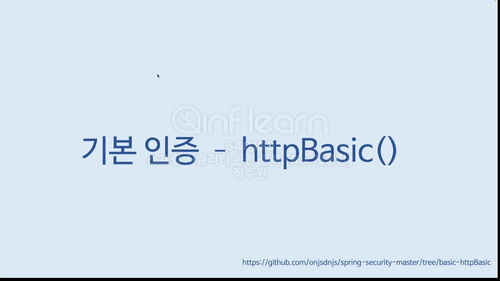
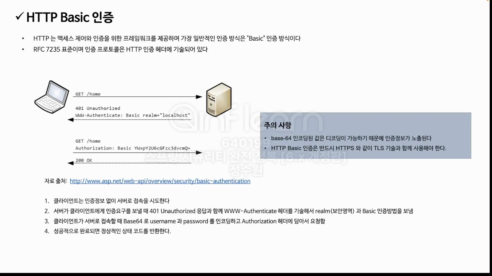
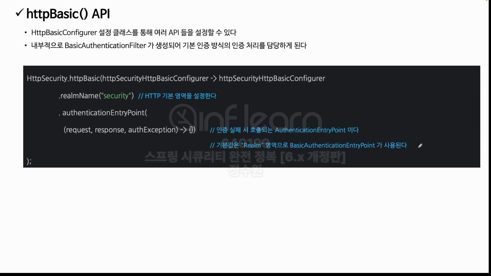
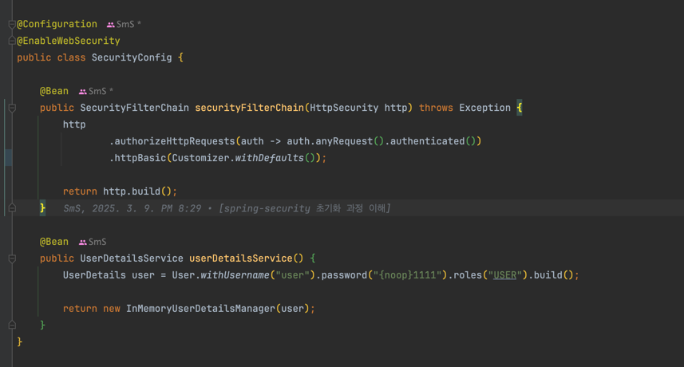
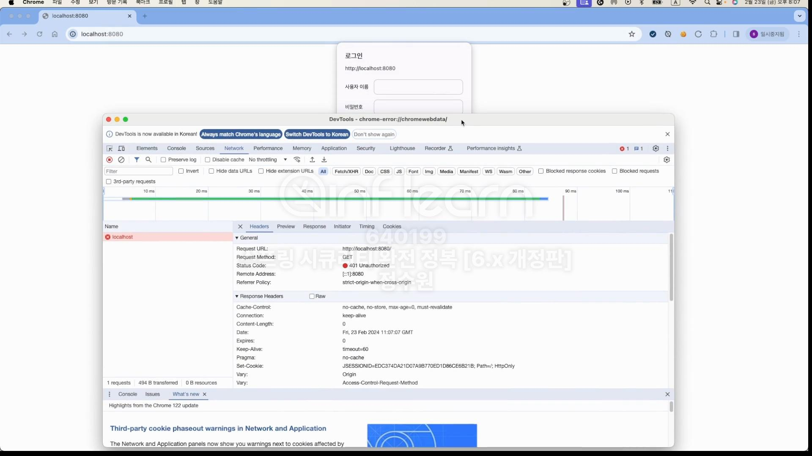
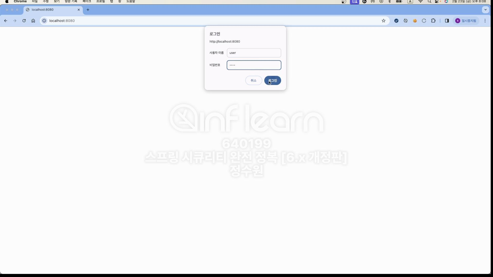
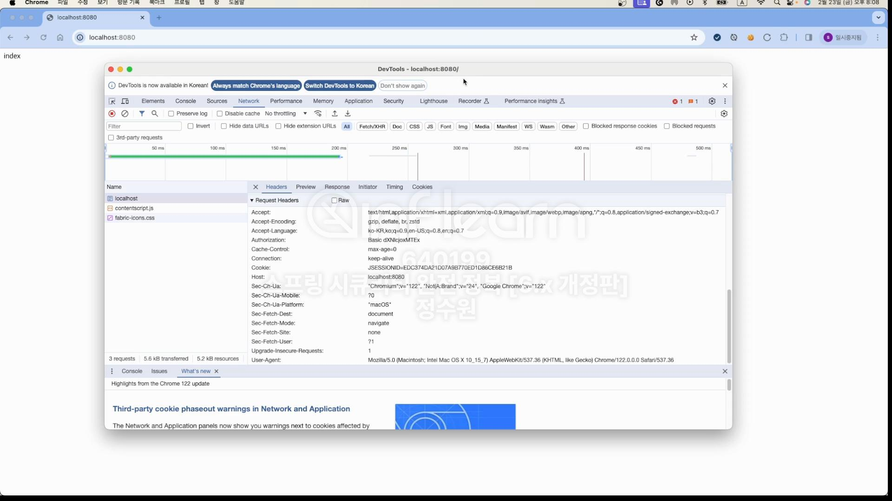
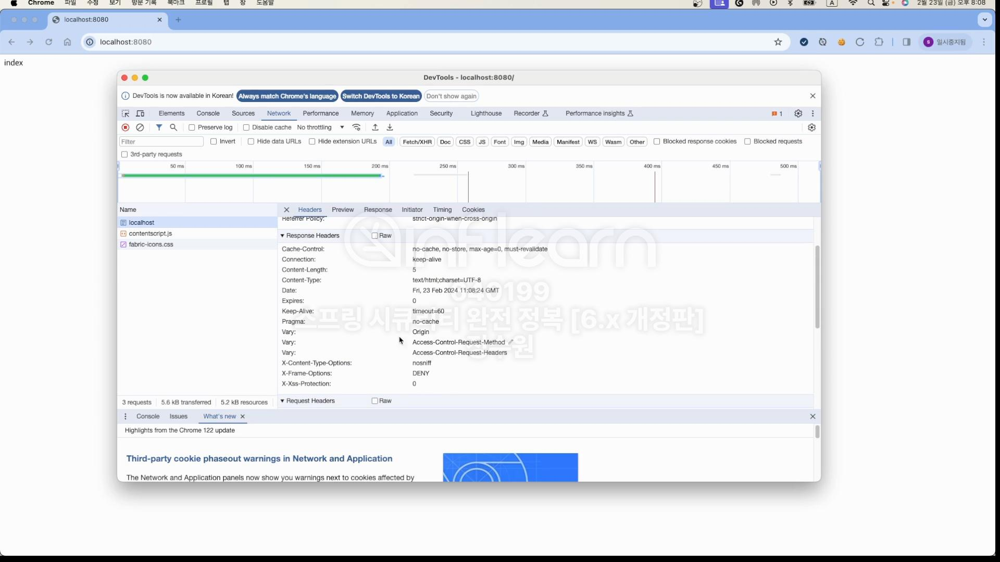
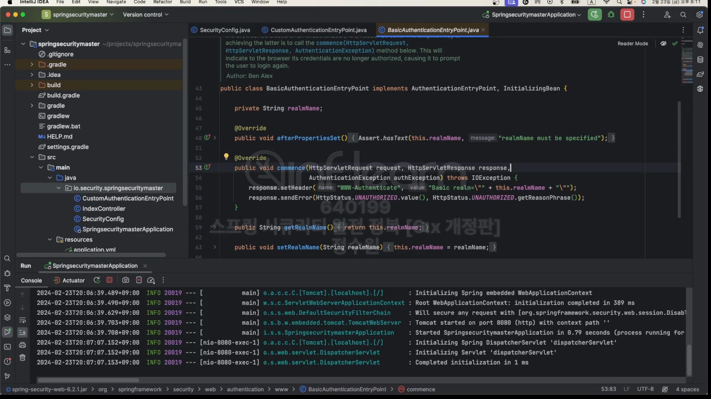
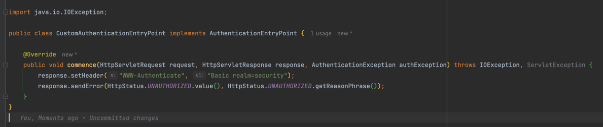

  
  
  
  
코드로 살펴보자.  
  
  
루트 경로로 접근을 했는데 접근하지 못하고 401이 뜸  
Www-Authenticate: Basic realm="Realm" 이 보인다. 
인증을 해야 함을 확인하고 Basic 방식으로 인증을 제공한 것이다.  

user, 1111을 확인하고 접속을 하게 되면, 인증이 된다.  
  
Authorization이 보인다. 그리고 Basic하고 입력한 값을 인코딩한 값들이 보인다.  
  
이렇게 Basic 인증방식이 처리가 되는 것이다.

그 전에 authenticationEntryPoint를 보자.  

security에서 사용하는 기본 구현체.  

이렇게 해보자. 근데 만약에 내가 WWW-Authenticate이걸 빼고 WW-Authenticate로 바꾸면  
client에서 이 헤더명을 인식하지 못함. 그래서 id,pw 그 창을 보여주지 못한다.

