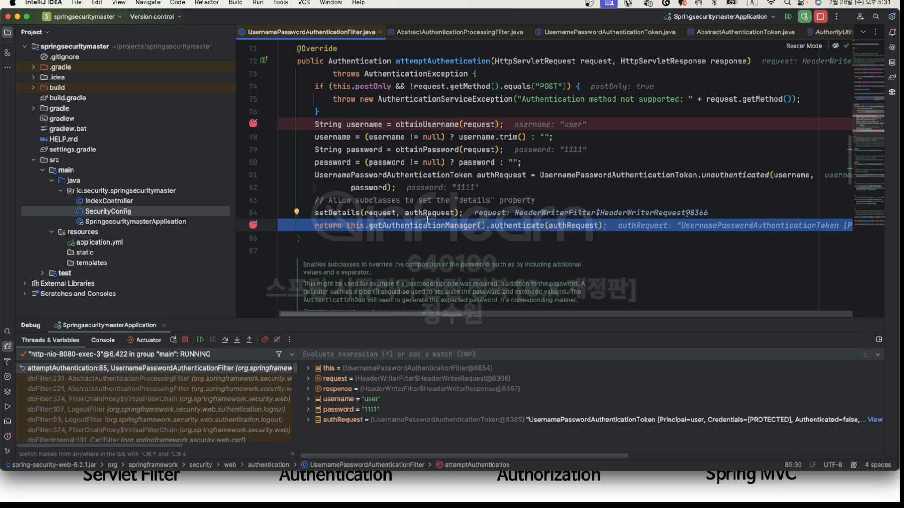

사용자가 요청을 하면  DelegatingFilterProxy가 이 요청을 Spring Container 쪽으로 넘겨준다.  
FilterChainProxy에다가 요청을 넘겨주고 여기서 이놈이 가지는 여러개의 시큐리티 필터들을 하나씩 호출하면서  
그러던 중 Authentication Filter를 호출한다. 그럼 이 AuthenticationFilter는 Authentication 객체를 만든다.  
이놈은 AuthenticationFilter가 사용자의 요청을 가지고 Authentication에 정보를 담는데 그 역할을 한다.  
그리고 쭉 가다가 또 쭉 가다가 오른쪽에 Authentication이 또 잇는데 이놈은 AuthenticationManager -> AuthenticationProvider로  
가다가 아때는 인증에 성공한 이후에 Authentication객체를 만든 후에 다시 Manager로 ruturn하는 것이다.  
AuthenticationManager는 AuthenticationProvider에게 사용자의 정보가 맞는지의 처리를 위임한다. AuthenticationProvider는  
UserDetailService를 통해서 사용자의 정보를 인증하기 위해 사용자의 정보를 가지고 온다. 그리고 UserDetailService는 처리를 한다음  
UserDetails를 반환한다. 이건 다시 AuthenticationProvider로 와서 사용자 객체가 null이거나 없으면 실패처리하면 되고 성공 했다면 다시  
AuthenticationProvider에서 Authentication을 만든다. 그때 이게 맞는지 확인하는 과정에서 PasswordEncoder를 통해서 확인한다.  
그리고 AuthenticationManager는 이 객체를 AuthenticationFilter까지 넘겨준다. 그렇게 되면 이 필터가 최종적으로 Authentication 이 객체를  
SecurityContext에 SecurityContextHodler를 통해서 저장하는 것이다. 그렇게 되면 SecurityContext에는 Authentication이 저장돼 있고  
Authentication에는 UserDetails가 저장돼 있다. 

**여기까지가 인증 process이다.**
 

 
코드로 보자.

처음 인증에 성공할 수 있게 로그인 해보자. 
  
이렇게 하면 현재는 아래 그림에서 FilterChainProxy를 거쳐서 AuthenticationFilter로 가려는 상황이다.  

위위 그림에서 attempAuthentication하면 아래 그림으로 간다.  
  
UsernamePasswordAuthenticationToken으로 들어가 보면  

AbstractAuthenticationToken을 상속받고 있고 또 이건 Authentication을 상속받고 있고 또 이건 최종적으로 Principal을 상속받고 있다. 

지금 보면 unauthenticated를 호출해서 저장을 하고 있다.  

그래서 지금 unauthenticated를 찾아들어가면 새로운 객체를 만들 때, 이름하고 비밀번호를 입력하고 있다.  
그리고 
 
현재 인증을 받기 전이니까 권한은 없다.  
  
이 인증 객체를 만들어서 AuthenticationManager에 주고 있다.  

순서를 보면 지금 이제 AuthenticationManager까지 옴.  
  
그리고 authenticate로 들어가보면  

이렇게 생겼다.  
그리고 이건 ProviderManager에 있고 이 클래스는 AuthenticationManager의 구현체이다.  

  
그리고 provider 이 클래스가 사용자의 인증 처리를 총괄하는 그런 클래스이다.  
그래서 이 클래스에 단지 위임하고 있다.  

그리고 지금 authenticate로 들어와있다.  
들어온 authenticate 객체를 가지고 위의 시큐리티 인증 / 인가흐름도의 그림의 AuthenticationProvider로 왔다.  
그리고 그 다음 UserDetailService를 이용한다. 우리는 지금 메모리에 정보를 하나 저장해 놓았다.  
  
저장돼 있는 모습.

그리고 UserDetailsService로 부터 사용자 정보를 하나 가지고 온다.  
 여기서걸국 getUserDetailsService()가  

이 정보를 가져오겠다는 소리다.  
그리고 이렇게 사용자 정보를 가져오면  
 
이제는 password만 검증하면 된다.  
 
이제  

패스워드 체크를 PasswordEncoder를 통해서 체크하면 된다.  
그리고 여기까지 하면 사용자의 검증이 끝난다.

그리고 인증에 성공하게 되면 또 다른 Authentication 객체를 만들게 된다. 근데 이 객체는 인증 성공한 최종 결과물을 저장한다. 
그리고 그 결과물의 하나는 User객체 와 또 하나는 권한에 관한 객체이다. 
User 객체가 위의 그림의 파라미터상 Principal이고 또 하나가 권한 정보이다. 그리고 이 정보들로 최종 리턴한다.  

최종적으로 리턴 됨. 그리고 이게 다시 역으로 AuthenticationFilter까지 전달 됨.  

그리고 이 정보를 다시 SecurityContext에 저장함.  
  

 

 