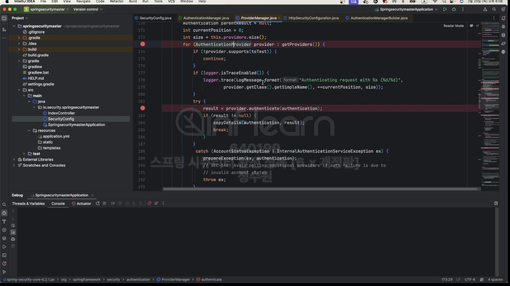
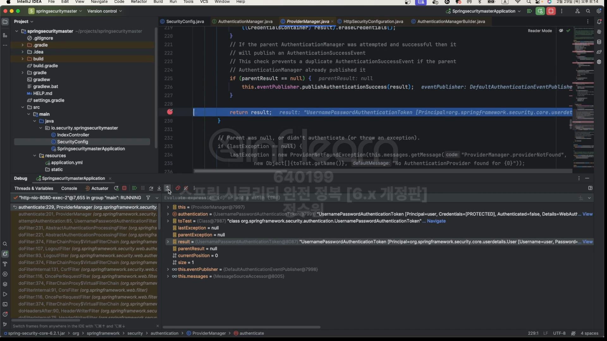
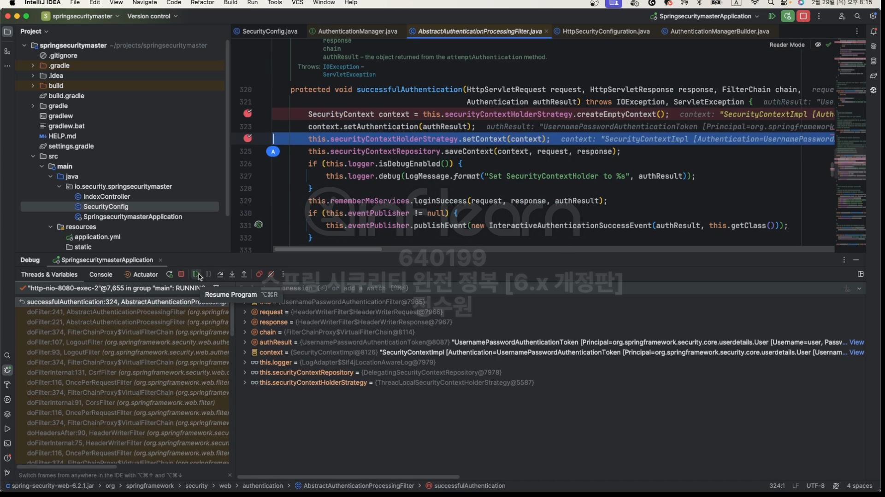
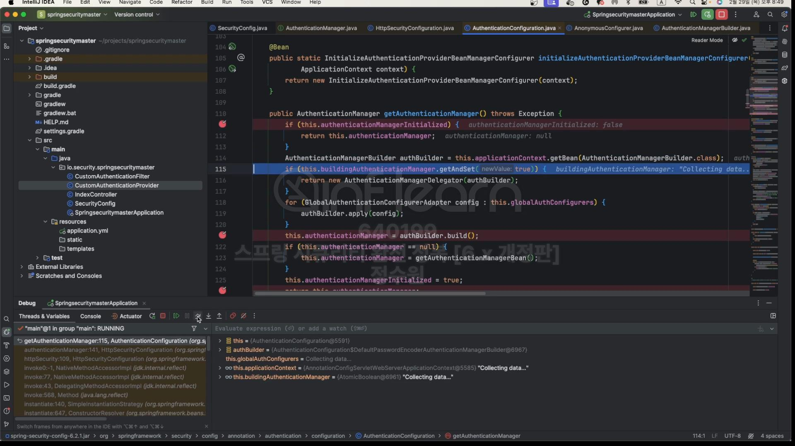

  
AuthenticationManager를 기준으로 그 위로는 인증받기 전 그 아래로는 인증받은 후이다. 

 

 

코드로 보자.
  
인터페이스이며 하나의 메서드가 정의 돼 있다. authenticate -> 인증을 수행하라. 인증 Filter로 부터 하나의 Authentication 타입의 객체를 전달 받는다.  
인증을 수행한 이후로는 다시 filter로 Authentication 타입의 객체를 반환해준다.  
여기 까지가 Authentication Manager가 하는 주된 역할이다.  
AuthenticationManager의 구형체중 ProviderManager를 주로 사용한다.  
  
providers가 있는데, AuthenticationProvider의 객체를 담을 수 있다.  
그래서 ProviderManager는 여러개의 AuthenticationProvider를 관리하고 그리고 이 provider에게 실제적인 인증 처리를 위윔한다. 
그리고 AuthenticationManager parent로 또 하나의 AuthenticationManager 타입의 객체가 있다.  
  
그리고 가장 중요한 authenticat()가 있는데 여기서 for 구문을 돌면서 인증 처리가 가능한 AuthenticationProvider를 하나 선택한다.  
그리고 그 provider에게 authenticate 처리를 위임한다.  

근데 result가 나오면 바로 for 구문을 나오고 한번 인증에 성공하면 그 즉시 빠져나와서 필터로 결과를 리턴한다.  
근데 result가 null이고 parent가 null이 아니면 혹시 parent가 가지고 있을 수 있으니까 parent에게 인증을 시킨다.  
  
그리고 그 결과가 정상적으로 나오면 필터에게 전달하고 역할이 끝난다.  
그런데 이것마저도 결과가 null이라면 lastException을 던진다.  

 

실제로 한번 보자. 
 
  
시작!  
  
인증 필터로 들어왔다. (form 인증 필터)  
authenticate()로 들어간다.  
  
  
  
AnonymousAuthenticationProvider 하나 밖에 없다.  
근데 parent에 DaoAuthenticationProvider가 하나 더 있다.  
AnonymousAuthenticationProvider 이건 못하고 DaoAuthenticationProvider가 이건 할 수 있다.  
for문에서 AnonymousAuthenticationProvider이건 통과하고  
  
실제적으로 인증을 처리하게 된다.
  
아래 디버그 창을 보면 this DaoAuthenticationProvider가 나와있다.  
   
최종성공하고 Authentication을 만들고 AuthenticationProvider는 Manager에게 다시 값을 리턴한다.  
  
result를 필터로 다시 전달하고 필터는 최종 인증에 성공한 결과를 가지고  
  
  
  
씨큐리티 컨텍스트에 저장하는 역할을 한다.

 

그럼 이제 AuthenticationManager 객체를 어떤 상황에서 우리가 필요로 할 때 어떻게 구해서 사용할 수 있는지 그 방법을 알아보자.  
그전에 AuthenticationManager 초기화 과정을 한번 살펴보자.  
서버를 기동하면 HttpSecurityConfiguration으로 온다.  
  
여기서 AuthenticationManagerBuilder authenticationBuilder = new DefaultPasswordEncoderAuthenticationManagerBuilder(
this.objectPostProcessor, passwordEncoder);  
AuthenticationBuilder를 만들고 있다.  
그리고 authenticationBuilder.parentAuthenticationManager(authenticationManager());로 parent를 설정하고 있다.   
authenticationManager() 그리고 AuthenticationManager 객체를 생성하고 있다.  
  
this.authenticationConfiguration.getAuthenticationManager()를 하고 있다.  
  
여기서 얻고 있는데  
AuthenticationManagerBuilder authBuilder = this.applicationContext.getBean(AuthenticationManagerBuilder.class);  
빈으로 있는지 먼저 찾아봤는데 빈으로 설정 돼 있음.   
근데 AuthenticationManager는 AuthenticationBuilder로 얻어진다. 근데 이미 authBuilder를 얻었다. 그래서 이 builder를 통해서 AuthenticationManager
를 생성할 수가 있다.  
  
 이 클래스가 AuthenticationManagerBuilder이다.  
그리고 여기에  

performBuil를 하기 전에 이걸 실행하면, AuthenticationProviders에 add하고 있다.   
  
그 객체는 DaoAuthenticationProvider 였다. 이 클래스는 초기화 과정에서 생성 됨 그 과정은 skip 
providerManager객체를 만들 때 AuthenticationManagerBuilder가 필요하니까 미리 넣어준거다.  
  
인자로 넣어주는 것을 확인할 수 있다.  
  
그리고 이 providerManager는 DaoAuthenticationProvider를 가지고 있는것을 확인할 수 있다.   
  
리턴해서 이제  
  
여기에 설정이 돼 있다.
  
그리고 HttpSecurity http = new HttpSecurity(this.objectPostProcessor, authenticationBuilder, createSharedObjects());  
이걸 보면 HttpSecurity를 생성하고 있는데  
  
여기보면 setSharedObject로 저장하고 있다.  
그리고 나서 최종적으로  
  
여기서 빌드를 한다.
이런식으로 Anonymous그것도 가져오게 된다. 
 

그럼 이제부터 AuthenticationManager를 가져와 보자.  
  
요로케 그리고 이제 CustomFilter를 이용해서 이 매니저를 통해 직접 CustomAuthenticationFilter를 통해 인증을 해보자.

  
호출 해보자.  

여기로 왔다.  
   
그리고 authenticationManager로 보낸다.  
  
그럼 우리가 아까 봤던 인증 절차대로 그개돌 수행하게 된다.  
  
Dao가 선택이 되고 인증처리가 된다. 이런식으로 할 수 있다.
 
 

  
이렇게도 할 수 있다. 

