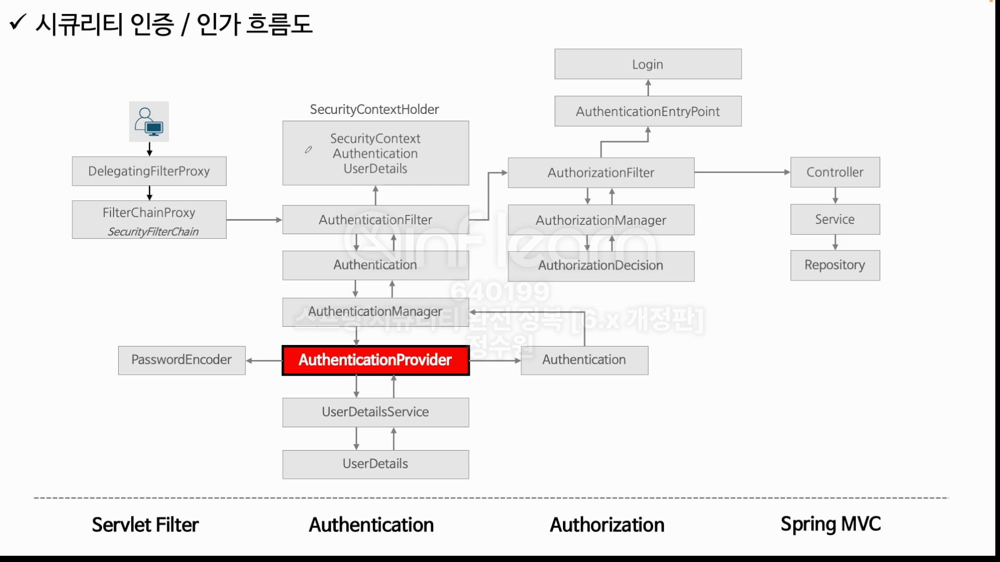
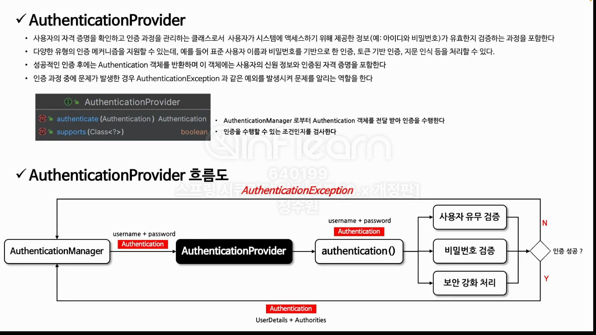
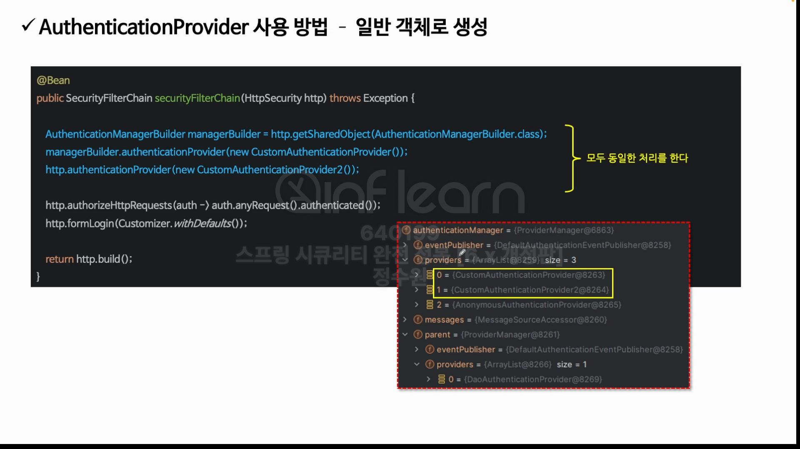
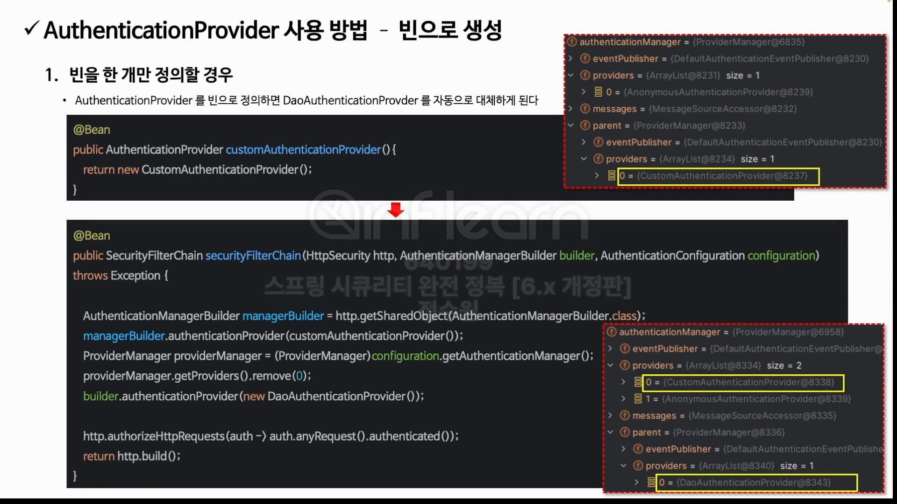
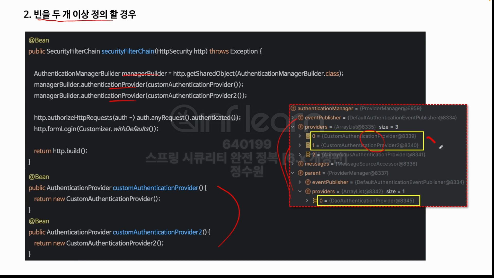
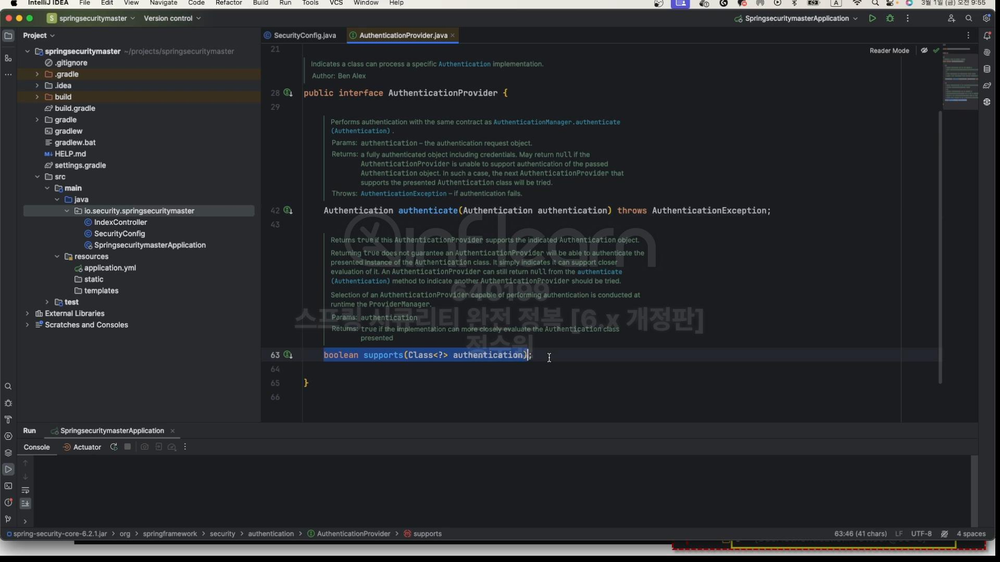
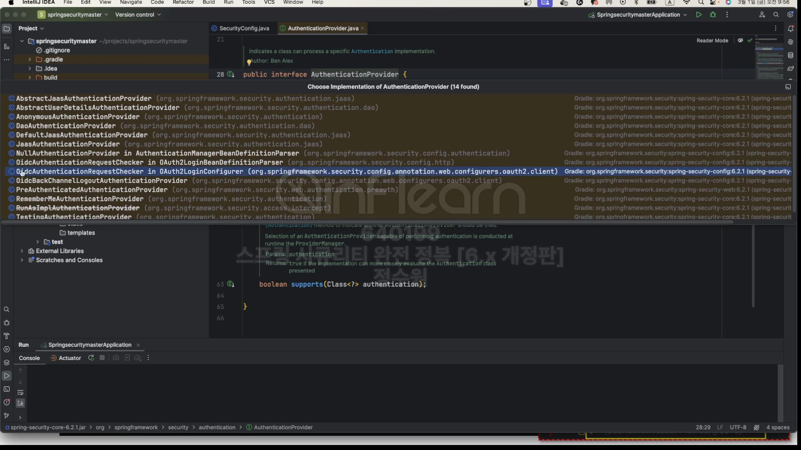

 
코드로 보자.

 
authentication 객체가 검증을 수행할 수 있는 적절한 객체인지를 supports에서 판단할 수 있다.
 

 
여러가지 종류의 AuthenticationProvider를 볼 수 있다. 그 중  
AnonymousAuthenticationProvider와 DaoAuthenticationProvider를 볼 수 있다.  

생성과정은 생략 궁금할 시, 인증 제공자 AuthenticationProvider - 2 참조
