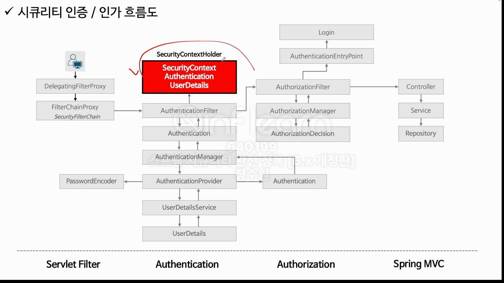
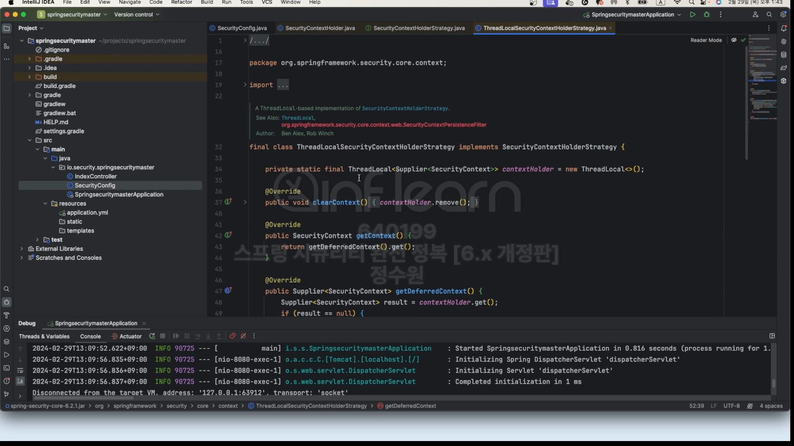

SecurityContextHolder와 SecurityContext의 구조를 보자. <br>
 <br>
SecurityContextHolder는 Security Context를 객체를 저장하거나 불러오는 API가 정의돼 있다. <br>
그런데 이 클래스 안에 정의가 되어있은 것은 아니다. 이 클래스가 가지고 있는 MODE_THREADLOCAL 과 같은 세가지 <br>
제작 패턴으로 활용되는 인터페이스가 있다. 그 인터페이스를 통해서 그런 작업을 하는것! <br>
 SecurityContextHolderStrategy가 있다. 이게 SecurityContext의 strategy를 제어하기 위한 전략 패턴으로 <Br>
사용되는 인터페이스이다. <br>
 <br>
여기에 6개 정도의 api가 정의 돼 있다. 근데 여기에는 getDeferredContext()가 있다. 이 값들은 반환값이 Supplier다. <br>
이것의 의미는 우리가 시큐리티 컨텍스트의 객체를 참조하거나 저장할 때 이전 버전에서는 바로 세션에서 저장하거나 꺼내왔다. <br>
그런데 모든 요청마다 그렇게 할 필요가 없이 일단 서플랄이어에 저장해 놓고 모든 요청이 아니라 어떤 필터에서 필요한 시점, 필요한 상황에서 <br>
서플라이어를 실행시켜서 꺼내 오겠다. 그런 의미다. <br> 약간의 생성 시점을 늦추는효과가 있다. (성능상의 이점) <Br>
<br>
그래서 SecurityContextHolder가 로딩이 되면 <br>
<br>
static {<br>
initialize();<br>
}
<br>
이 부분이 시작 된다. 그리고 초기화 될 때<br>
 <Br>
어떤 전략 패턴을 사용할 것인가가 여기서 정의해준다. 각각의 클래스 객체가 모드에 따라 생성해 준다. 기본은 MODE_THREADLOCAL이다. <br>
이걸 살펴보면<br>

ThreadLocal이 Supplier로 저장돼 있다. 
<br>
<br>

로그인을 해보자.<br>

로그인을 하면 어떻게 될까? 앞부분은 건너 뛰고 인증부터 보자. <br>
 <br>
authenticationManager로 들어가 보자. <br>
 <br>
ProviderManager는 AuthenticationManager를 상속받고 있다. 여기다 인증 처리를 위임한다. <br>

DaoAuthenticationProvider였다. daoAuthenticationProvider에게 Authentication 객체를 인자를 전달해서 인증 처리를 위임한다. <br>
 <br>
여기서 사용자 아이디와 비밀번호를 검증하는 최종 처리가 이루어진다. <br> 
위 authenticate(Authentication authenticataion)의 전문 <br>

```
@Override
	public Authentication authenticate(Authentication authentication) throws AuthenticationException {
		Assert.isInstanceOf(UsernamePasswordAuthenticationToken.class, authentication,
				() -> this.messages.getMessage("AbstractUserDetailsAuthenticationProvider.onlySupports",
						"Only UsernamePasswordAuthenticationToken is supported"));
		String username = determineUsername(authentication);
		boolean cacheWasUsed = true;
		UserDetails user = this.userCache.getUserFromCache(username);
		if (user == null) {
			cacheWasUsed = false;
			try {
				user = retrieveUser(username, (UsernamePasswordAuthenticationToken) authentication);
			}
			catch (UsernameNotFoundException ex) {
				this.logger.debug("Failed to find user '" + username + "'");
				if (!this.hideUserNotFoundExceptions) {
					throw ex;
				}
				throw new BadCredentialsException(this.messages
					.getMessage("AbstractUserDetailsAuthenticationProvider.badCredentials", "Bad credentials"));
			}
			Assert.notNull(user, "retrieveUser returned null - a violation of the interface contract");
		}
		try {
			this.preAuthenticationChecks.check(user);
			additionalAuthenticationChecks(user, (UsernamePasswordAuthenticationToken) authentication);
		}
		catch (AuthenticationException ex) {
			if (!cacheWasUsed) {
				throw ex;
			}
			// There was a problem, so try again after checking
			// we're using latest data (i.e. not from the cache)
			cacheWasUsed = false;
			user = retrieveUser(username, (UsernamePasswordAuthenticationToken) authentication);
			this.preAuthenticationChecks.check(user);
			additionalAuthenticationChecks(user, (UsernamePasswordAuthenticationToken) authentication);
		}
		this.postAuthenticationChecks.check(user);
		if (!cacheWasUsed) {
			this.userCache.putUserInCache(user);
		}
		Object principalToReturn = user;
		if (this.forcePrincipalAsString) {
			principalToReturn = user.getUsername();
		}
		return createSuccessAuthentication(principalToReturn, authentication, user);
	}
```
<br>

 <br>
최종적으로 인증객체를 만들고 이걸 다시 필터로 반환한다. <br>
여기로 반된다. <br>
 <br>
그리고 이건 다시 필터까지 전달된다. 아래 확인.<br>

이 결과를 SecurityContext에 저장해야 해서 successAuthentication(request, response, chain, authenticationResult); 이걸 호출한다.<br>
 <br>
context.setAuthentication(authResult); 실행한다. <br>
 <br>
지정 할 때 보면 SecurityContextImpl에 저장을 하고 있다. <br>

그리고 또 다시 this.securityContextHolderStrategy.setContext(context); <br>
<br>
 <br>
이 SecurityContext가 SecurityContextHolder에 저장 된다. 근데 이 ContextHolder가 클래스명을 보면 ThreadLocalSucurityContextHolderStrategy이다. <br>
 <br>
그림을 보면 Supplier로 감싸서 저장하는것을 확인할 수 있다. <br>
 <br>
 <br>
이렇게하면 이제 SecurityContext안에 인증 받은 최종 객체가 저장되어 있고 그 다음에 saveContext하면 <br>
 <br>
this.securityContextRepository에 2개의 구현체가 있는데 하나는 HttpSessionSecurityContextRepository, 즉 세션에 컨테스트를 저장하는 레퍼지토리이고, <br>
또 하나는 RequestAttributeSecurityContextRepository 요청 객체에 Security Context를 저장하는 레퍼지토리 이다. <br>
지금은 HttpSessionSecurityContextRepository 이걸 사용해서 HttpSession에 저장
<br>

이제 인증을 마치고 다시 접속했을 때 어떻게 흐름이 이루어지는지 간단하게 살펴보자. <br>
 <br>
인증을 받은 상태에서 다시 root로 접근한다. <br>
 <br>
이놈이 호출 된다. 근데 이건 <br>
 <br>
여기서 호출했다. <br>
다시 한번 보면 <br>
 <br>
저기 보면 supplier에 HttpSessionSecurityContextRepository, RequestAttributeSecurityContextRepository가 있고 결론적으로 여기서 가져 오겠다는<br>
소리이다. 이렇게 result를 가져와서 <br>
 <br>
어떤 처리를 한다.  <br>

<br>

 <br>
이렇게 사용할 수 있다. <br>

```java
        @Service
public class SecurityContextService {

 public void securityContext() {
  SecurityContext securityContext = SecurityContextHolder.getContextHolderStrategy().getContext();
  Authentication authentication = securityContext.getAuthentication();
  System.out.println("authentication = " + authentication);
 }
}
```
이런걸 만들고 <br>

```java
   @Autowired SecurityContextService service;

    @GetMapping("/")
    public String index() {
        SecurityContext securityContext = SecurityContextHolder.getContextHolderStrategy().getContext();
        Authentication authentication = securityContext.getAuthentication();
        System.out.println("authentication = " + authentication);

        service.securityContext();

        return "index";
    }
```
<br>
이렇게 쓸 수도 있다. <br>


 


 


 


