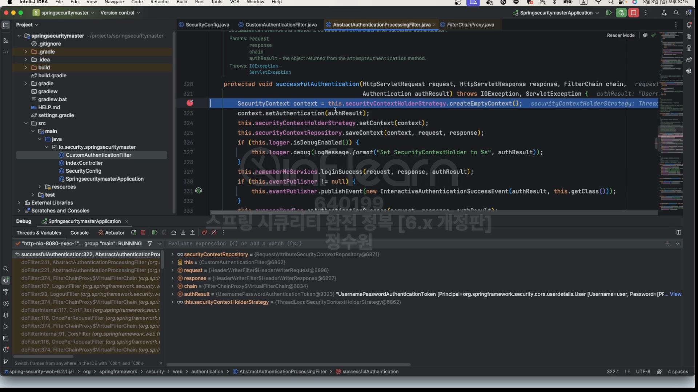

스레드 풀의 경우 반드시 필요하다는 이유는 SecurityContext의 생명 주기와 관련이 있다.<br>
SecurityContext의 생명 주기는 Request이다. 즉, 요청이 시작 될 때 세션으로부터 꺼내어 사용하고 요청이 끝나면 <br>
삭제하는 것이다. 그런데 왜 굳이 삭제를 할까? 그 이유는 스레드와 Request와의 관계에 있다. 스레드와 Request는 1:1 매핑 관계인데 <br>
사용자는의 스레드는 풀 개념으로 순환되기 때문에 한 사용자가 다른 사용자과 동일한 스레드를 사용하게 될 가능성이 있다. <br>
그런데 그렇게 되면 인증 된 SecurtyContext가 인증이 안된 사용자에게 갈 수 있기 때문에 SecurityContext는 반드시 삭제 되어야한다. <br>
SecurityContext 는 스레드마다 가지고 있는 스레드로컬에 저장되기 때문에 스레드 풀로 운영되는 서버에서는 여러 사용자가 동일한 스레드를 공유할 수 있다는 문제가 존재한다.
<br>


1. SecurityContextHolderFilter의 목적은 SecurityContext를 꺼내 와서 SecurityContextHolder에 저장하는 것이 목적이다. <br>
2. SeucirtyContextPersistenceFilter는 SecurityContextHolderFilter와 동일하지만 SecurtyContextRepository.saveContext() 와 동일하지만<br>
   하나가 더 있다. 
<br>


<br>

코드로 살펴보자.
SecurityContext의 설정 클래스부터 보자. <br>
SecurityContextConfigurer, 설정 클래스는 init과 configure 두개의 메서드가 생성 과정에서 호출된다. <br>

그래서 configure 호출 될 것이다. init 메서드는 아직 정의가 안 되어 있다. <br>
실행을 시키면 configure가 호출된다. <br>
 <br>
먼저 getSecurityContextRepository()를 통해 SecurityContextRepository 객체를 가지고 오고 있다. <br>

객체가 공유가 되고 있는지확인 하는데 이미 공유가 되어 있다. 다른 설정 클래스에서 이미 만든것!
 <br>
securityContextRepository 아래 delegates라는 이름으로 HttpSessionSecurityContextRepository, RequestAttributeSecurityContextRepository <br>
가 저장 되어 있다. 궁극적으로는 securityContextRepository를 가지고 와서 <br>

requireExplicitSave가 true일 경우에 (기본이 true로 설정 되어 있음) <br>
SecurityContextHolderFilter를 만들어서 이 filter에 SecurityContextRepository를 저장 하겠다. 즉 명시적으로 SecurityContext를 사용하기 위한 <br>
저장소를 가져야한다는 것이다. <br>
두번째 설정 클래스로 오면 <br>

FormLoginConfigurer이다. 여기서도 configure 호출. 여기서 여러 작업을 하지만 <br>
 <br>
로직을 보면 <br>

UsernamePasswordAuthenticationFilter에도 securityContextRepository를 저장하고 있다. 왜 저장을 할까?<br>
폼 인증 필터도 인증이 끝나고 나서는 SecurityContext를 Session에 져장하기 때문이다. 그렇기 때문에 SecurityContextRepository가 필요한것이다. <br>
여기까지 하고 일단 초기화 과정이 끝난다.

<br>

이제 1. 익명 사용자가 요청할 경우, 2. 익명 사용자가 인증을 요청할 경우, 3. 인증이 끝나고 인증을 요청할 경우의 <br>
과정을 살펴보자. <br>

<br>

1. 익명 사용자 
<br>


<br>
SecurityContextHolderFilter에 왔다. 
 <br>
이 필터는 모든 요청에 대해서 매 요청마다 수행이 되는 필터이다. <br>
이 필터는 설정에서 이미 DelegatingSecurityContextRepository를 가지고 있다!.
 <br>
그래서 처음에 this.securityContextRepository.loadDefferedContext(request);로 SecurityContext를 가지고 온다. <br>
어디서? 저장소로부터. 근데 그 저장소는 하나가 세션이고 다른 하나는 요청 객체이다. 근데 지금은 Session에 저장이 안돼 있다. <br>
 <br>
그런데 이게 Supplier로 되어 있다. 이 말은 지금 당장 세션으로부터 SecurityContext가 있는것을 확인하지 않겠다는 것이다. <br>
이건 supplier를 사용하는 시점에 하겠다는 것이다. <br>
그래서 지연된 로딩이라 하는것! 그래서 return new SupplierDefferedSecurityContext(supplier, this.securityContextHolderStrategy); <br>
를 통해서 값을 반환하는데  <br>
 
지금은 httpSecurity로부터 가지고 오고 <br>

그 다음은 RequestAttributeSecurityContextRepository로부터 가지고 온다. <br>
 <br>
이놈도 Supplier로 반환. <br>

session과 request의 두개 contextRepository를 다 탐색해서 반환한다. <br>

그럼 defaultContext는 하나는 세션으로부터, 또 하나는 request로부터 감싼 컨텍스트가 있는것이다.

그리고 설정하고 다음 필터에 넘겨준다. 그리고 finally 부분은 요청이 끝나고 응답할 때 실행이 된다. 

그래서 요청에 대해서는 이런 작업이 수행된다. 글리고 다시 chain.doFilter실행. <br>
근데 지금 익명 사용자이기 때문에 익명 사용자는 AnonymousAuthenticationFilter로 간다. <br>
 <br>
defferedContext에는 Session과 Request의 Repository가 들어있다. 설정만 하고 또 다시 chain.doFilter로 넘긴다. <br>
그래서 SecurityContext안에 있는 Authentication 즉, 인증 객체가 필요한 것이다. SecurityContext 자체는 그 자체로서 중요한것은 아니다. <br>
우리가 스프링 시큐리티에서 인증을 받거나 체크하거나 저장하는 핵심 객체는 Authentication이다. 이 자체가 우리가 필요로하는 최종적인 목표다. <br>
그 말은 SecurityContext를 Supplier로 감싸고 있다고 해서 바로 실행할 필요는 없다는 말이다. 그럼 언제 실행을 할까? 그 시점은 Authentication이 필요한<br>
시점이다. 그렇기 때문에 AnonymousAuthentication Filter에서도 설정만 하고 chain.doFilter를 통해 넘기고 있다. <br>
그런데 언젠가는 실행할 것이다. 바로 한번 보자. <Br>
 <br>
바로 여기다. 이 필터는 Authorization Filter이다. 즉, 권한과 관련된 필터이다. 근데 여기서 this.securityContextHolderStrategy.getContext().getAuthentication(); <br>
을 통해서 Authentication을 가지고 오고 있다. <Br>
가져오는 이유는 해당 요청의 사용자가 어떤 인증과 관련된 객체를 가지고 있는지를 확인해서 사용자가 원하는 endpoint에 대해 승인을 할지 거절을 할지 이 필터가 <br>
판단을 하는것이다. 그래서 getContext().getAuthentication()을 하게 되면 Supplier들이 호출이 되는것이다.
<br>
시간상 지금 다 보진 않을것이다. 지금은 AnonymousAuthenticationFilter에서 하는 작업만 보자. <br>
 <br>
이곳으로 왔다. 이게 왜 실행이 될까? 이 작업은 <br>
 <br>
이곳에서 한 것이다. <br>
여기서 들어가보면 <br>
 <Br>
Supplier<SecurityContext> supplier = () -> readSecurityContextFromSession(request.getSession(false)); <br>
여기서 Supplier로 감싸고 있다. 지금 그래서 supplier에서 get을 하니까 호출 된 것이다. <br>
 <br>
그런데 세션은 당연히 없다. 왜냐? 인증 받은 사용자가 당연히 없기 때문에 <br>
 <br>
그리고 또 session에 없으니까 request 객체를 봐야한다. <br>
 <br>
currentAuthentication이 null이라서 <br>
 <br>
하나의 새로운 AnonymousAuthenticationToken을 만든다. <br>
 <br>
그렇게 익명 사용자 토큰을 만들어서 
SecurityContext anonymousContext = this.securityContextHolderStrategy.createEmptyContext(); <br>
anonymousContext.setAuthentication(anonymous)를 통해 저장해 주고 있다. <br>

조금 과정들이 복잡해 보이지만 결론은 익명 사용자는 새로운 객체를 만들어서 SecurityContext에 저장한다. <br>
그리고 인증된 사용자는 Session에 저장했다면 Session으로부터 가져와서 SecurityContext에 저장한다. <br>

<br>

그리고 이걸 만들었으면 <br>
 <br>
그걸 이제 사용하겠쬬? 어디서? 
 <br>
쭉쭉 따라가보면 <br>
 


<br>
아까 권한을 처리하는 필터에서 사용한다. 이후의 과정은 알 필요가 없다. <br>
 <br>
그리고 이제 요청이 끝나면, 요청에 응답할 때 finally해서 Context를 삭제한다. <br>
 <br>
그리고 다시 요청이 온다. 이 요청은 어떤 요청일까? 이 요청은  "/login" 페이지로 가는 요청이다. <br>
이 과정은 skip
<br>

2. 인증 사용자

 <br>
 <br>
결국 이 과정도 Supplier를 가져 온다. <br>
 <br>
그리고 과정이 끝나고  <Br>

this를 보면 UsernamePasswordAuthenticationFilter로 온것을 볼 수 있다. <br>
 <br>
HttpSessionSecurityContextRepository, RequestAttributeSecurityContextRepository를 둘 다 볼 수 있다. <br>
이 객체 두개를 다 저장했기 때문에 이 객체 상에서 지금 최종 성공한 SecurityContext를 저장하고 있는 것이다. 그럼 Session에 저장할 것이다. <br>
 <Br>
Delegating해서 하나씩 저장할 것이다. 현재 delegate는 HttpSessionSecurityContextRepository이다. <br>


그래서 결국은  <br>
 <br>
 <br>
세션에 저장하는 부분까지 온다. 그러면 이제 세션에 저장하고 응답한다. <br>
 <br>
이 부분은 필수 그리고 세션에 저장한 다음 다시 응답하게 되면 root로 오게 설정해 놨다. <br>
 <br>
다시 root로 왔다. 이제는 인증을 받은 상태이다. session에 SecurityContext가 저장돼 있는 상태이다. 이제 Session으로부터 SecurityContext를 꺼내 올 수 있다. <br>


<br>
이제 아까처럼 AuthorizationFilter로 가서 가지고 올 것이다. <br>
이때 session으로 부터 가지고 올 것이다. Supplier로 감싸져 있는 <br>
 <br>
 <br>
이번에는 session이 null이 아니다. 그래서 이 값들을 이제 가져올 수 있다. <br>


 <br>
그래서 인가 필터에서 <br>
 <br>
이런 정보들을 
 <br>
 <br>

 <br>
사용자의 접근을 허가할 것인지 거부할 것인지를 판단할 수 있게 된다.


 <br>
자 왔다. 현재 인증 객체가 근데 Supplier로 되어 있다. <br>
자 이렇게 하는 이유는 성능 때문인다. 필요 시점에 가지고 오겠다. <br>
<br>
이렇게 인증 후 처리까지 하고 끝난다. <br>

<br>
직접 만들어보자.

```java
package io.security.springsecuritymaster;

import org.springframework.context.annotation.Bean;
import org.springframework.context.annotation.Configuration;
import org.springframework.security.authentication.AuthenticationManager;
import org.springframework.security.config.Customizer;
import org.springframework.security.config.annotation.authentication.builders.AuthenticationManagerBuilder;
import org.springframework.security.config.annotation.web.builders.HttpSecurity;
import org.springframework.security.config.annotation.web.configuration.EnableWebSecurity;
import org.springframework.security.core.userdetails.UserDetailsService;
import org.springframework.security.web.SecurityFilterChain;
import org.springframework.security.web.authentication.UsernamePasswordAuthenticationFilter;

@Configuration
@EnableWebSecurity
public class SecurityConfig {

    @Bean
    public SecurityFilterChain securityFilterChain(HttpSecurity http) throws Exception {
        AuthenticationManagerBuilder builder = http.getSharedObject(AuthenticationManagerBuilder.class);
        AuthenticationManager authenticationManager = builder.build();

       http.authorizeHttpRequests(auth -> auth
                       .requestMatchers("/api/login").permitAll()
                       .anyRequest().authenticated())
               .formLogin(Customizer.withDefaults())
               .authenticationManager(authenticationManager)
               .addFilterBefore(customAuthenticationFilter(http, authenticationManager), UsernamePasswordAuthenticationFilter.class)
       ;


        return http.build();
    }

    public CustomAuthenticationFilter customAuthenticationFilter(HttpSecurity http, AuthenticationManager authenticationManager) {
        CustomAuthenticationFilter customAuthenticationFilter = new CustomAuthenticationFilter(http);
        customAuthenticationFilter.setAuthenticationManager(authenticationManager);

        return customAuthenticationFilter;
    }


    @Bean
    public UserDetailsService userDetailsService() {
         return new CustomUserDetailsService();
    }
}

```
```java
public class CustomAuthenticationFilter extends AbstractAuthenticationProcessingFilter {

    private final ObjectMapper objectMapper = new ObjectMapper();

    public CustomAuthenticationFilter(HttpSecurity http) {
        super(new AntPathRequestMatcher("/api/login", "POST"));
    }

    @Override
    public Authentication attemptAuthentication(HttpServletRequest request, HttpServletResponse response) throws AuthenticationException, IOException, ServletException {
        String username = request.getParameter("username");
        String password = request.getParameter("password");

        UsernamePasswordAuthenticationToken token = new UsernamePasswordAuthenticationToken(username, password);

        return this.getAuthenticationManager().authenticate(token);
    }
}
```

<br>
우리가 이 상태에서 인증을 하게 되면, 인증은 될 것이다. 그런데 인증 상태가 지속은 안될것이다. <br>
디버깅해서 확인해보자. 우선 FilterChainProxy를 보면 하단 쪽에 nextDoFilter가 있다. <br>

 <br>
요청을 해보자.

왔다.
 <br>
 <br>
우리가 만든 필터가 7번째로 들어가 있는것을 확인할 수 있다. <br> 
그리고 이 필터는 <br>

AbstractAuthenticationProcessingFilter를 상속 받았기 때문에 최종 인증에 성공한 이후에는 <br>
 <br>
이곳으로 올것이다. <br>
 <br>
CustomAuthenticationFilter 차례가 오면! <br>
 <br>
이리로 왔다. 최종적으로 성공할 것이다. <br> 
 <br>
그리고 여기로 왔다. 근데 우리가 AbstractAuthenticationProcessingFilter를 상속받았다면 이 클래스는 내부적으로 <br>
private SecurityContextRepository securityContextRepository = new RequestAttributeSecurityContextRepository();를 가지고 있다.<br>
즉, 요청 객체에다가 SecurityContext를 저장하는 객체를 가지고 있다. 즉, 기본적으로는 Session이 아니라 Request에 저장하는 객체가 사용된다. <br>
 <br>
(RequestAttributeSecurityContextRepository)<br>
그래서 저장 하는 곳으로 가보면<br>
 <br>
이렇게 되있는데 요청이 끝나게되면 이정보가 날라간다는 의미이다. 그 다음 요청은 새로운 요청이기 때문에 공유가 안됨.<br>
그렇기 때문에 성공을 헀는데도 불구하고 <br>

그래서 이 모든 과정이 끝나고 나서도 <br>


<br>
targetUrl이 root다. 근데 root는 인증을 받지 못하면 <br>
 <br>
접근이 안된다. <br>
근데 우리가 지금 인증을 받았는데 그러면 root로 가는게 맞는데 <br>
 <br>
가지 못하고 아래와 같이 Login이 뜬다. <br>
 <br> 
인증을 받았음에도 login이 뜨는 이유는 인증을 받았을 때 SecurityContext가 Session이 없다보니까 새로운 요청 객체가 생성 되는것이다. 그리고 새로운 SecurityContext <br>
가 생성되는데 그 안에는 당연히 Authentication이 존재하지 않는다. <br>
과거에는 이렇지 않았다. 과거에는 SecurityContext를 세션에 저장하는 처리를 하지 않아도 자동으로 저장해줬기 때문에 인증이 되고 나서는 다시 인증을 받을 필요가 없게 해줬다. <br>
그럼 이제 다시 보자. <br>
```java
@Bean
    public SecurityFilterChain securityFilterChain(HttpSecurity http) throws Exception {
        AuthenticationManagerBuilder builder = http.getSharedObject(AuthenticationManagerBuilder.class);
        AuthenticationManager authenticationManager = builder.build();

        http.authorizeHttpRequests(auth -> auth
                        .requestMatchers("/api/login").permitAll()
                        .anyRequest().authenticated())
                .formLogin(Customizer.withDefaults())
                .securityContext(securityContext -> securityContext.requireExplicitSave(false))
                .authenticationManager(authenticationManager)
                .addFilterBefore(customAuthenticationFilter(http, authenticationManager), UsernamePasswordAuthenticationFilter.class)
        ;
        
        return http.build();
    }
```
<br>
.securityContext(securityContext -> securityContext.requireExplicitSave(false))를 추가해 줬다. 
<br>
다시 해보면 <br>


root로 잘 간다. 왜 일까? 자동적으로 해준다는 것이다. debug해보자. 
 <br>
this.requireExplicitSave가 false다. <br>

그래서 SecurityContextPersistenceFilter가 생성이 되는 것이고 이 필터가 동작이 된다. <br>
 <br>
그런데 이 필터는 finally에서 this.repo.saveContext(contextAfterChainExecution, golder.getRequest(), holder.getResponse()); <br>
를 해주고 있다. 근데 여기서 repo는 기본적으로 <br>
 <br>
세션을 들고 있다. 그래서 세션에 저장을 한다. <br>
 <br>
끝나고 나서 <br>
 <br>
저장을 한다. 당연히 세션에 <br>
 <br>
그래서 다음에 세션에서 꺼내 쓸 수 있는것이다. 
근데 굳이 .securityContext(securityContext -> securityContext.requireExplicitSave(false)) 이걸 사용하지 않아도 우리가 직접 세션에 저장할 수 있다. <br>
<br>

그걸 해보자. <br>
```java
public class CustomAuthenticationFilter extends AbstractAuthenticationProcessingFilter {

    private final ObjectMapper objectMapper = new ObjectMapper();

    public CustomAuthenticationFilter(HttpSecurity http) {
        super(new AntPathRequestMatcher("/api/login", "POST"));
        setSecurityContextRepository(getSecurityContextRepository(http));
    }

    public SecurityContextRepository getSecurityContextRepository(HttpSecurity http) {
        SecurityContextRepository securityContextRepository = http.getSharedObject(SecurityContextRepository.class);
        if (securityContextRepository == null) {
            securityContextRepository = new DelegatingSecurityContextRepository(
                    new RequestAttributeSecurityContextRepository(), new HttpSessionSecurityContextRepository()
            );
        }

        return securityContextRepository;
    }

    @Override
    public Authentication attemptAuthentication(HttpServletRequest request, HttpServletResponse response) throws AuthenticationException, IOException, ServletException {
        String username = request.getParameter("username");
        String password = request.getParameter("password");

        UsernamePasswordAuthenticationToken token = new UsernamePasswordAuthenticationToken(username, password);

        return this.getAuthenticationManager().authenticate(token);
    }
}

```
이렇게 하면 된다.


