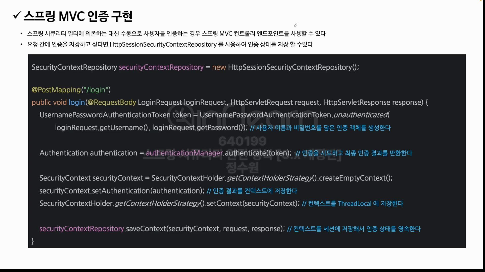

 <br>
근데 클라이언트가 "/login"으로 요청을 하면 Spring Security에서 문제가 될까? 문제가 된다. <br>
왜냐하면 기본적으로 Post방식으로 로그인 요청을 하면 UsernamePasswordAuthenticationFilter가 동작한다. 그래서 컨트롤러로 오기전에 이 필터가 <br>
동작을 하게 되고 컨트롤러 자체로 오지 않는다. <br> 
그렇다면 이 필터를 disable해야한다.

<br>
이제 코드를 보자. 기억해 보면 우리가 form인증을 할 때 그 인증 필터가 가장 먼저 사용자의 이름과 패스워드를 인증 객체에 담았다. 그게 첫번째고 코드에선 <br>

```java
UsernamePasswordAuthenticationToken token = UsernamePasswordAuthenticationToken.unauthenticated(
        loginRequest.getUsername(), loginRequest.getPassword()
);
```
이 코드이다. 

그리고 두번째로 인증 객체를 인증을 수행하도록 
```java
authenticationManager.authenticate(token);
```
authenticationManager에게 인증을 시도한다. 그리고 Authentication 타입으로 반환한다. <br>

그리고 인증에 성공한 이후에 Authentication객체를 SecurityContext에 저장을 해야한다. 왜? 인증 상태를 유지해야하니까. <br>

```java
SecurityContext securityContext = SecuritSecurityContextHolder.getContextHolderStrategy().createEmptyContext();
// 새로운 SecurityContext를 만들고 
securityContext.setAuthentication(authentication);
// 그리고 지금 securityContext안에 인증 객체를 저장한다. 
SecurityContextHolder.getContextHolderStrategy().setContext(securityContext);
// 그리고 ThreadLocal에 저장한다.

securityContextRepository.saveContext(securityContext, request, response);
// 매 요청마다 인증을 필요치 않게 하기 위해 securityCcontext를 세션에 저장한다. 
```

```java
@RestController
@RequiredArgsConstructor
public class LoginController {

    private final AuthenticationManager authenticationManager;
    private final HttpSessionSecurityContextRepository securityContextRepository = new HttpSessionSecurityContextRepository();

    @PostMapping("/login")
    public Authentication login(@RequestBody LoginRequest loginRequest, HttpServletRequest request, HttpServletResponse response) {
        UsernamePasswordAuthenticationToken token =
                UsernamePasswordAuthenticationToken.unauthenticated(loginRequest.getUsername(), loginRequest.getPassword());

        Authentication authentication = authenticationManager.authenticate(token);
        SecurityContext securityContext = SecurityContextHolder.getContextHolderStrategy().createEmptyContext();
        securityContext.setAuthentication(authentication);

        SecurityContextHolder.getContextHolderStrategy().setContext(securityContext);

        securityContextRepository.saveContext(securityContext, request, response);

        return authentication;
    }
}
```

```java
@Data
public class LoginRequest {
    private String username;
    private String password;
}
```

```java
@Configuration
@EnableWebSecurity
public class SecurityConfig {

    @Bean
    public SecurityFilterChain securityFilterChain(HttpSecurity http) throws Exception {
        http
                .authorizeRequests(auth -> auth
                        .requestMatchers("/login").permitAll()
                        .anyRequest().authenticated())
                .csrf(AbstractHttpConfigurer::disable)
        ;

        return http.build();
    }

    @Bean
    public AuthenticationManager authenticationManager(AuthenticationConfiguration configuration) throws Exception {
        return configuration.getAuthenticationManager();
    }

    public CustomAuthenticationFilter customAuthenticationFilter(HttpSecurity http, AuthenticationManager authenticationManager) {
        CustomAuthenticationFilter customAuthenticationFilter = new CustomAuthenticationFilter(http);
        customAuthenticationFilter.setAuthenticationManager(authenticationManager);

        return customAuthenticationFilter;
    }


    @Bean
    public UserDetailsService userDetailsService() {
         return new CustomUserDetailsService();
    }
}

```

```http request
### Send POST request with json body
 POST http://localhost:8080/login
Content-Type: application/json

{
  "username": "user",
  "password": "1111"
}

```

