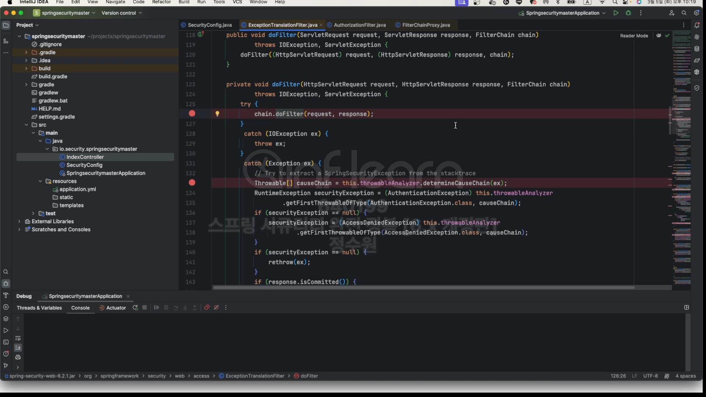
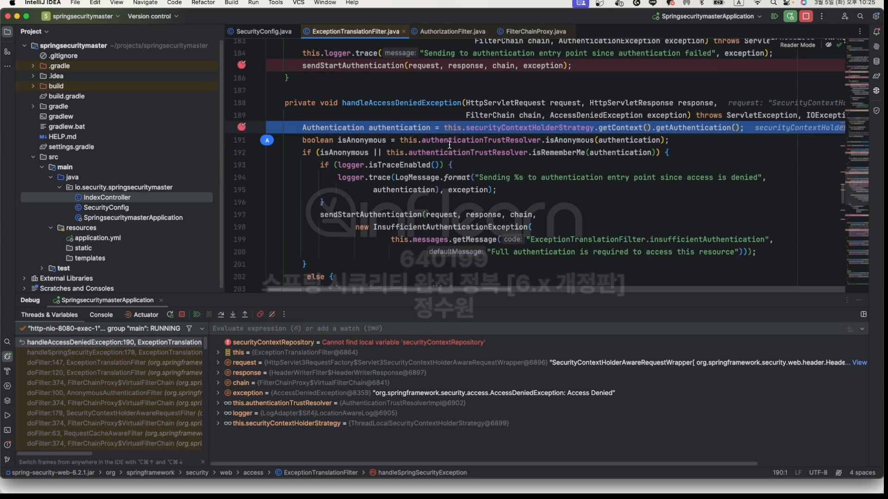

  
AuthorizationFilter는 Security filters중 맨 마지막에 위치해 있다.
AuthorizationFilter는 AceessDeniedException(인가예외)을 날린다. 이 놈은 인증에러를 날리지 않는다.  
이 필터 자체가 권환 관련된 처리를 하는 필터이기 때문에 인증 예외를 날리지 않는다.  
그럼 이 예외는 ExceptionTranslationFilter로 날아가는데 이 필터는 AuthenticationException과 AceessDeniedException 두개를  
처리할 수 있다. 근데 지금 들어온 예외가 AceessDeniedException 이놈이다. 근데 이놈을 isAnonymous || isRememberMe? 이 조건으로 판단하고 만약  
둘 중에 하나라도 포함되는 녀석이라면 이 프로세스는 바로 AuthenticationException으로 가버린다.  
그리고 거기서 1. SecurityContext(null) 2. HttpSessionRequestCache 3. AuthenticationEntryPoint로 보낸다.  
 
그리고 인증 상태가 되면, 다시 요청할 때, 이 사용자는 ADMIN권한이 없으니까 ExceptionTranslationFilter로 가서 다시  
isAnonymous || isRememberMe?이 두개가 다 아니라서 AccessDeniedHandler로 간다.  

코드로 보자.  
  
아무런 작업을 하지 않고 다음 필터로 작업을 넘기고 있다.  
다음 필터는 AuthorizationFilter이다 이 말은 즉, AuthrizationFilter에서 발생하는 예외를 잡겠다는 소리이다.  
그럼 요청을 보내보자.  
  
처음엔 당연히 FilterChainProxy로 온다.  
  
여기서 13, 14번째를 보면 ExceptionTranslationFilter와 AuthorizationFilter를 볼 수 있다.  
이 두 필터는 붙어 있으면서 예외를 발생시키고 처리하는 관계를 가지고 있다.  
순서상 0~12번째 필터들은 ExceptionTranslationFilter가 처리할 수 없다. 그런데 AuthorizationFilter에서 발생하는 처리는 ExceptionTranslationFilter  
가 처리한다. 
 
 
여기로 온다.  
 
저기서 만약 AccessDeniedException이 터지면 그 예외는 ExceptionTranslationFilter에서 받게 될 것이다.  
  
받았다. 여기서는 해당 예외가 AuthenticationException인지 AccessDeniedException인지 보는 것이다.  
  
지금은 causeChain을 보면 AccessDeniedException이 담겨 있다.  

  
isAnonymous, isRememberMe 둘 중 하나 보고, 
  
여기로 넘어온다. 
 
여기로 오고 loginpage로 넘어간다.
로그인하고 이제 이번엔  
 
이걸 하면 똑같은 과정을 거치다가   
 
  
이렇게 된다.
 
참고로 알고 있으면 좋은것은 
 
여기서 이렇게 error를 날리면 일단 인증을 받고 다시 root로 접근하면  
 
여기로 오는데 그럼 이 예외를 누가 받을까? 만약 ControllerAdvice처리를 했다면 당연히 처리를 할 것이다. 그런데  
예외를 잡지 못할경우 이 예외는  
   
여기까지 온다. 발생한 예외를 보면  
 
아까 우리가 발생시킨 예외와 ServletException도 있다. 그래서 이제 다시  rethrow 해버린다.  
  
근데 만약 이런 예외를 던졌다면? 인증예외를 처리할 수 있다.

