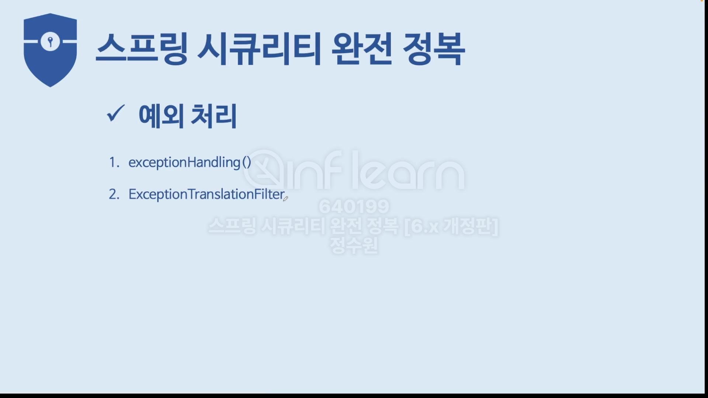
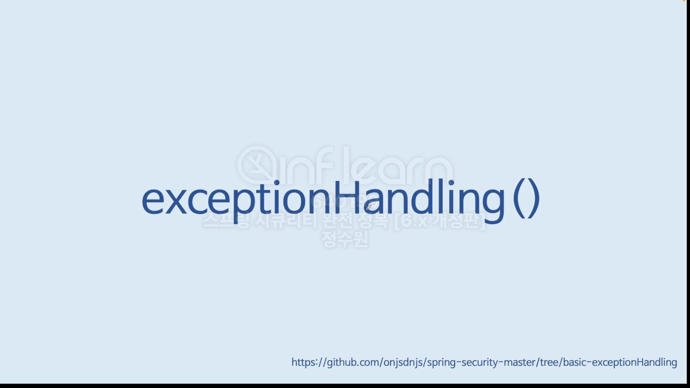
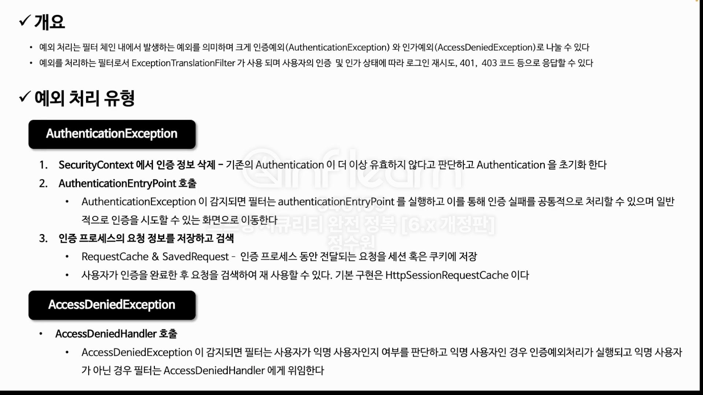
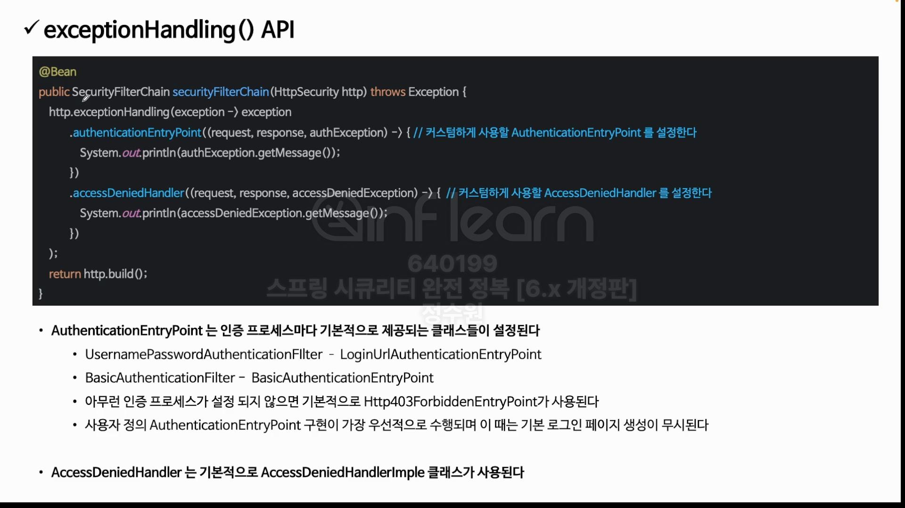
<Br>
코드로 보자. 
```java
@Configuration
@EnableWebSecurity
public class SecurityConfig {

    @Bean
    public SecurityFilterChain securityFilterChain(HttpSecurity http) throws Exception {

        http.authorizeHttpRequests(auth -> auth
                        .requestMatchers("/login").permitAll()
                        .anyRequest().authenticated())
                .formLogin(Customizer.withDefaults())
                .exceptionHandling(exception -> exception.authenticationEntryPoint(((request, response, authException) -> {
                            System.out.println("exception: " + authException.getMessage());
                            response.sendRedirect("/login");
                        }))
                        .accessDeniedHandler((request, response, accessDeniedException) -> {
                            System.out.println("exception : " + accessDeniedException.getMessage());
                            response.sendRedirect("/denied"); 
                        }));

        ;

        return http.build();
    }
    
    @Bean
    public UserDetailsService userDetailsService() {
        return new CustomUserDetailsService();
    }
}
```
localhost:8080에 접속하면, <br>
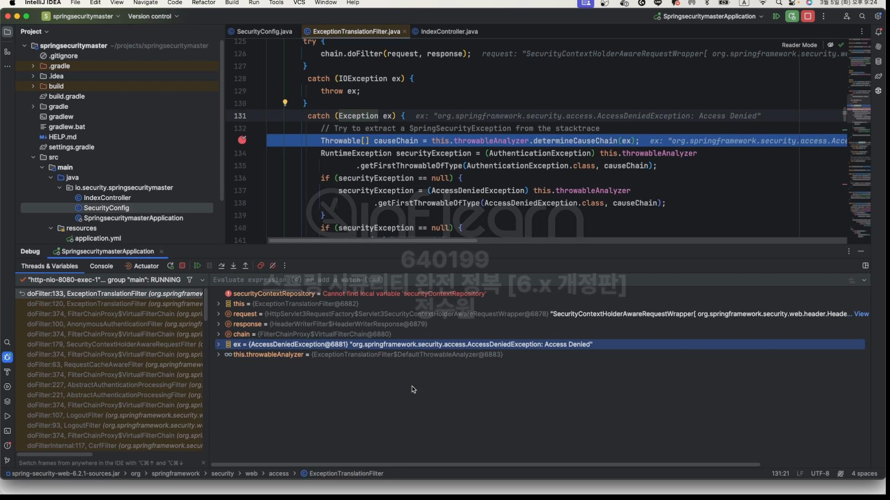 <br>
ExceptionTranslationFilter로 넘어온다. 그리고 예외를 확인하면 AccessDeniedException이다. 이것은 인가 예외이다. <br>
그런데 인증에 관련된 예외를 생각했는데 인가에 대한 예외가 나왔다. 이건 <br>
<br>
여기 나와 있듯이 인증예외 인가예외가 있는데 인가 예외가 발생하더라도 현재 사용자가 익명 사용자인지 확인을 한다. 그래서 지금 AccessDeniedException 부분을 <br>
처리하고 있다. <br>
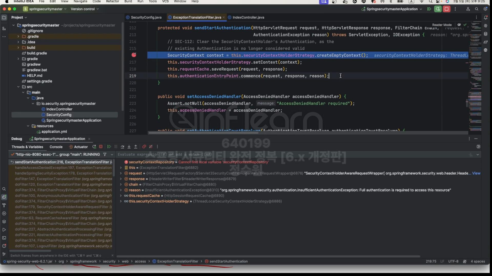 <br>
그리고 여러 경로를 통해 sendStartAuthentication 여기까지 온다. <br>
여기 오는 과정은 인증을 받지 못한 상태에서 root에 접근하다가 거부 되어서 AccessDeniedException이 발생했고 그 예외 안에서 익명 사용자였기 때문에<br>
이리로 왔다고 이해하면ㄷ 된다. <br>
여기서는 세가지 작업을 하는데, <br>
1. SecurityContext안에서 Authentication이 있으면, 그걸 null로 처리한다.
```java
SecurityContext context = this.securityContextHolderStrategy.createEmptyContext();
this.securityContextHolderStrategy.setContext(context);
this.requestCache.saveRequest(request, response);
```
2. AuthenticationEntryPoint를 호출한다. 
```java
this.authenticationEntryPoint.commence(request, response, reason);
```
<br>
이건 우리가 설정을 했기 때문에 <br>

```java
@Configuration
@EnableWebSecurity
public class SecurityConfig {

    @Bean
    public SecurityFilterChain securityFilterChain(HttpSecurity http) throws Exception {

        http.authorizeHttpRequests(auth -> auth
                        .requestMatchers("/login").permitAll()
                        .anyRequest().authenticated())
                .formLogin(Customizer.withDefaults())
                .exceptionHandling(exception -> exception.authenticationEntryPoint(((request, response, authException) -> {
                            System.out.println("exception: " + authException.getMessage());
                            response.sendRedirect("/login");
                        }))
                        .accessDeniedHandler((request, response, accessDeniedException) -> {
                            System.out.println("exception : " + accessDeniedException.getMessage());
                            response.sendRedirect("/denied"); 
                        }));

        ;

        return http.build();
    }
    
    @Bean
    public UserDetailsService userDetailsService() {
        return new CustomUserDetailsService();
    }
}
```
<br>
저기로 간다. <br>

그럼 이번에 인증을 받고 권한이 안되는 경우를 생각해보자. <br>
```java
@Configuration
@EnableWebSecurity
public class SecurityConfig {

    @Bean
    public SecurityFilterChain securityFilterChain(HttpSecurity http) throws Exception {

        http.authorizeHttpRequests(auth -> auth
                        .requestMatchers("/login").permitAll()    
                        .requestMatchers("/admin").hasRole("ADMIN")
                        .anyRequest().authenticated())
                .formLogin(Customizer.withDefaults())
                .exceptionHandling(exception -> exception
                        //.authenticationEntryPoint(((request, response, authException) -> {
                        //    System.out.println("exception: " + authException.getMessage());
                        //    response.sendRedirect("/login");}
                        //    ))
                        .accessDeniedHandler((request, response, accessDeniedException) -> {
                            System.out.println("exception : " + accessDeniedException.getMessage());
                            response.sendRedirect("/denied"); 
                        }));

        ;

        return http.build();
    }
    
    @Bean
    public UserDetailsService userDetailsService() {
        return new CustomUserDetailsService();
    }
}
```
<br>
권한 추가 authenticationEntryPoint주석. 
<br>
그럼이제 로그인을 하면 formLogin이 설정돼 있기 때문에 자동적으로 LoginUrlAuthenticationEntryPoint로 호출된다. <br>

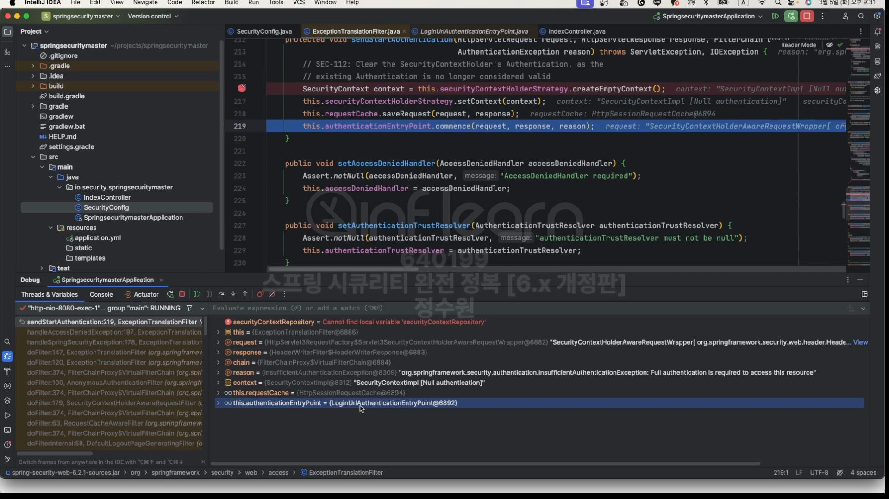 <br>
보면 loginUrlAuthenticationEntryPoint로 간다. 이건 우리가 설정하지 않았지만 formLogin인 경우 자동으로 설정 돼 있다. <br>
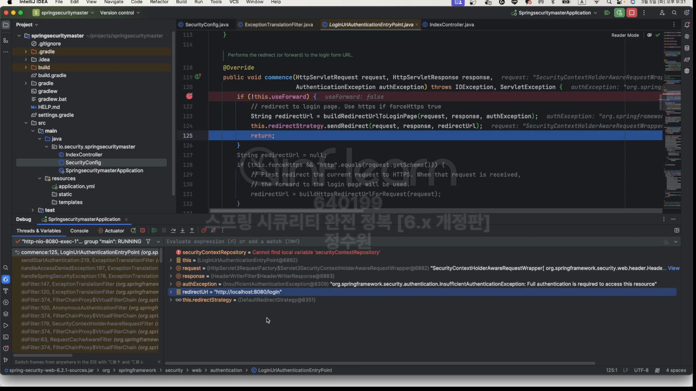 <br>
요청을 한다. <br>
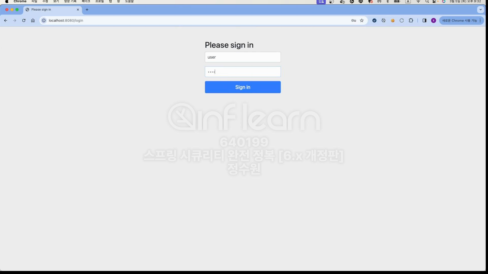 <br>
그럼 이제 user, 1111로 인증을 한다. <br>
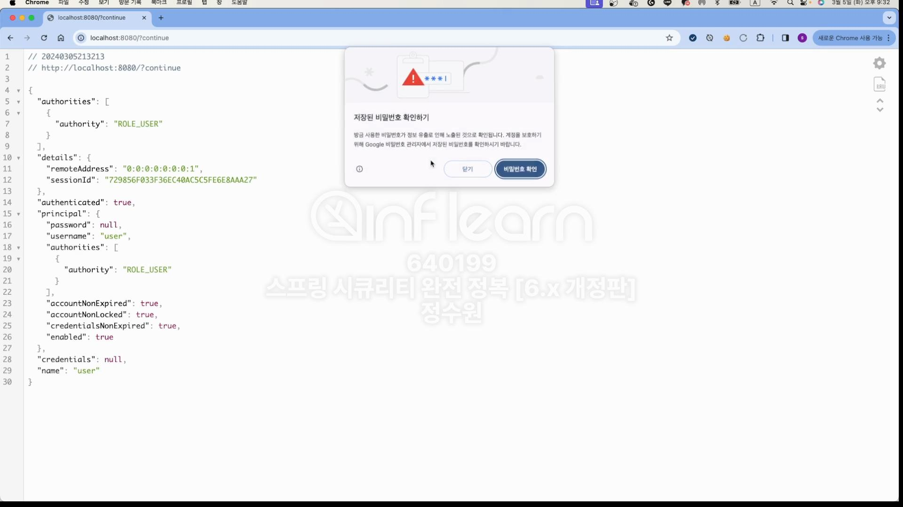 <br>
여기까지는 문제가 없다. /admin으로 접근을 해보자. <br>
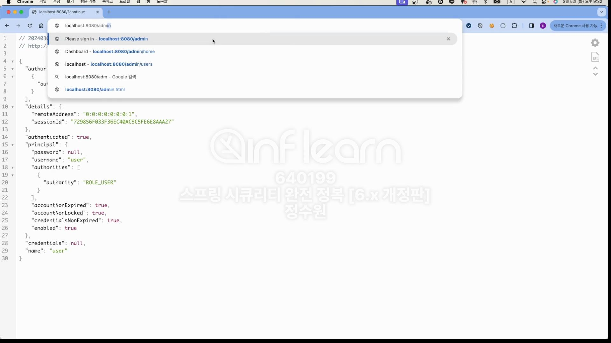 <br>
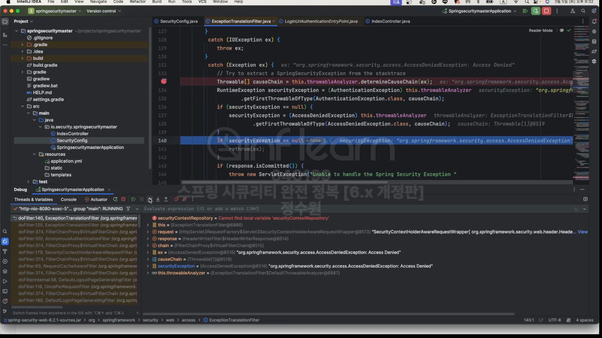
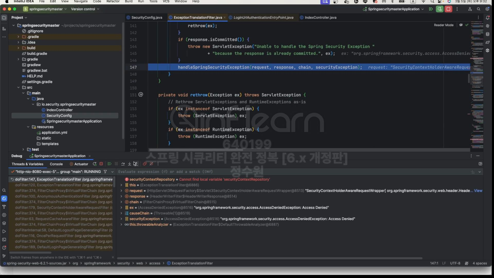
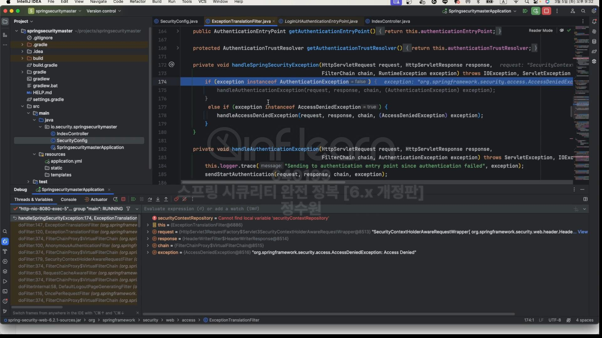 <br>
인증과 인과예외가 나뉘는데 지금 발생한 예외는 인가 예외이다.<br>
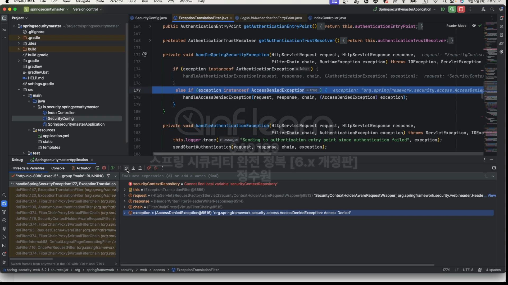 <br>
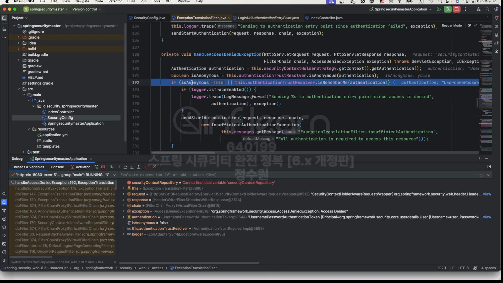 <br>
그래서 지금 익명 사용자인지 확인하지만 익명 사용자가 아니다. <br>
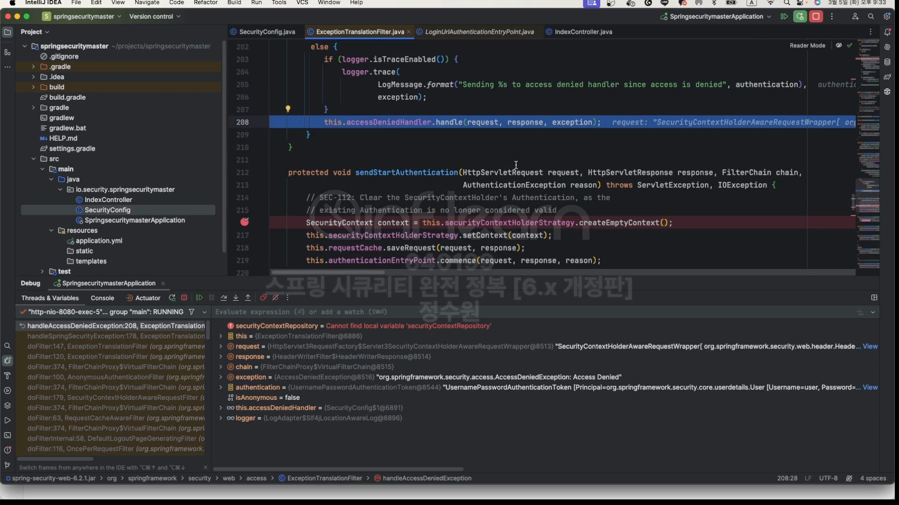 <br>
그래서 else로 와서 accessDeniedHandler를 호출한다. <br>
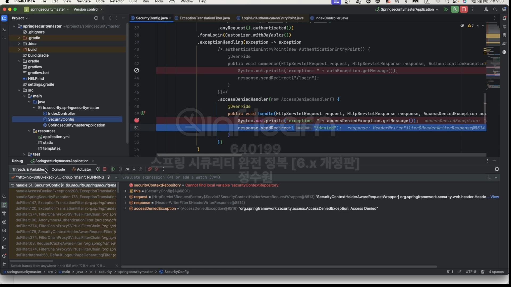


