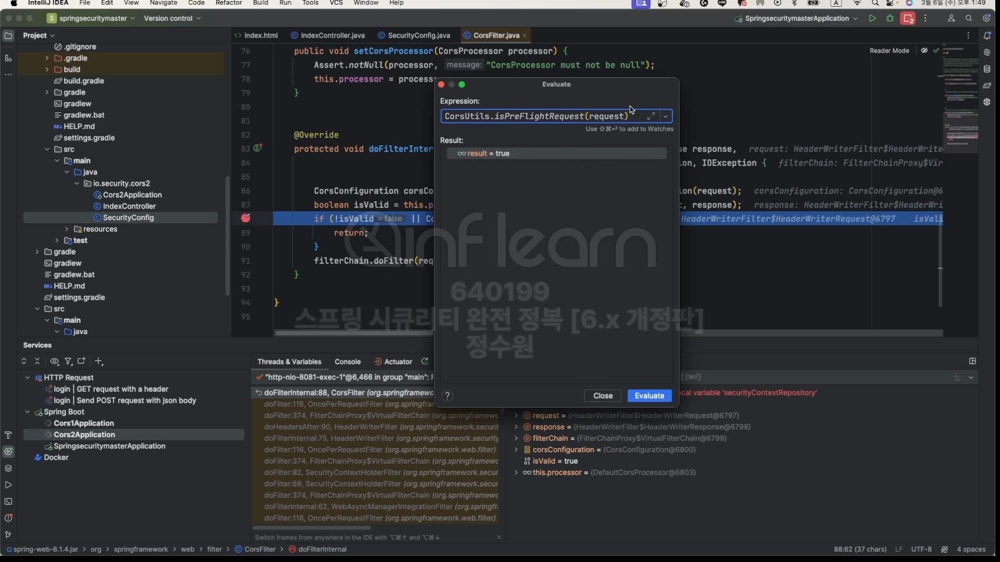

 <br>
코드로 보자. 
<br>
테스트를 하기 위해서 출처가 다른 두개의 서비스가 필요하다. <br>
출처가 다르려면 scheme이 다르거나 port가 다르면 된다. 우리는 port를 다르게 해서 다른 서비스 두개를 띄어서 테스트 해보자.<br>
<br>
모듈을 통해서 2개의 서비스를 만들 수 있다. <br>
 <br>
두개를 만들었다. <br>

## **cor1 코드** <br>
```java
@Controller
public class IndexController {

    public String index() {
        return "index";
    }

}
```
```html
<!DOCTYPE html>
<html lang="en" xmlns:th="http://www.thymeleaf.org">
<head>
    <meta charset="UTF-8">
    <title>Title</title>
    <script>

        function corsTest(){
            fetch("http://localhost:8081/api/users", {
                method : "GET",
                headers : {
                    "Content-Type" : "text/xml",
                }
            })
                    .then(response => {
                        response.json().then(function(data){
                            console.log(data)
                        })
                    })
        }
    </script>
</head>
<button name="corsTest" onclick="corsTest()">corsTest</button>
</html>
```

## **cor2 코드** <br>
```java
@EnableWebSecurity
@Configuration
public class SecurityConfig {

    @Bean
    public SecurityFilterChain securityFilterChain(HttpSecurity http) throws Exception {

        http
                .authorizeHttpRequests(auth -> auth
                        .anyRequest().permitAll())
                .formLogin(Customizer.withDefaults())
                .cors(cors -> cors.configurationSource(configurationSource()));

        return http.build();
    }

    @Bean
    public CorsConfigurationSource configurationSource() {
        CorsConfiguration configuration = new CorsConfiguration();
        configuration.addAllowedOrigin("http://localhost:8080");
        configuration.addAllowedMethod("*");
        configuration.addAllowedHeader("*");
        configuration.setAllowCredentials(true);
        configuration.setMaxAge(3600L);

        UrlBasedCorsConfigurationSource source = new UrlBasedCorsConfigurationSource();
        source.registerCorsConfiguration("/**", configuration);

        return source;
    }

    @Bean
    public UserDetailsService userDetailsService() {
        UserDetails user = User.withUsername("user").password("{noop}1111").roles("USER").build();
        return new InMemoryUserDetailsManager(user);
    }
}
```

```java
@RestController
@RequestMapping("/api")
public class IndexController {

    @GetMapping("/users")
    public String users() {
        return "{\"name\": \"hong gil dong\"}";

    }
}
```
<br>


<br>
두 서버를 기동시킨다. <br>
 <br>
8080에 접속하니 화면이 보인다. <br>
저기 버튼을 클릭하면! 정상 적이라면 return "{\"name\": \"hong gil dong\"}"; 이 값들을 가져 올 것이다. <br>
 <br>
잘 왔다. <br>
 <br>
근데 users라는게 2개가 보인다. 하나는 fetch(본요청)이고 하나는 preflight다. <br>
 <br>
 <br>
request를 보면 preflight가 속성들이 더 많다. Access-Control-Request-Headers, Aceess-Control-Request-Method 등등... <br>
  
<br>
이번엔 Simple=Request로 보내보자.<br>

```html
<!DOCTYPE html>
<html lang="en" xmlns:th="http://www.thymeleaf.org">
<head>
    <meta charset="UTF-8">
    <title>Title</title>
    <script>

        function corsTest(){
            fetch("http://localhost:8081/api/users", {
                method : "GET",
                // headers : {
                //     "Content-Type" : "text/xml",
                // }
            })
                    .then(response => {
                        response.json().then(function(data){
                            console.log(data)
                        })
                    })
        }
    </script>
</head>
<button name="corsTest" onclick="corsTest()">corsTest</button>
</html>
```
<br>
위처럼 바꾸면 Simple-Request로 보낼 수 있다. <br>


<br>
본요청으로 바로 갔다.
<br>
```java
    @Bean
    public CorsConfigurationSource configurationSource() {
        CorsConfiguration configuration = new CorsConfiguration();
        configuration.addAllowedOrigin("http://localhost:8082");
        configuration.addAllowedMethod("*");
        configuration.addAllowedHeader("*");
        configuration.setAllowCredentials(true);
        configuration.setMaxAge(3600L);

        UrlBasedCorsConfigurationSource source = new UrlBasedCorsConfigurationSource();
        source.registerCorsConfiguration("/**", configuration);

        return source;
    }
```
<br>
이렇게 수정하고 요청을 보내면, <br>


<br>
Cors에러가 뜨는 것을 확인할 수 있다. <br>

<br>
CORS 필터를 보면 요청을 보내면 <br>
 <br>
먼저 preflight 확인하고 <br>
 <br>
예비 요청은 method가 OPTIONS니까 확인하고, <br>
예비 요청이기 때문에 그냥 return 보내고 또 본 요청이 들어온다.