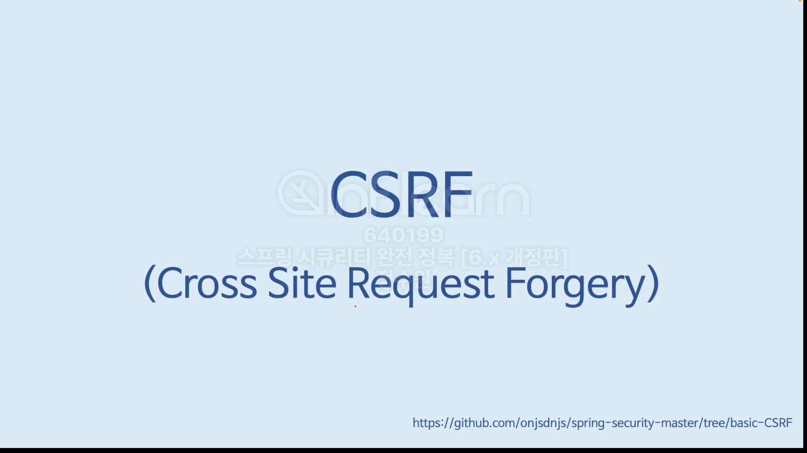
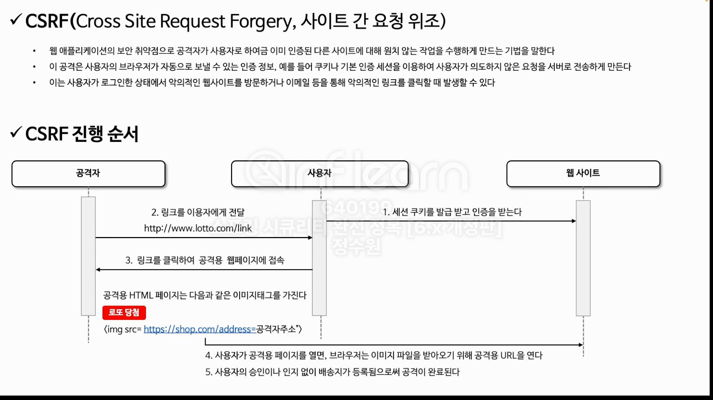
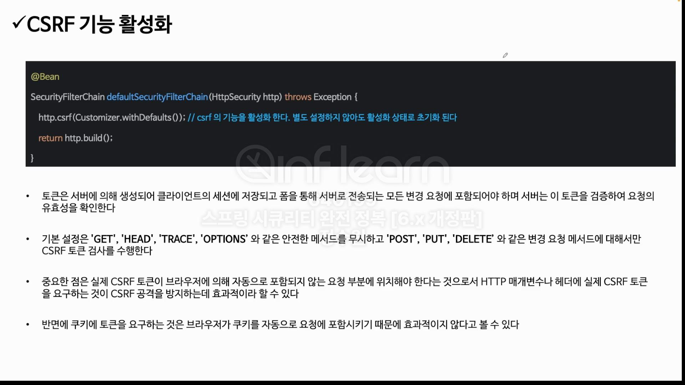
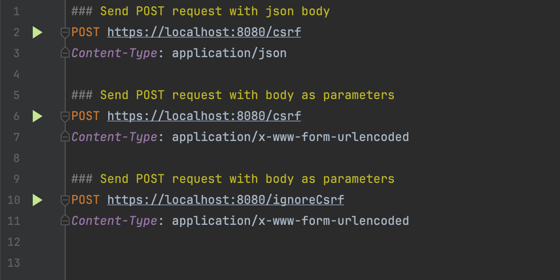
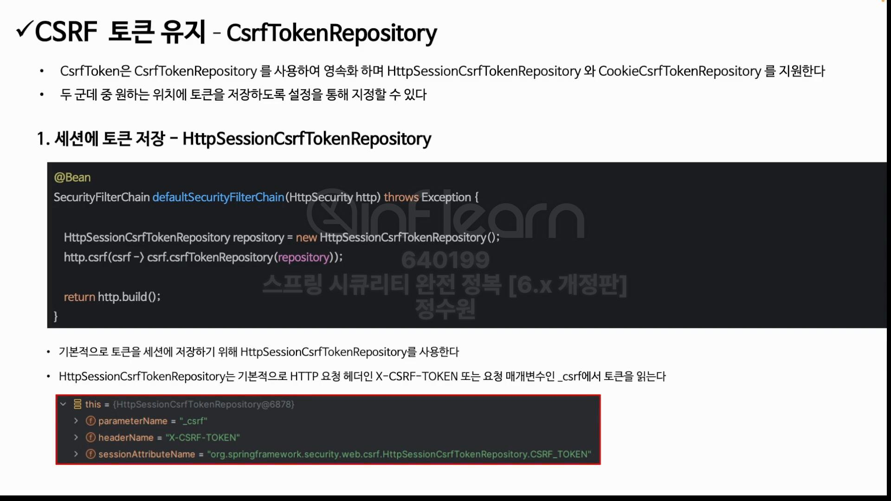
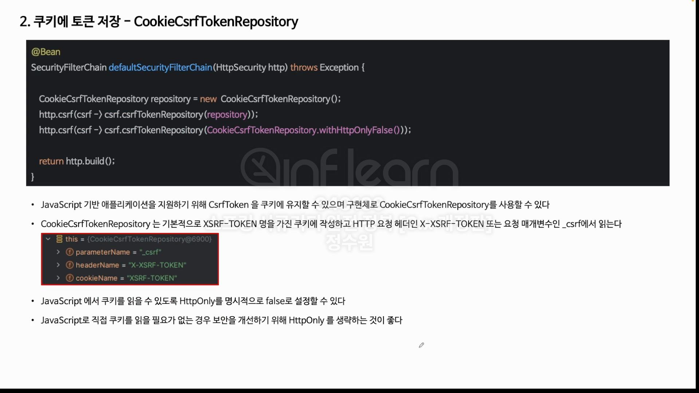
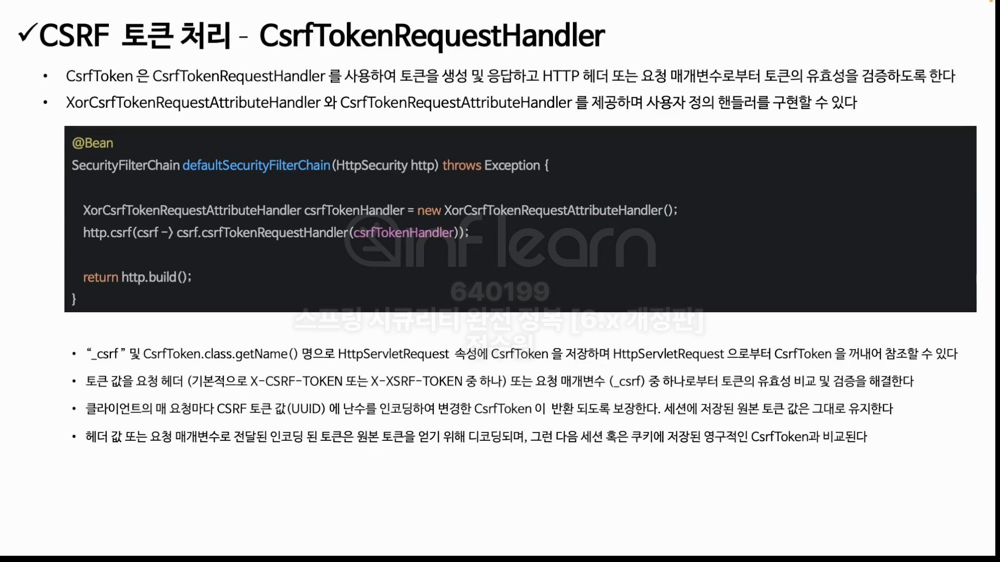
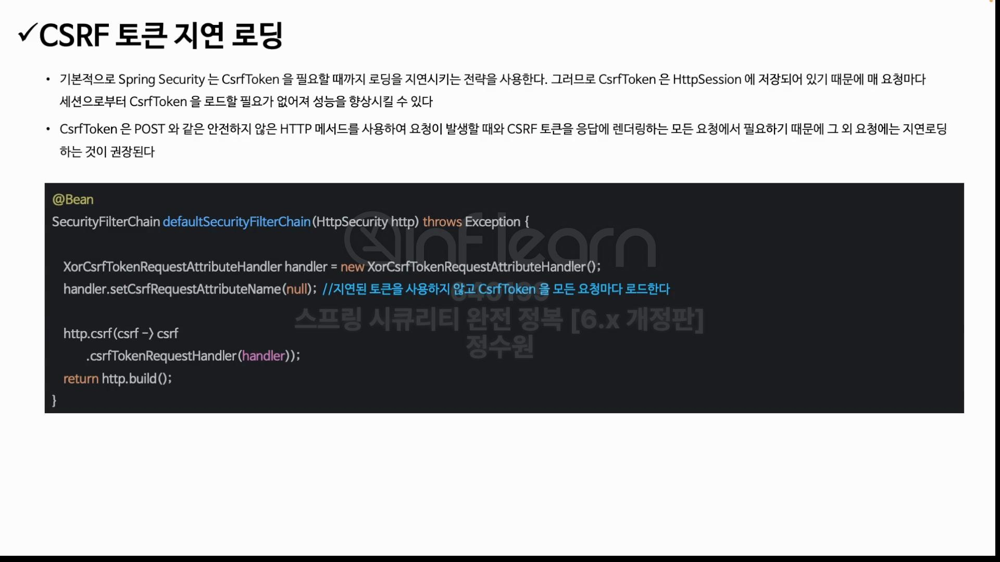

 

<br>
테스트를 해보자.<br>
csrf요청을 보낼건데 csrf 토큰을 가지고서 요청을 할 때와 가지지 않고 요청을 할 때 두가지를 나누어서 다 테스트를 해보자. <br>
csrf 기능을 비활성화 하거나 특정한 url만 열어놓고 테스트도 해보자. <br>

 <br>
csrf 요청 샘플 csrf요청에 대해서는 따로 인증을 받지 않아도 되게 셋팅을 해보자. <br>

```java
    @Bean
    public SecurityFilterChain securityFilterChain(HttpSecurity http) throws Exception {
        http
                .authorizeHttpRequests(auth -> auth
                    .requestMatchers("/csrf").permitAll()
                    .anyRequest().authenticated())
            .formLogin(Customizer.withDefaults())
            .csrf(csrf -> csrf.ignoringRequestMatchers("/csrf"))
    ;
}
```

```java
@RestController
@RequestMapping("/api")
public class IndexController {
    @PostMapping("/csrf")
    public String csrf() {
        return "csrf 적용됨";
    }
}
```
<br>
위와 같은 방식으로 요청을 해보자. <br>

<br>






<br>
csrf 토큰에 관한 처리 과정들을 보도록 하자. <br>
문제는 csrf토큰이 생성이 되어야 하고 저장소에 저장이 되어야하고 필요할 경우 저장소에 저장된 토큰을 꺼내 와서 사용도 할 수 있어야한다. <br>
그것을 처리하는 클래스의 사용 과정을 볼 것이고 그 다음에 클라이언트에 post 방식으로 요청을 할 경우 client는 csrf토큰을 헤더나 매게 변수에 담아서 보내야 한다. <br>
그렇지 않으면 접근 자체가 안된다. <br>
서버에서는 client의 토큰을 검증하는 단계가 필요할 것이다. 그래서 토큰의 유효성을 체크할 것이다. 그 과정을 보자. <br>


