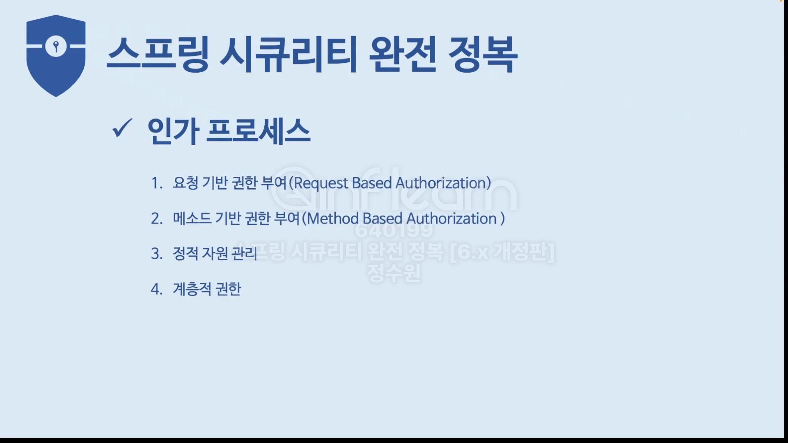
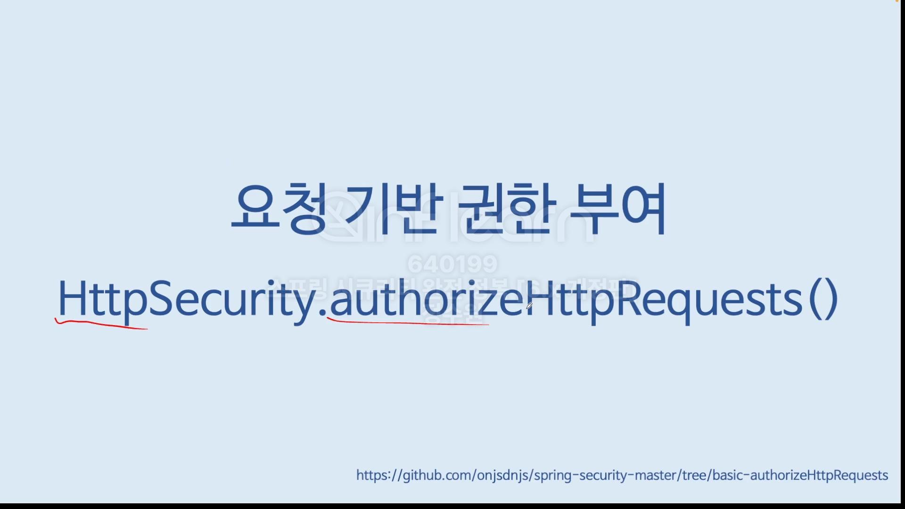
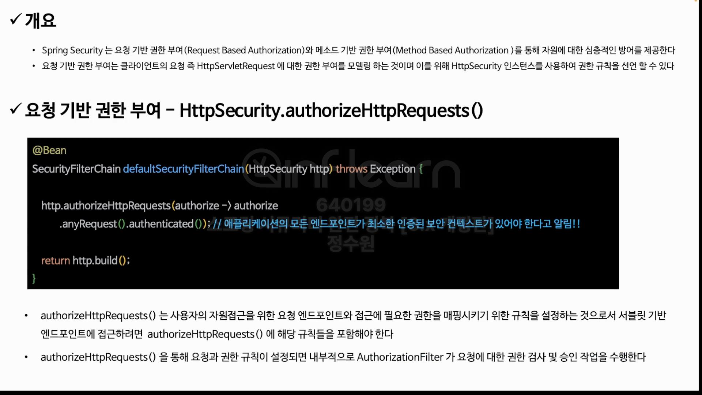
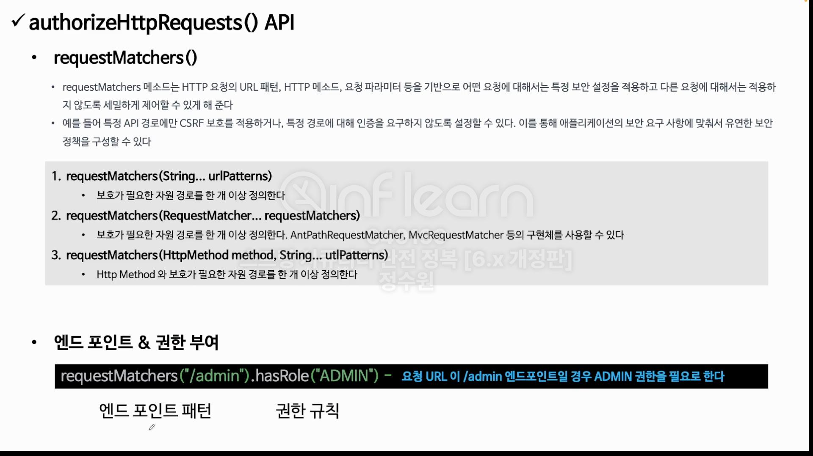
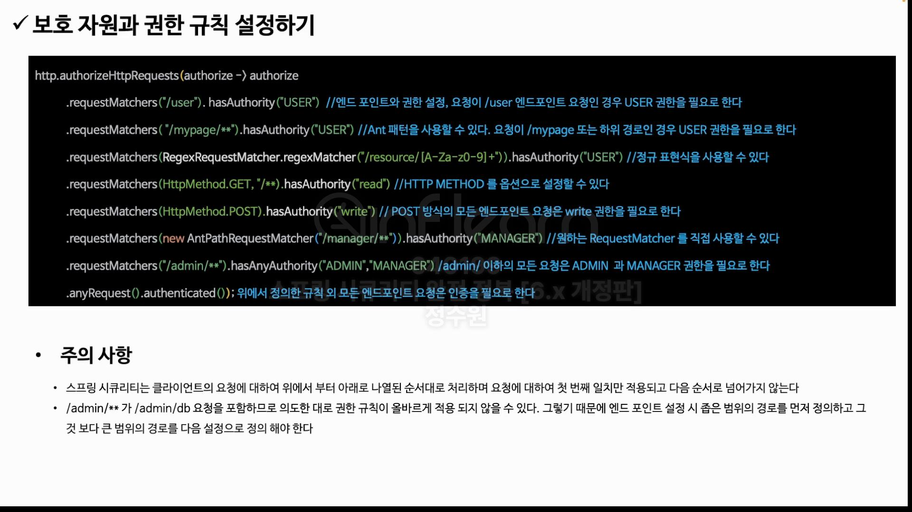
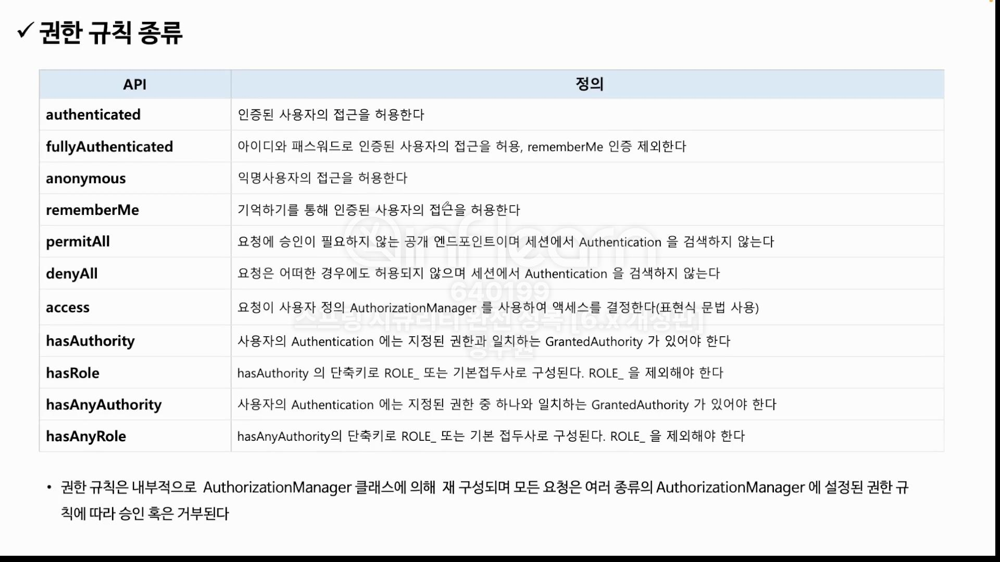
<br>
코드로 알아보자. <br>
일단 화면 코드 먼저 <br>
```html
<!DOCTYPE html>
<html>
<head>
    <meta charset="UTF-8">
    <title>Spring Security Test Page</title>
</head>
<body>
<h2>Spring Security 요청 테스트</h2>
<a href="/login">로그인</a>
<a href="/logout">로그아웃</a>
<button onclick="fetchAndDisplay('/user')">User 페이지 접근</button>
<button onclick="fetchAndDisplay('/myPage/points')">MyPage 페이지 접근</button>
<button onclick="fetchAndDisplay('/manager')">Manager 페이지 접근</button>
<button onclick="fetchAndDisplay('/admin/payment')">Admin Payment 접근</button>
<button onclick="fetchAndDisplay('/admin')">Admin 페이지 접근</button>
<button onclick="fetchAndDisplay('/resource/address_01')">인증자 페이지 접근</button>
<button onclick="fetchAndDisplay('/resource/address01')">Manager 페이지 접근</button>
<button onclick="sendPostRequest()">Post 요청 보내기</button>
</body>

<script>
    function fetchAndDisplay(url) {
        fetch(url)
            .then(response => {
                if (!response.ok) throw new Error('Request failed');
                return response.text();
            })
            .then(data => alert('Response: ' + data))
            .catch(error => alert('Error: ' + error));
    }

    function sendPostRequest() {
        fetch('/post', {
            method: 'POST',
            headers: {
                'Content-type': 'application/json',
                // 'Authorization': 'Bearer YOUR_TOKEN_HERE // 필요한 경우 인증 토큰 추가
            },
            body: JSON.stringify({data: 'yourDataHere'})
        })
            .then(response => {
                if (!response.ok) throw new Error('Post request failed');
                return response.text();
            })
            .then(data => alert('Post Response: ' + data))
            .catch(error => alert('Post Error: ' + error));
    }
</script>
</html>
```

<br>
그리고 Controller 코드도 보자. <br>

```java
package io.security.springsecuritymaster;

import org.springframework.web.bind.annotation.GetMapping;
import org.springframework.web.bind.annotation.PostMapping;
import org.springframework.web.bind.annotation.RestController;

@RestController
public class IndexController {

    @GetMapping("/user")
    public String user() {
        return "user";
    }

    @GetMapping("/myPage/points")
    public String myPage() {
        return "myPage";
    }

    @GetMapping("/manager")
    public String manager() {
        return "manager";
    }

    @GetMapping("/admin")
    public String admin() {
        return "admin";
    }

    @GetMapping("/admin/payment")
    public String adminPayment() {
        return "adminPayment";
    }

    @GetMapping("/resource/address_01")
    public String address_01() {
        return "address_01";
    }

    @GetMapping("/resource/address01")
    public String address01() {
        return "address01";
    }

    @PostMapping("/post")
    public String post() {
        return "post";
    }

}
```
<br>
시큐리티 코드를 보자.
<br>

```java
@EnableWebSecurity
@Configuration
public class SecurityConfig {

    @Bean
    public SecurityFilterChain securityFilterChain(HttpSecurity http, HandlerMappingIntrospector introspector) throws Exception {
        http
                .authorizeHttpRequests(authorize -> authorize
                        .requestMatchers("/").permitAll()
                        .requestMatchers("/user").hasAuthority("ROLE_USER") 
                        .requestMatchers("/myPage/**").hasRole("USER") 
                        .requestMatchers(HttpMethod.POST).hasAuthority("ROLE_WRITE") 
                        .requestMatchers(new AntPathRequestMatcher("/manager/**")).hasAuthority("ROLE_MANAGER") 
                        .requestMatchers(new MvcRequestMatcher(introspector, "/admin/payment")).hasAuthority("ROLE_ADMIN")
                        .requestMatchers("/admin/**").hasAnyAuthority("ROLE_ADMIN", "ROLE_MANAGER")
                        .requestMatchers(new RegexRequestMatcher("/resource/[A-Za-z0-9]+", null)).hasAuthority("ROLE_MANAGER")
                        .anyRequest().authenticated())
                .formLogin(Customizer.withDefaults())
                .csrf(AbstractHttpConfigurer::disable);

        return http.build();
    }
    
    @Bean
    public UserDetailsService userDetailsService() {
        UserDetails user = User.withUsername("user").password("{noop}1111").roles("USER").build();
        UserDetails manager = User.withUsername("manager").password("{noop}1111").roles("MANAGER").build();
        UserDetails admin = User.withUsername("admin").password("{noop}1111").roles("ADMIN", "WRITE").build();

        return new InMemoryUserDetailsManager(user, manager, admin);
    }
}

```
<br>
.hasAuthority와 .hasRole의 차이점은 <br>
.hasAuthority는 문자열 그대로 권한이 설정이 되고 .hasRole은 ROLE_이 붙기 때문에 ROLE_을 제외하고 붙여야한다. <br>
.AntPathRequestMatcher는 Ant 스타일의 패턴을 사용하여 URL을 매칭한다. <br>
.mvcRequestMatcher는 Spring MVC의 핸들러 매핑을 사용하여 URL을 매칭한다. (Ant 패턴도 지원한다.)<br>


```java
@Controller
public class ViewController {
    @GetMapping("/")
    public String index(){
        return "index";
    }
}
```
<br>

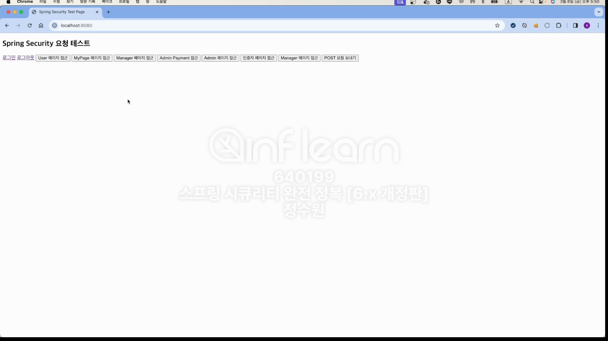<br>
먼저 로그인을 해보자. <br>
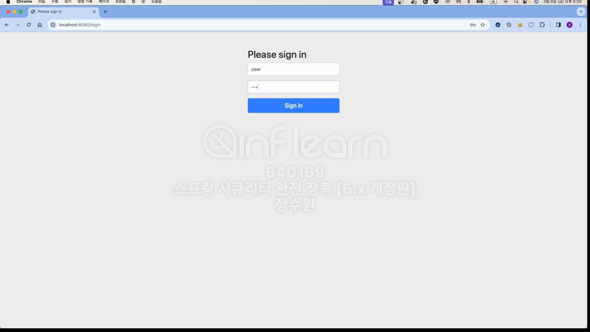<br>
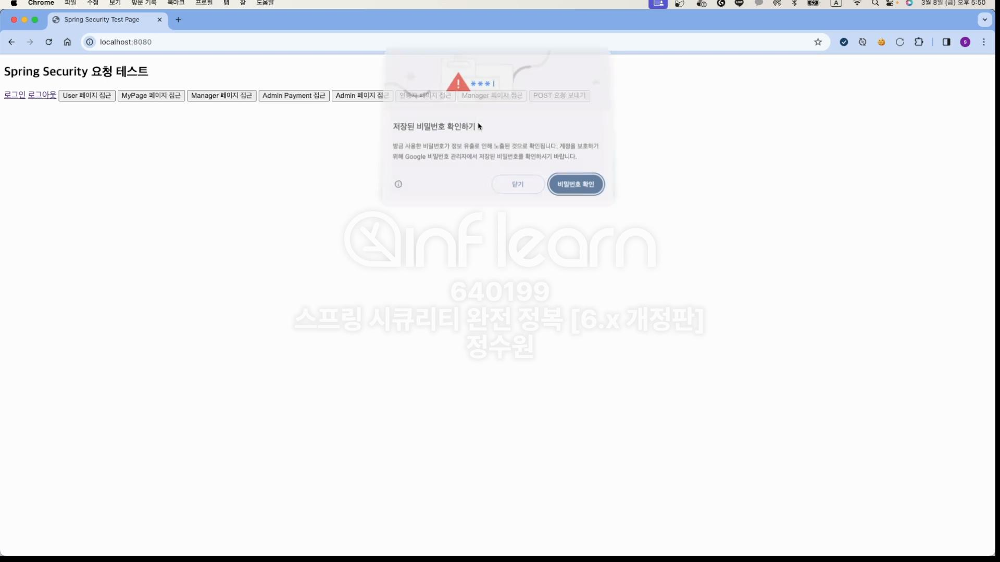<br>
이제 user로 로그인을 하게 되면 <br>
```java
    @Bean
    public UserDetailsService userDetailsService() {
        UserDetails user = User.withUsername("user").password("{noop}1111").roles("USER").build();
        UserDetails manager = User.withUsername("manager").password("{noop}1111").roles("MANAGER").build();
        UserDetails admin = User.withUsername("admin").password("{noop}1111").roles("ADMIN", "WRITE").build();

        return new InMemoryUserDetailsManager(user, manager, admin);
    }
```
<br>
.roles가 USER이다. 그럼 이 놈은 User 페이지 접근, MyPage접근, 인증자 페이지 접근이 가능하다. <br>
하지만 나머지 페이지는 접근이 불가능하다. <br>
User 페이지 접근 버튼 클릭! <br>

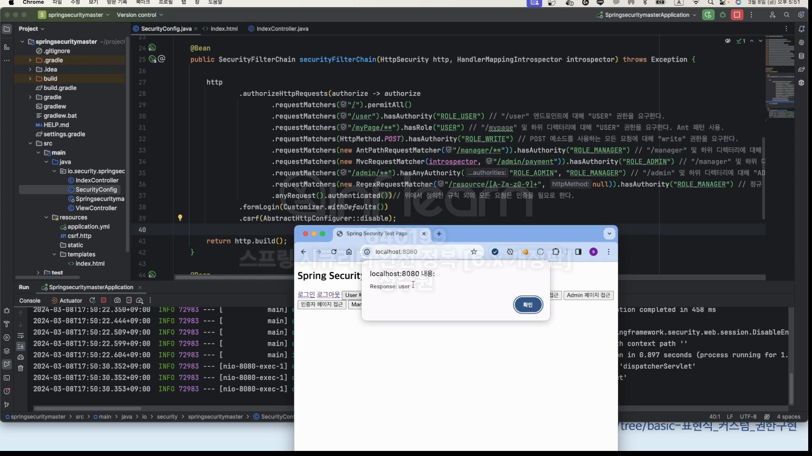

<br>
but!
Admin 페이지 접근은 오류가 난다. <br>

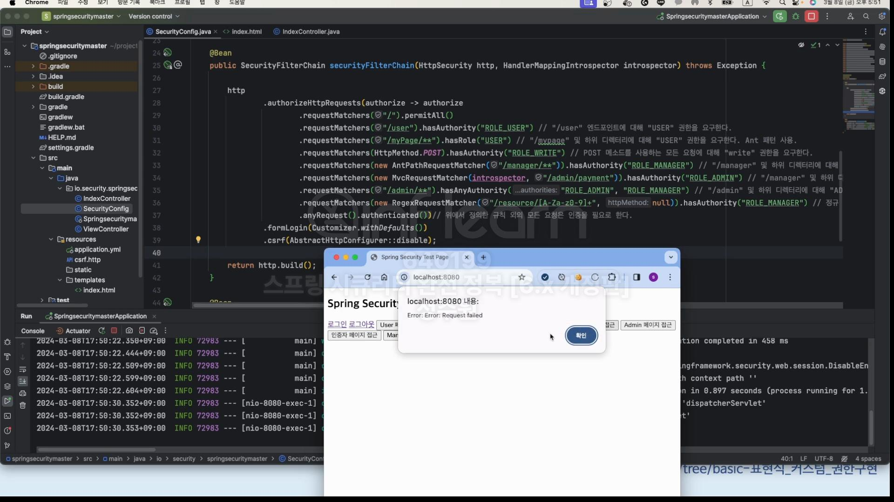

<br>
지금은 계층적 권한을 적용하지 않아서 매니저가 오히려 접근 권한이 좁음. 추후에 해결. <br>

```java
 .requestMatchers("/admin/**").hasAnyAuthority("ROLE_ADMIN", "ROLE_MANAGER")
 .requestMatchers(new MvcRequestMatcher(introspector, "/admin/ payment")).hasAuthority("ROLE_ADMIN")
```


코드를 보면 매니저로 로그인을 했을시에 /admin/payment에 접근을 할 수 없다. 왜냐 거기에는 ROLE_ADMIN만 접근이 허용되있다. <br>
그런데 접근을 할 수 있다. 왜냐 순서대로 적용이 되기 떄문에 위에서 "/admin/**"을 통해 접근했기 때문이다. <br>
그래서 우리의 코드를 보면 좁은 범위가 먼저 적용되고 넓은 범위가 아래 있는것이다.
