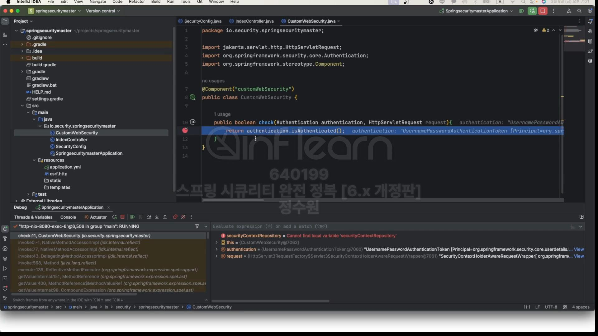

<br>

<br>
 만약 {name}이 user이면, 이 이름이 현재 인증 객체에 저장돼 있는 이름하고 ('#name == authentication.name') 같으면 그때 <br>
"/resource/{name}" 이라는 endpoint로 접근할 수 있다는 표현. <br>


코드로 테스트해 보자. <br>
```java
@EnableWebSecurity
@Configuration
public class SecurityConfig {

    @Bean
    public SecurityFilterChain securityFilterChain(HttpSecurity http, HandlerMappingIntrospector introspector) throws Exception {

        http.authorizeHttpRequests(authorize -> authorize
                .requestMatchers("/user/{name}")
                .access(new WebExpressionAuthorizationManager("#name == authentication.name"))
                .requestMatchers("/admin/db")
                .access(new WebExpressionAuthorizationManager("hasAuthority('ROLE_DB') or hasAuthority('ROLE_ADMIN')"))
                .anyRequest().authenticated()
        ).formLogin(Customizer.withDefaults());

        return http.build();
    }

    @Bean
    public UserDetailsService userDetailsService() {
        UserDetails user = User.withUsername("user").password("{noop}1111").roles("USER").build();
        UserDetails manager = User.withUsername("manager").password("{noop}1111").roles("MANAGER").build();
        UserDetails admin = User.withUsername("admin").password("{noop}1111").roles("ADMIN", "WRITE").build();

        return new InMemoryUserDetailsManager(user, manager, admin);
    }
}
```

user로 로그인을 해보자. <br>
 <br>
 <br>
접속이 된다. <br>
 <br>
이렇게 하면 접속이 안되는데 <br>
 <br>
user로 접근시 접속이 된다. 
<br>
<br>
이번에는 커스텀 권한 표혁식을 보자. <br>
```java
@EnableWebSecurity
@Configuration
public class SecurityConfig {

    @Bean
    public SecurityFilterChain securityFilterChain(HttpSecurity http, ApplicationContext context) throws Exception {
        DefaultHttpSecurityExpressionHandler expressionHandler = new DefaultHttpSecurityExpressionHandler();
        expressionHandler.setApplicationContext(context);

        WebExpressionAuthorizationManager authorizationManager =
                new WebExpressionAuthorizationManager("@customWebSecurity.check(authentication, request)");
        authorizationManager.setExpressionHandler(expressionHandler);

        http.authorizeHttpRequests(authorize -> authorize
                .requestMatchers("/custom/**").access(authorizationManager)
                .anyRequest().authenticated()
        ).formLogin(Customizer.withDefaults());

        return http.build();
    }

    @Bean
    public UserDetailsService userDetailsService() {
        UserDetails user = User.withUsername("user").password("{noop}1111").roles("USER").build();
        UserDetails manager = User.withUsername("manager").password("{noop}1111").roles("MANAGER").build();
        UserDetails admin = User.withUsername("admin").password("{noop}1111").roles("ADMIN", "WRITE").build();

        return new InMemoryUserDetailsManager(user, manager, admin);
    }
}
```

```java
@RestController
public class IndexController {

    @GetMapping("/")
    public String index() {
        return "index";
    }

    @GetMapping("/custom")
    public String custom() {
        return "custom";
    }

    @GetMapping("/user/{name}")
    public String userName(@PathVariable(value = "name") String name) {
        return name;
    }

    @GetMapping("/admin/db")
    public String admin() {
        return "admin";
    }
}
```
<br>

 <br>
로그인 해보자. <br>
 <br>
 <br>
 <br>
커스텀으로 요청을 해보자. <br>
 <br>
 <br>

<br>
<br>
이번엔 커스텀 requestMatcher를 만들어 보자.<br>

```java
@EnableWebSecurity
@Configuration
public class SecurityConfig {

    @Bean
    public SecurityFilterChain securityFilterChain(HttpSecurity http, ApplicationContext context) throws Exception {
        http.authorizeHttpRequests(authorize -> authorize
                .requestMatchers(new CustomRequestMatcher("admin/**")).hasAuthority("ROLE_ADMIN")
                .anyRequest().authenticated()
        ).formLogin(Customizer.withDefaults());

        return http.build();
    }

    @Bean
    public UserDetailsService userDetailsService() {
        UserDetails user = User.withUsername("user").password("{noop}1111").roles("USER").build();
        UserDetails manager = User.withUsername("manager").password("{noop}1111").roles("MANAGER").build();
        UserDetails admin = User.withUsername("admin").password("{noop}1111").roles("ADMIN", "WRITE").build();

        return new InMemoryUserDetailsManager(user, manager, admin);
    }
}
```
```java
public class CustomRequestMatcher implements RequestMatcher {

    private final String urlPattern;

    public CustomRequestMatcher(String urlPattern) {
        this.urlPattern = urlPattern;
    }

    @Override
    public boolean matches(HttpServletRequest request) {
        String requestURI = request.getRequestURI();

        return requestURI.startsWith(urlPattern);
    }

}
```

<br>
근데, requestMatchers(new CustomRequestMatcher("/admin")).hasAuthority("ROLE_ADMIN") 이런 코드가 있기 때문에 <br>
CustomRequestMatcher는 반드시 실행이 된다. <br>
