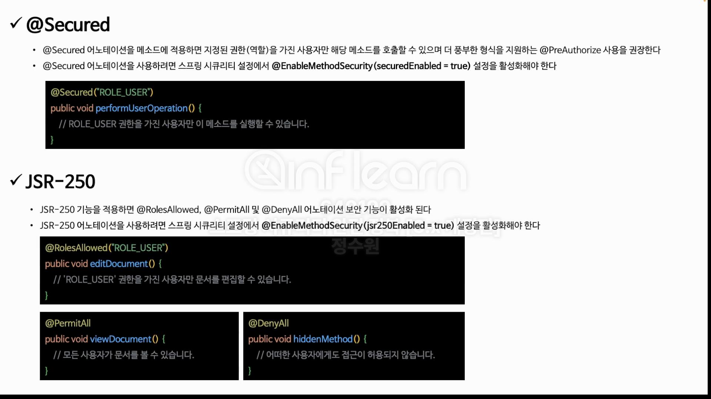
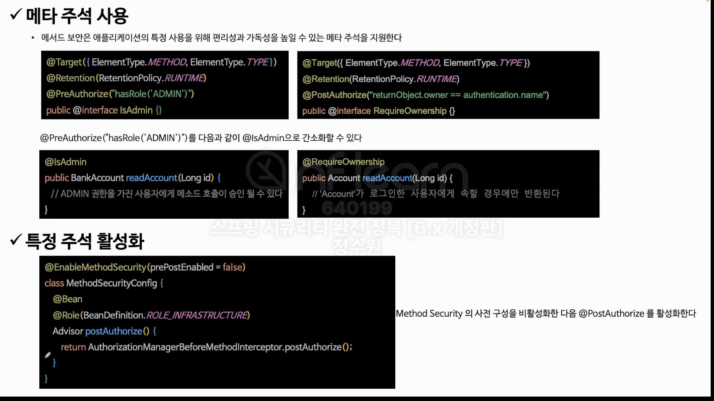   
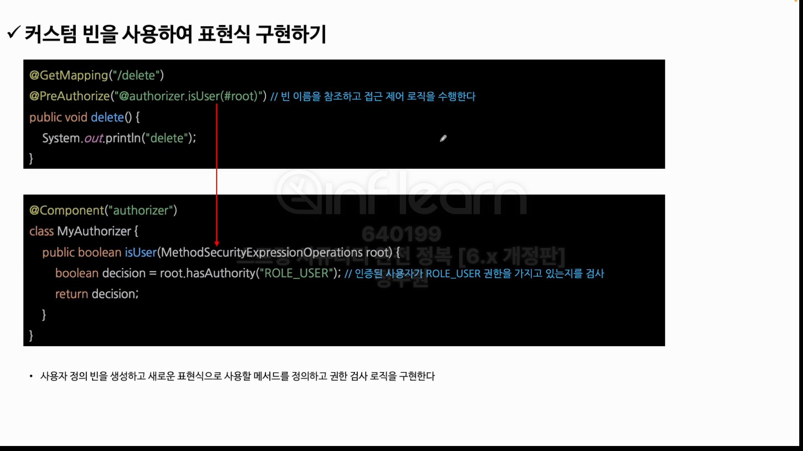
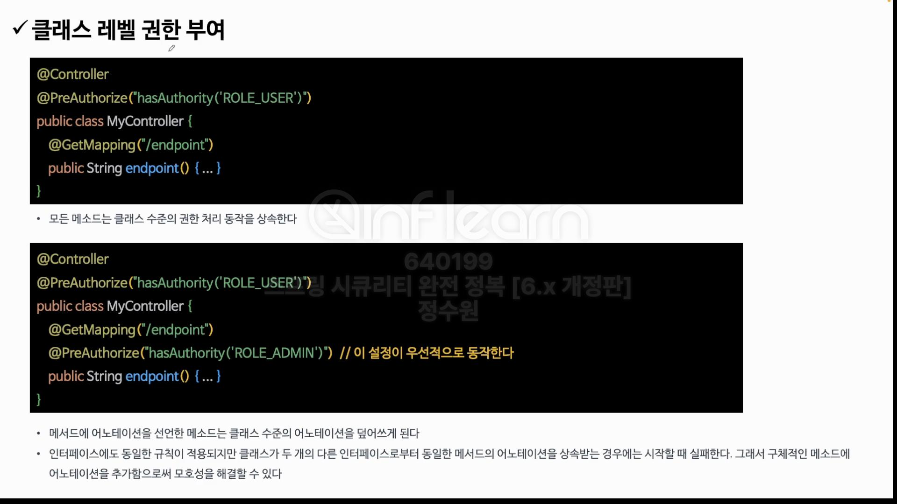
```java
@EnableWebSecurity
@EnableMethodSecurity(securedEnabled = true, jsr250Enabled = true)
@Configuration
public class SecurityConfig {

    @Bean
    public SecurityFilterChain securityFilterChain(HttpSecurity http, HandlerMappingIntrospector introspector) throws Exception {
        http
                .authorizeHttpRequests(authorize -> authorize
                        .anyRequest().authenticated())
                .formLogin(Customizer.withDefaults());

        return http.build();
    }

    @Bean
    public UserDetailsService userDetailsService() {
        UserDetails user = User.withUsername("user").password("{noop}1111").roles("USER").build();
        UserDetails db = User.withUsername("db").password("{noop}1111").roles("DB").build();
        UserDetails admin = User.withUsername("admin").password("{noop}1111").roles("ADMIN", "SECURE").build();

        return new InMemoryUserDetailsManager(user, db, admin);
    }
}

```

```java
@RestController
@RequiredArgsConstructor
public class MethodController {

    @GetMapping("/user")
    @Secured("ROLE_USER")
    public String user() {
        return "user";
    }

    @GetMapping("/user")
    @RolesAllowed("ADMIN")
    public String admin() {
        return "admin";
    }

    @GetMapping("/permitAll")
    @PermitAll
    public String permitAll() {
        return "permitAll";
    }
    
    @GetMapping("/denyAll")
    @DenyAll
    public String denyAll() {
        return "denyAll";
    }
}
```

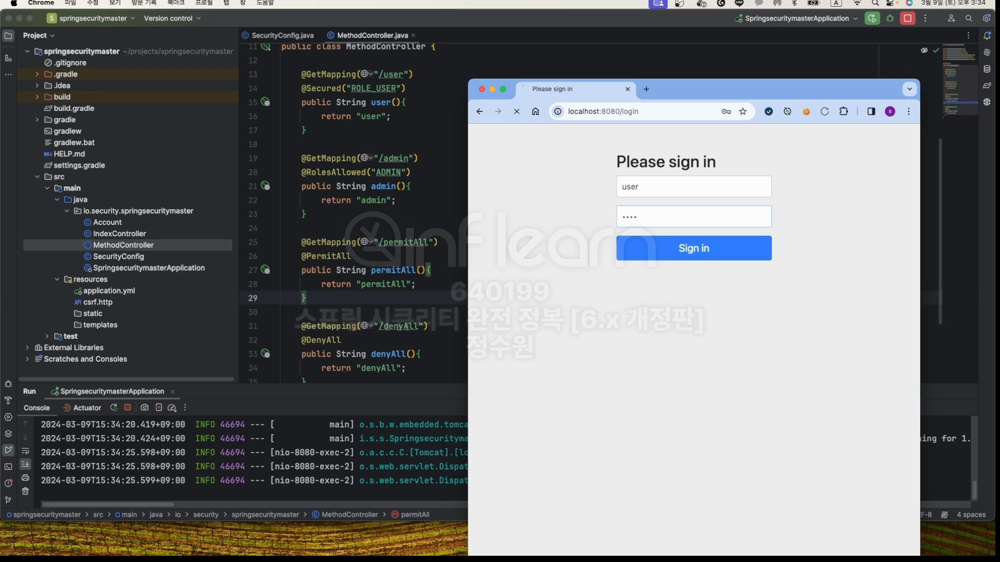
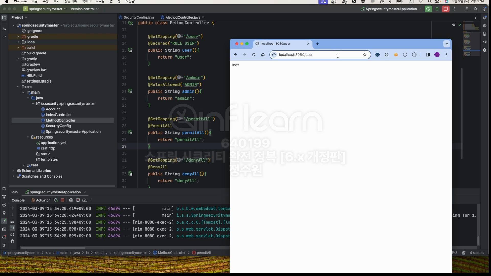

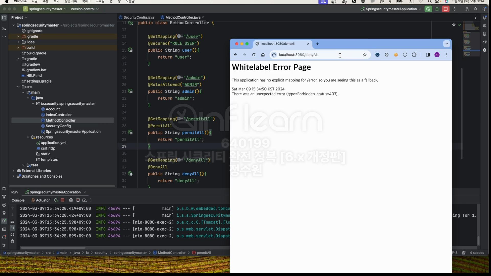
<br>
<br>
<br>


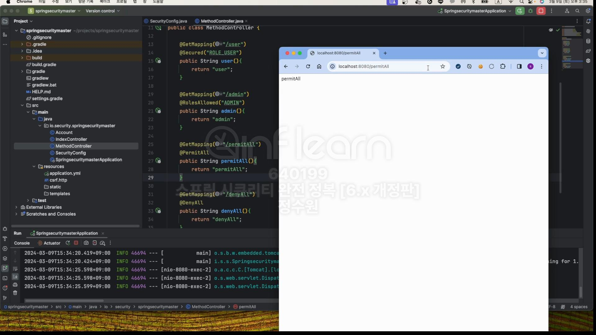

<br>
지금

```java
    @GetMapping("/permitAll")
    @PermitAll
    public String permitAll() {
        return "permitAll";
    }
```
이 부분이 의도와 다르게 동작하지 않는다. permitAll이면 로그인을 안해도 동작해야할것 같지만 접근할 수 없다. 이것은
```java
    @Bean
    public SecurityFilterChain securityFilterChain(HttpSecurity http, HandlerMappingIntrospector introspector) throws Exception {
        http
                .authorizeHttpRequests(authorize -> authorize
                        .anyRequest().authenticated())
                .formLogin(Customizer.withDefaults());

        return http.build();
    }
```
<br>
이 부분의 .authenticated 때문인데 이 부분을 .permitAll()로 바꾸면 동작한다. <br>
이번에는 메타 주석을 써보자. <br>

이걸 만들기 위해서는 @RolesAllowed에 있는 정보를 가져오면 된다. <br>
ex)
```java
@Documented
@Retention(RetentionPolicy.RUNTIME)
@Target({ElementType.TYPE, ElementType.METHOD})
public @interface RolesAllowed {
    String[] value();
}
```
<br>
참조해서 만든 객체 <br>

```java
@Documented
@Retention(RetentionPolicy.RUNTIME)
@Target({ElementType.TYPE, ElementType.METHOD})
@PostAuthorize("returnObject.owner == authentication.name")
public @interface OwnerShip {
}

```
```java
@Documented
@Retention(RetentionPolicy.RUNTIME)
@Target({ElementType.TYPE, ElementType.METHOD})
@PreAuthorize("hasRole('ADMIN')")
public @interface IsAdmin {

}
```

```java
@RestController
@RequiredArgsConstructor
public class MethodController {

    @GetMapping("/isAdmin")
    @IsAdmin
    public String isAdmin() {
        return "isAdmin";
    }

    @GetMapping("/ownerShip")
    @OwnerShip
    public Account ownerShip(String name) {
        return new Account(name, false);
    }

}
```

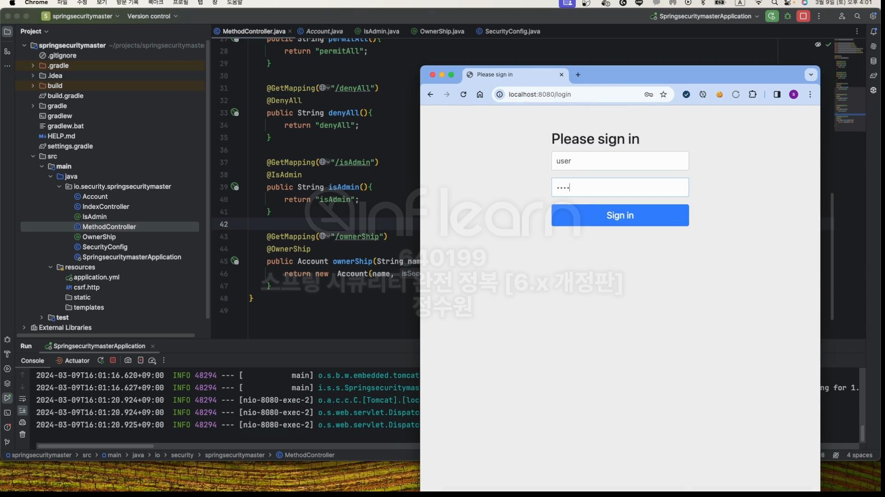
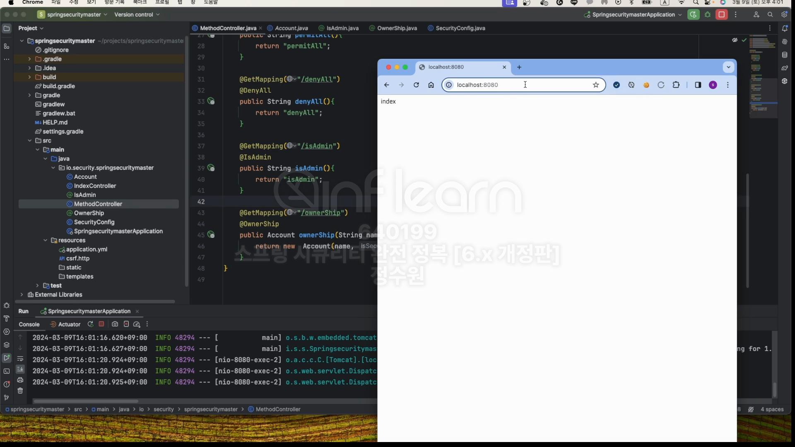
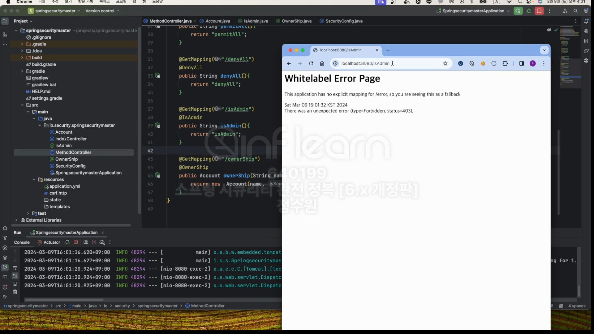
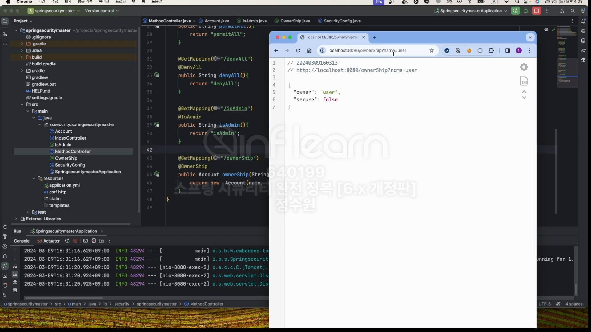
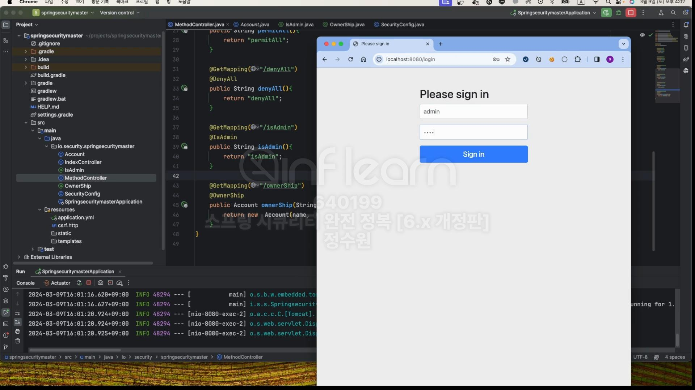
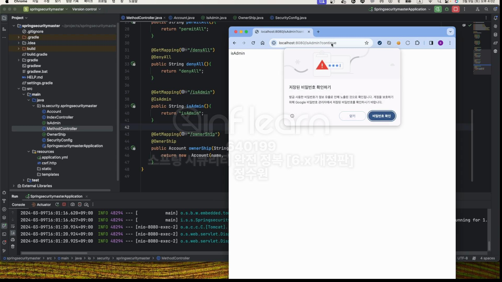


<br>
이번엔 커스텀하게 빈을 만들어서 활용해보자. <br>

```java
@RestController
@RequiredArgsConstructor
public class MethodController {
    
    @GetMapping("/delete")
    @PreAuthorize("@myAuthorizer.isUser(#root)")
    public String delete() {
        return "delete";
    }
    
}
```

```java
@Component("myAuthorizer")
public class MyAuthorizer {
    public boolean isUser(MethodSecurityExpressionOperations root) {
        return root.hasAuthority("ROLE_USER");
    } 
}
```
<br>
아래의 MyAuthorizer를 만들 때는 이 클래스가 상속받는 클래스 중 SecurityExpressionRoot이놈에게서 대충 어떤 기능이 있는지를 보고 참조하면 된다. <br>
<br>

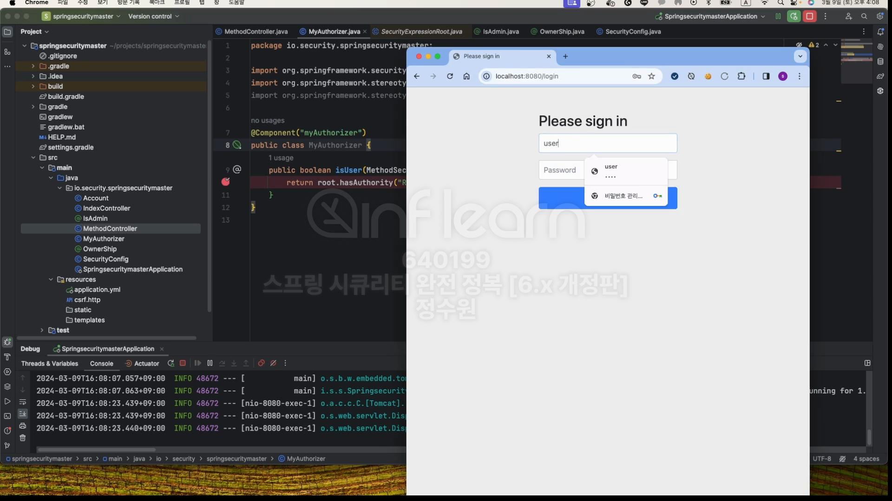

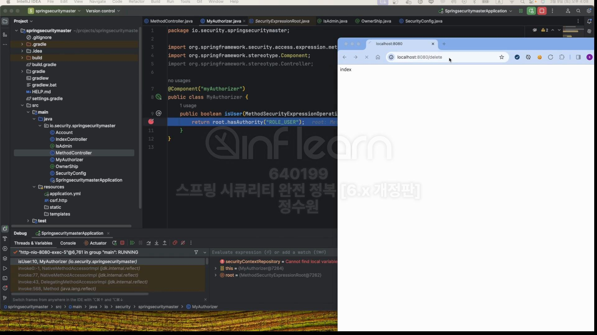
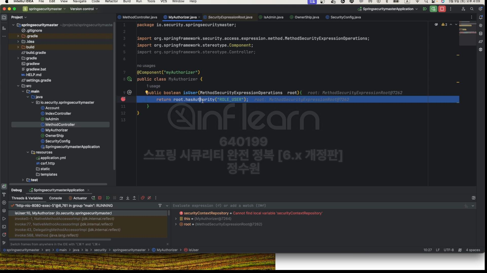  
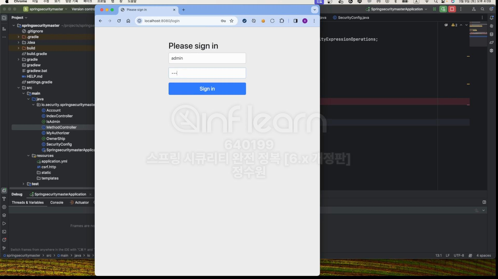
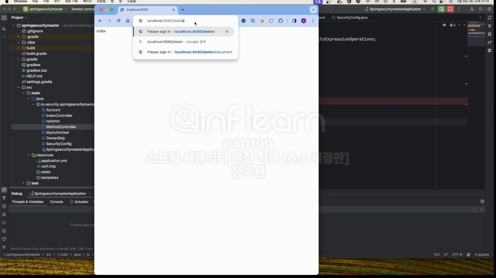 
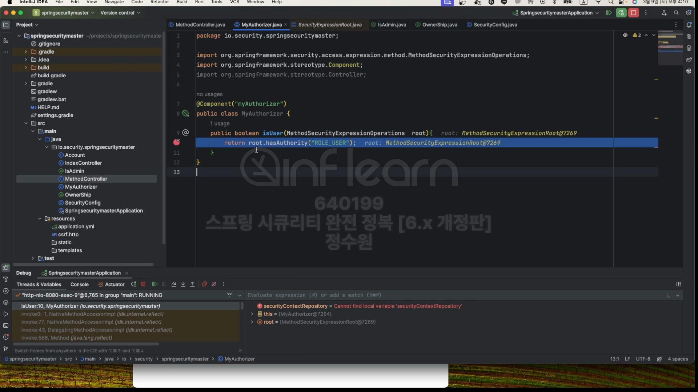
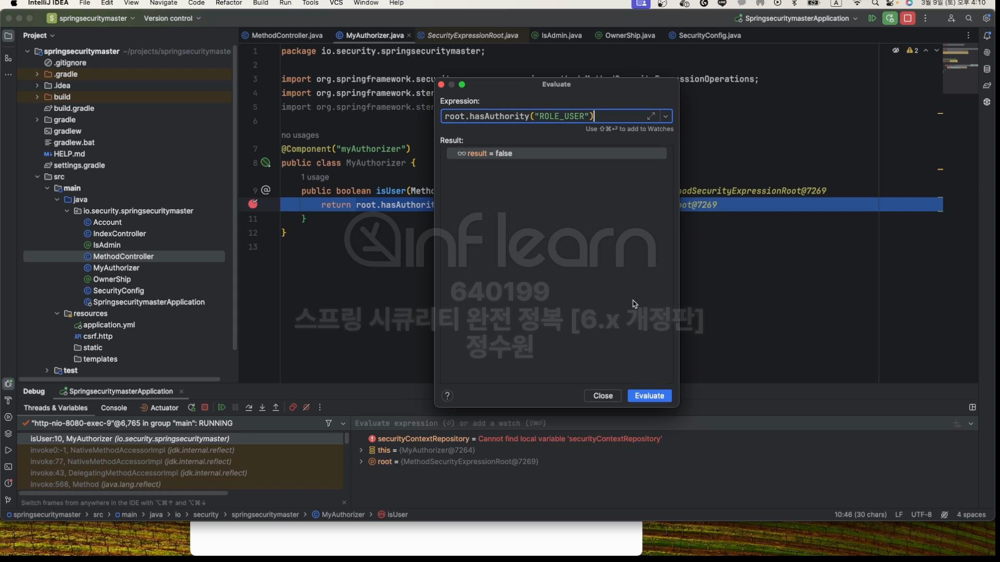
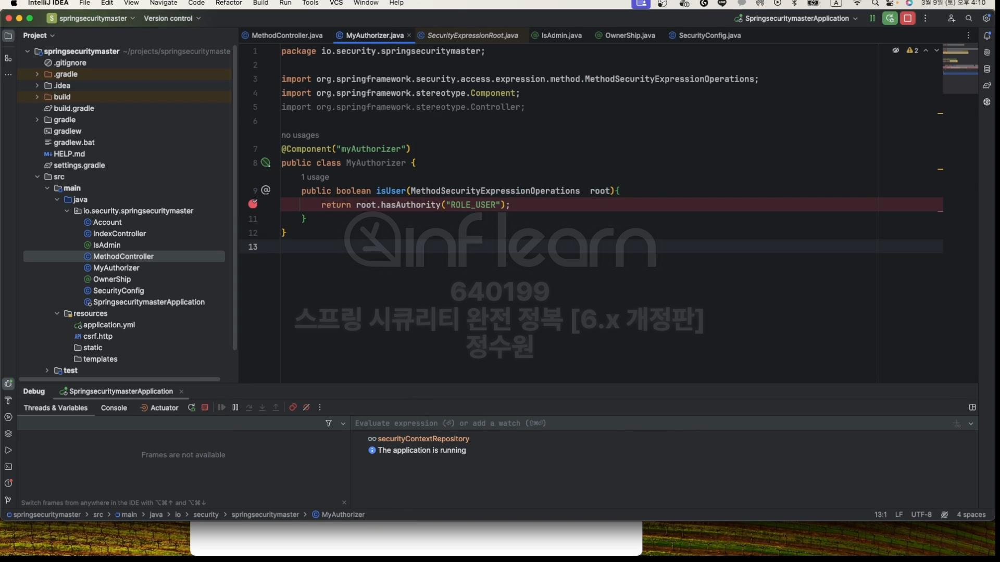