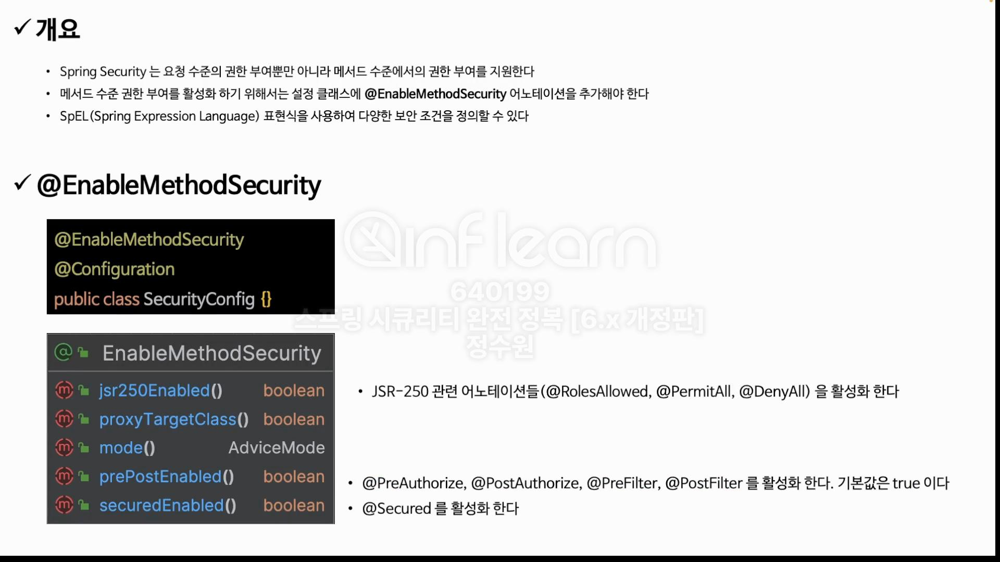
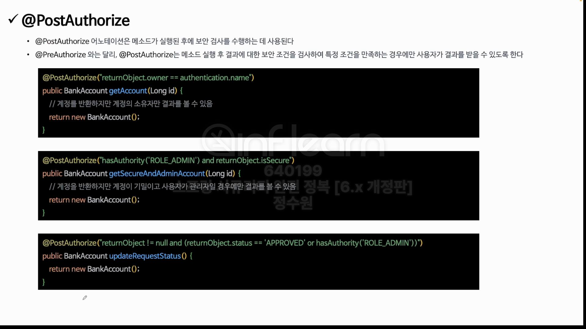
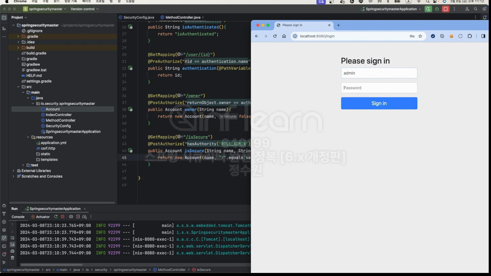
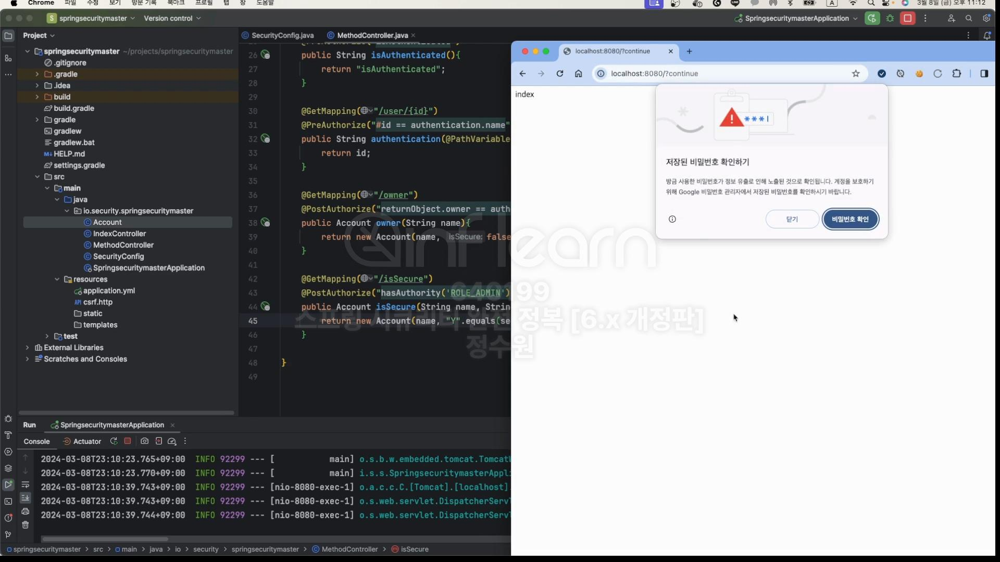
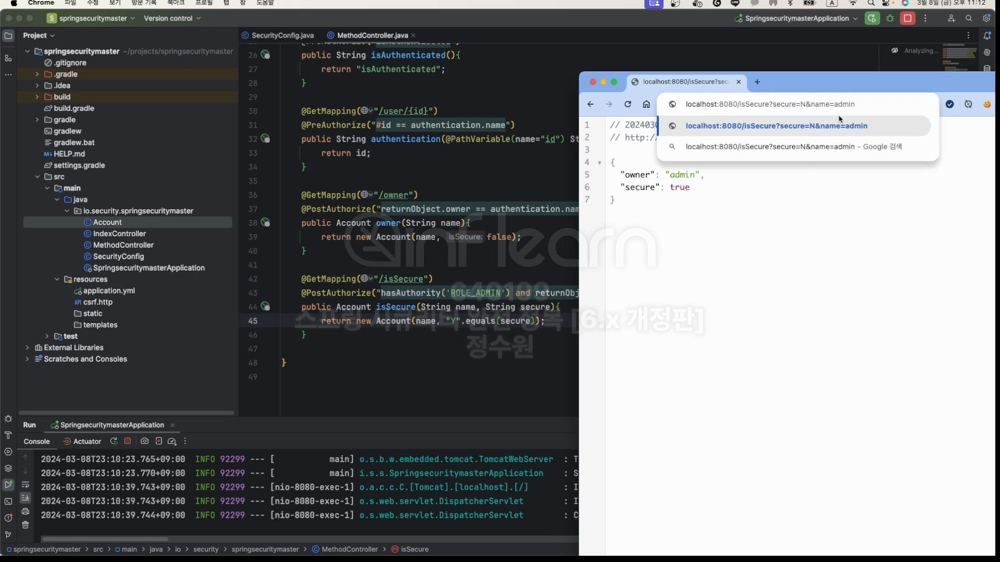

<br>
코드로 보자.

```java
@EnableWebSecurity
@EnableMethodSecurity
@Configuration
public class SecurityConfig {

    @Bean
    public SecurityFilterChain securityFilterChain(HttpSecurity http, HandlerMappingIntrospector introspector) throws Exception {
        http
                .authorizeHttpRequests(authorize -> authorize
                        .anyRequest().authenticated())
                .formLogin(Customizer.withDefaults());

        return http.build();
    }

    @Bean
    public UserDetailsService userDetailsService() {
        UserDetails user = User.withUsername("user").password("{noop}1111").roles("USER").build();
        UserDetails db = User.withUsername("db").password("{noop}1111").roles("DB").build();
        UserDetails admin = User.withUsername("admin").password("{noop}1111").roles("ADMIN", "SECURE").build();

        return new InMemoryUserDetailsManager(user, db, admin);
    }
}
```

```java
@RestController
public class MethodController {

    @GetMapping("/admin")
    @PreAuthorize("hasAuthority('ROLE_ADMIN')")
    public String admin() {
        return "admin";
    }

    @GetMapping("/user")
    @PreAuthorize("hasAnyAuthority('ROLE_ADMIN', 'ROLE_USER')")
    public String user() {
        return "user";
    }

    @GetMapping("/isAuthenticated")
    @PreAuthorize("isAuthenticated()")
    public String isAuthenticated() {
        return "isAuthenticated";
    }

    @GetMapping("/user/{id}")
    @PreAuthorize("#id == authentication.name")
    public String authentication(@PathVariable(name="id") String id) {
        return "id";
    }
}
```

<br>
postAuthorize는 익숙하지 않으니 코드로 실험결과까지 확인해보자. <br>

```java
@RestController
public class MethodController {

    @GetMapping("/user/{id}")
    @PostAuthorize("returnObject.owner == authentication.name")
    public Account owner(String name) {
        return new Account(name, false);
    }

    @GetMapping("/isSecure")
    @PostAuthorize("hasAuthority('ROLE_ADMIN') and returnObject.isSecure")
    public Account isSecure(String name, String secure) {
        return new Account("admin", "Y".equals(secure));
    }
}
```
```java
@Getter
@AllArgsConstructor
public class Account {
    private String owner;
    private boolean isSecure;
}
```






