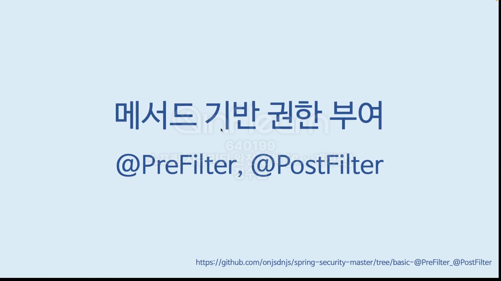
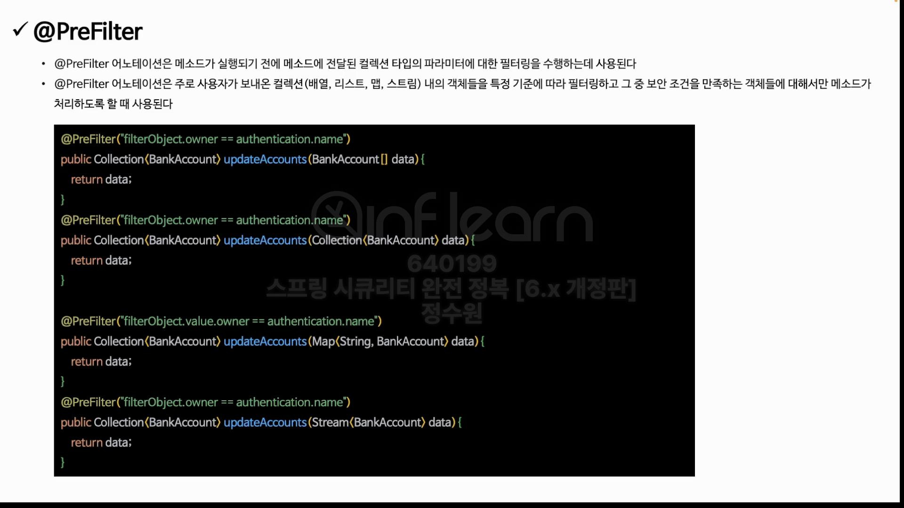
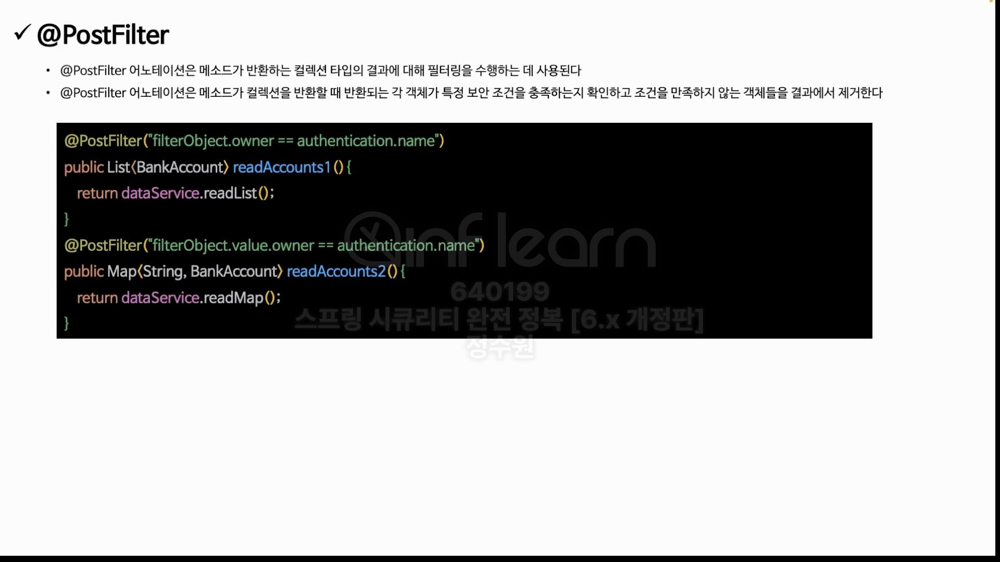
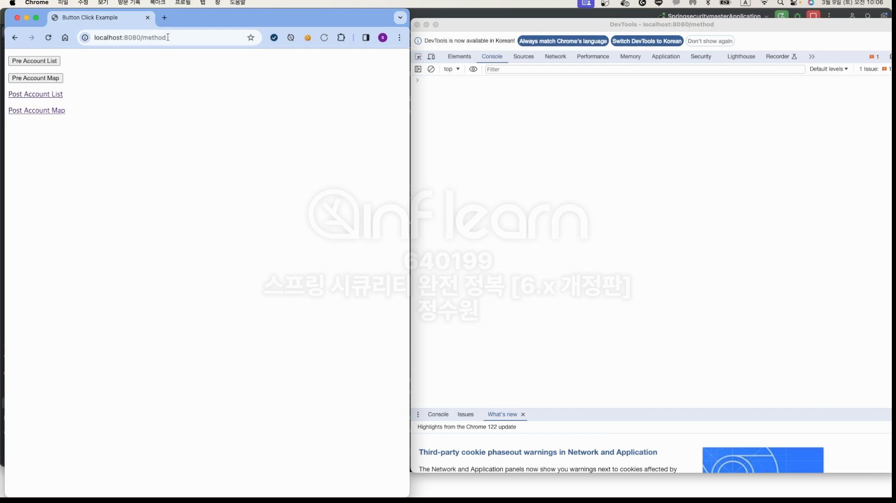
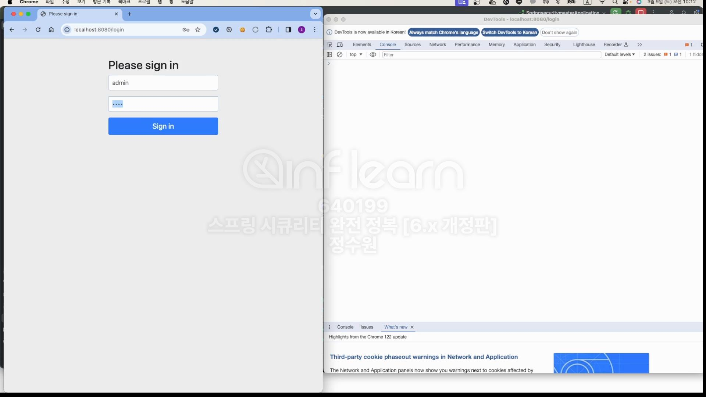
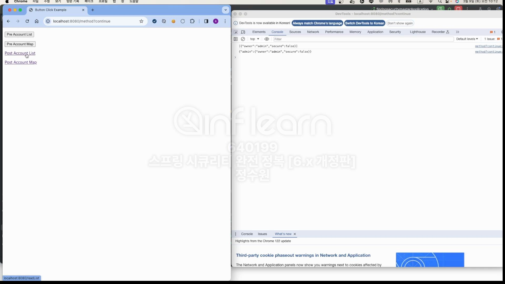
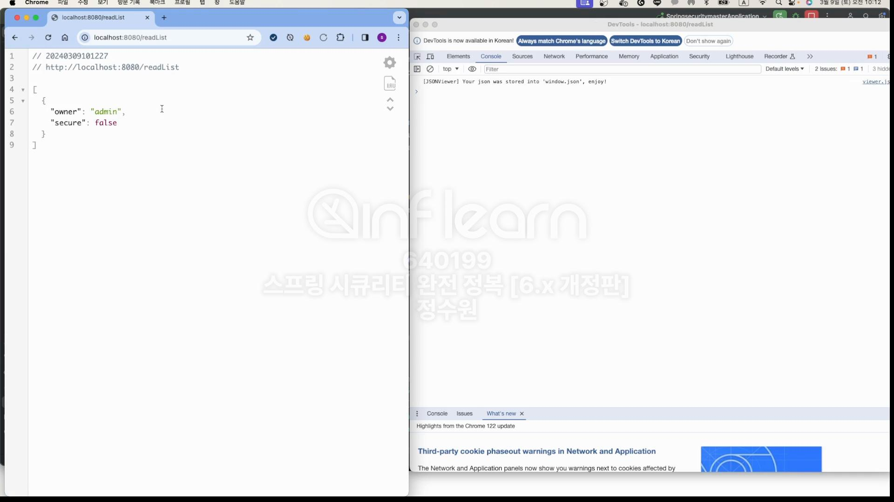
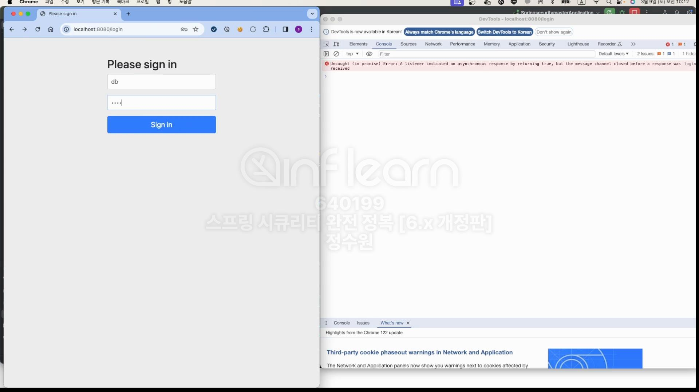
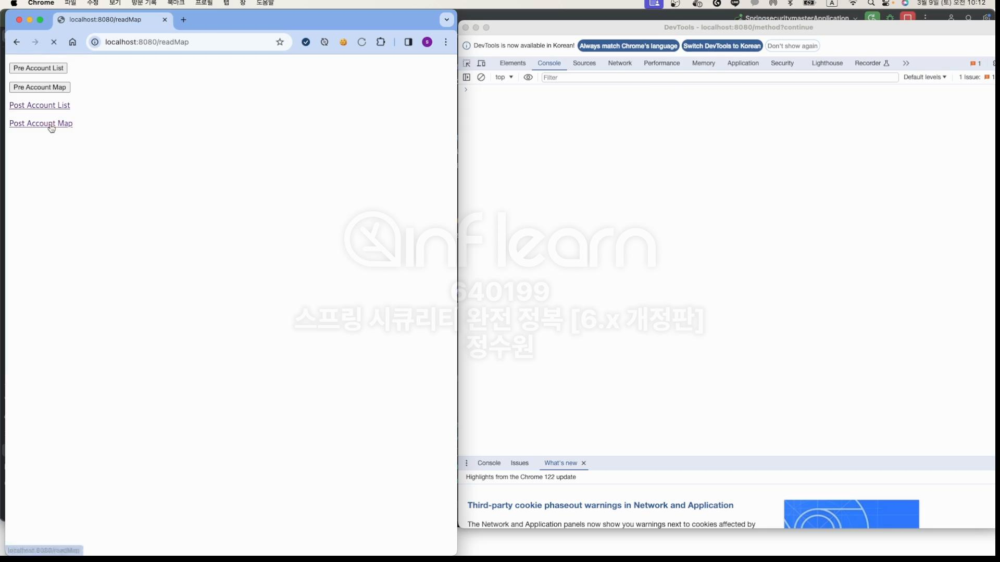

코드로 확인해보자 <br>
```java
@EnableWebSecurity
@EnableMethodSecurity
@Configuration
public class SecurityConfig {

    @Bean
    public SecurityFilterChain securityFilterChain(HttpSecurity http, HandlerMappingIntrospector introspector) throws Exception {
        http
                .authorizeHttpRequests(authorize -> authorize
                        .anyRequest().authenticated())
                .formLogin(Customizer.withDefaults());

        return http.build();
    }

    @Bean
    public UserDetailsService userDetailsService() {
        UserDetails user = User.withUsername("user").password("{noop}1111").roles("USER").build();
        UserDetails db = User.withUsername("db").password("{noop}1111").roles("DB").build();
        UserDetails admin = User.withUsername("admin").password("{noop}1111").roles("ADMIN", "SECURE").build();

        return new InMemoryUserDetailsManager(user, db, admin);
    }
}

```

```java
@RestController
@RequiredArgsConstructor
public class MethodController {

    private final DataService dataService;

    @PostMapping("/writeList")
    public List<Account> writeList(@RequestBody List<Account> data) {

        return dataService.writeList(data);
    }

    @PostMapping("/writeList")
    public Map<String, Account> writeMap(@RequestBody List<Account> data) {
        Map<String, Account> accountMap = data.stream()
                .collect(Collectors.toMap(account -> account.getOwner(), account -> account));

        return dataService.writeMap(accountMap);
    }

    @GetMapping("/readList")
    public List<Account> readList() {
        return dataService.readList();
    }

    @GetMapping("/readList")
    public Map<String, Account> readMap() {
        return dataService.readMap();
    }

}

```

```java
@Service
public class DataService {

    @PreFilter("filterObject.owner == authentication.name")
    public List<Account> writeList(List<Account> data) {
        return data;
    }

    @PreFilter("filterObject.value.owner == authentication.name")
    public Map<String, Account> writeMap(Map<String, Account> data) {
        return data;
    }

    @PostFilter("filterObject.owner == authentication.name")
    public List<Account> readList() {
        return new ArrayList<>(List.of(
                new Account("user", false),
                new Account("admin", false),
                new Account("db", false)
        ));
    }

    @PostFilter("filterObject.value.owner == authentication.name")
    public Map<String, Account> readMap() {
        return new HashMap<>(Map.of(
                "user", new Account("user", false),
                "db", new Account("admin", false),
                "admin", new Account("db", false)
        ));
    }
}
```

```java
@Setter
@Getter
@NoArgsConstructor
@AllArgsConstructor
public class Account {
    private String owner;
    private boolean isSecure;
}
```

```html
<!DOCTYPE html>
<html xmlns:th="http://www.thymeleaf.org">
<head>
    <meta charset="UTF-8">
    <meta name="viewport" content="width=device-width, initial-scale=1.0">
    <title>Button Click Example</title>
    <script>
        function sendRequest(url) {

            const dataItems = [
                {"owner": "user", "isSecure": "N"},
                {"owner": "admin", "isSecure": "Y"},
                {"owner": "db", "isSecure": "N"}
            ];

            fetch(url, {
                method: 'POST',
                headers: {
                    'Content-Type': 'application/json'
                },
                body: JSON.stringify(dataItems),
            })
                .then(response => {
                    if (response.ok) {
                        return response.text();
                    } else {
                        throw new Error('Network response was not ok');
                    }
                })
                .then(text => console.log(text))
                .catch(error => console.error('There was a problem with the fetch operation:', error));
        }
    </script>
</head>
<body>
    <p>
        <button onclick="sendRequest('/writeList')">Pre Account List</button>
    </p>
    <p>
        <button onclick="sendRequest('/writeMap')">Pre Account Map</button>
    </p>
    <p>
        <a href="/readList">Post Account List</a>
    </p>
    <p>
        <a href="/readMap">Post Account Map</a>
    </p>
</body>
```





---- postFilter ----









