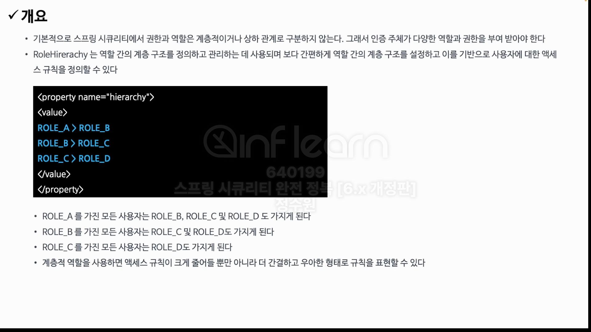
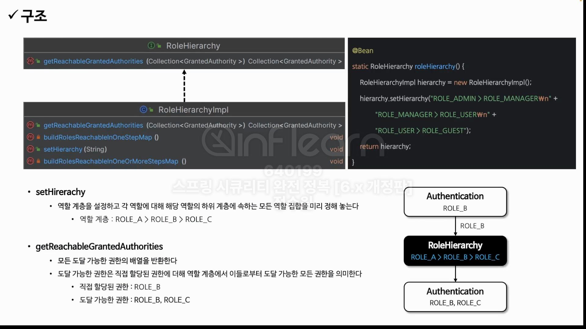

```java
@EnableWebSecurity
@EnableMethodSecurity(securedEnabled = true, jsr250Enabled = true)
@Configuration
public class SecurityConfig {

    @Bean
    public WebSecurityCustomizer webSecurityCustomizer() {
        return webSecurity -> webSecurity.ignoring().requestMatchers(PathRequest.toStaticResources().atCommonLocations());
    }

    @Bean
    public SecurityFilterChain securityFilterChain(HttpSecurity http, HandlerMappingIntrospector introspector) throws Exception {
        http
                .authorizeHttpRequests(authorize -> authorize
                        .requestMatchers("user").hasRole("USER")
                        .requestMatchers("db").hasRole("DB")
                        .requestMatchers("admin").hasRole("ADMIN")
                        .anyRequest().authenticated())
                .formLogin(Customizer.withDefaults());

        return http.build();
    }

    @Bean
    public RoleHierarchy roleHierarchy() {
        RoleHierarchyImpl roleHierarchy = new RoleHierarchyImpl();
        roleHierarchy.setHierarchy("ROLE_ADMIN > ROLE_DB\n" +
                "ROLE_DB > ROLE_USER\n" +
                "ROLE_USER > ROLE_ANONYMOUS");

        return roleHierarchy;
    }

    @Bean
    public UserDetailsService userDetailsService() {
        UserDetails user = User.withUsername("user").password("{noop}1111").roles("USER").build();
        UserDetails db = User.withUsername("db").password("{noop}1111").roles("DB").build();
        UserDetails admin = User.withUsername("admin").password("{noop}1111").roles("ADMIN", "SECURE").build();

        return new InMemoryUserDetailsManager(user, db, admin);
    }
}
```

```java
@RestController
public class IndexController {

    @GetMapping("/user")
    public String user() {
        return "user";
    }

    @GetMapping("/db")
    public String db() {
        return "db";
    }

    @GetMapping("/admin")
    public String admin() {
        return "admin";
    }

}
```

