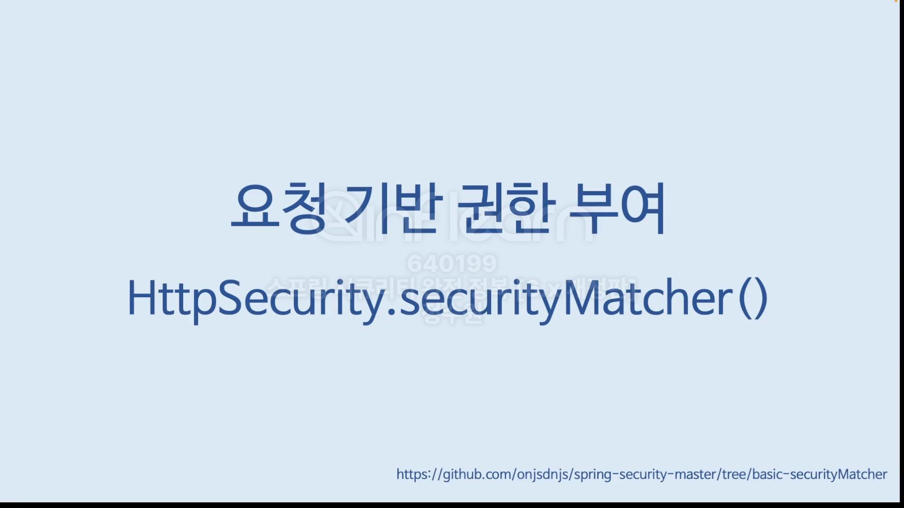
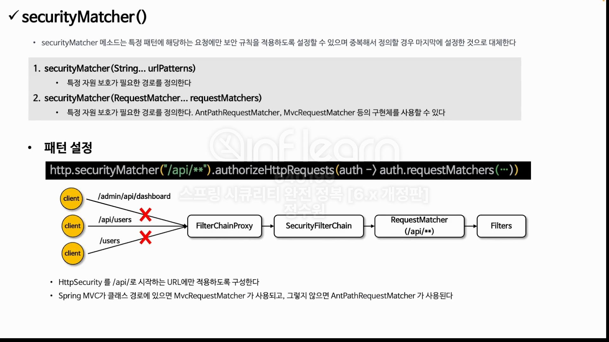
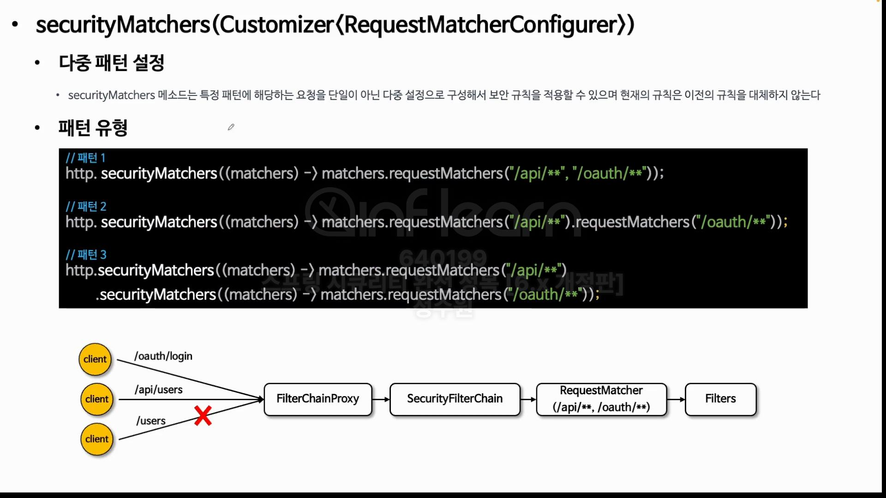
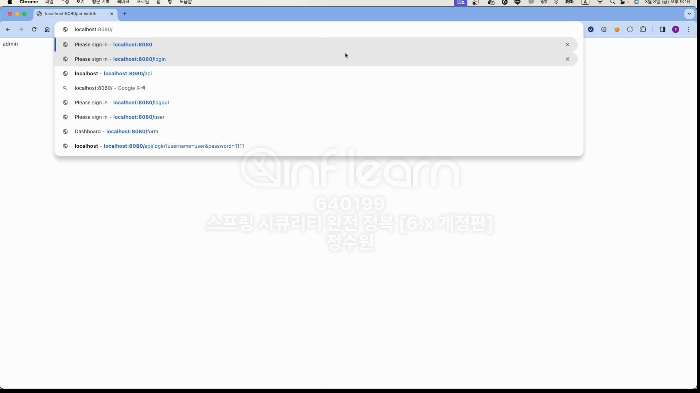
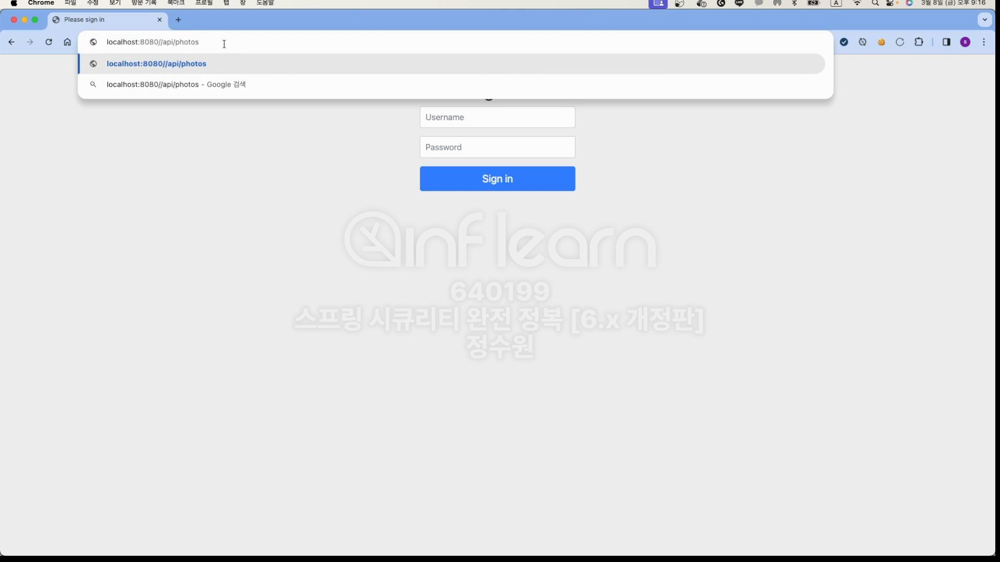
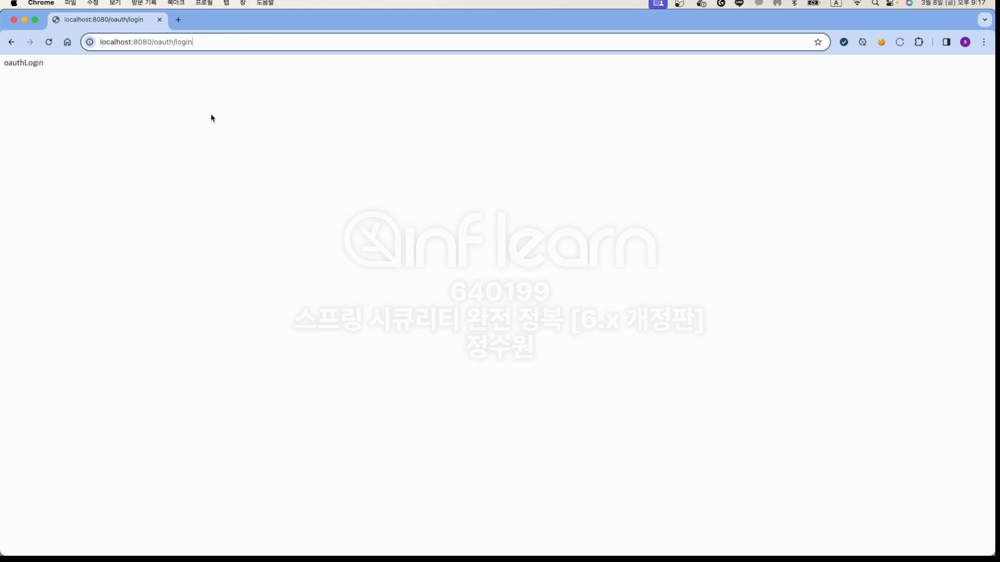
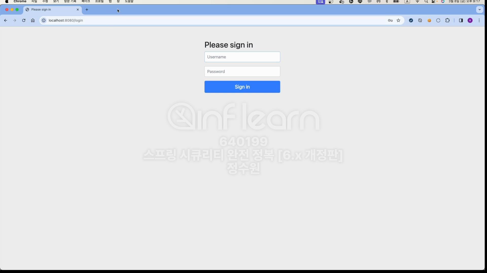

<br>
위 그림에서 RequestMatcher는 SecurityFilterChain이 가지고 있는 속성이다. <br>
SecurityFilterChain은 2개의 속성이 있다. 하나는 requestMathcher고, 다른 하나는 filter이다. <br>
그리고 filter는 FilterChainProxy로 들어간다. 그런데 아무튼, requestMatchers에는 어떤 url이 있다. 그리고 이 url에 따라서 <br>
filter가 동작하게 되있다. 그 말은 FilterChainProxy가 결국은 그 요청에 따라 Filter들을 하나하나 호출해서 요청들을 처리하게 된다. <br>
그러면 이 filterChainProxy는 어떤 filter들을 선택하게 될까? <br>
SecurityFilterChain은 여러개 생성할 수 있다. 다중 설정이 가능! 그런데 이 객체마다 RequestMathcer와 filter들을 가지고 있다. <br>
그리고 url들이 틀리다. 그러면 filterChainProxy는 이 요청을 처리하기 위해 filter가 필요한데 그 filter는 SecurityFilterChain으로 부터 가져와야 한다. <br>
그럼 어떤 기준으로 가지고 올까? 그 기준이 RequestMatcher다. <br>


<br>
코드로 보자. <br>

```java
@EnableWebSecurity
@Configuration
public class SecurityConfig {

    @Bean
    public SecurityFilterChain securityFilterChain(HttpSecurity http, HandlerMappingIntrospector introspector) throws Exception {
        http
                .authorizeHttpRequests(authorize -> authorize
                        .anyRequest().authenticated())
                .formLogin(Customizer.withDefaults());

        return http.build();
    }

    @Bean
    @Order(1)
    public SecurityFilterChain securityFilterChain2(HttpSecurity http, HandlerMappingIntrospector introspector) throws Exception {
        http
                .securityMatchers(matchers -> matchers.requestMatchers("/api/**", "/oauth/**"))
                .authorizeHttpRequests(authorize -> authorize
                        .anyRequest().permitAll());

        return http.build();
    }

    @Bean
    public UserDetailsService userDetailsService() {
        UserDetails user = User.withUsername("user").password("{noop}1111").roles("USER").build();
        UserDetails manager = User.withUsername("manager").password("{noop}1111").roles("MANAGER").build();
        UserDetails admin = User.withUsername("admin").password("{noop}1111").roles("ADMIN", "WRITE").build();

        return new InMemoryUserDetailsManager(user, manager, admin);
    }
}
```
<br>

```java
@RestController
public class IndexController {

    @GetMapping("/")
    public String index() {
        return "index";
    }

    @GetMapping("/custom")
    public String custom() {
        return "custom";
    }

    @GetMapping("/user/{name}")
    public String userName(@PathVariable(value = "name") String name) {
        return name;
    }

    @GetMapping("/admin/db")
    public String admin() {
        return "admin";
    }

    @GetMapping("/api/photos")
    public String photos() {
        return "photos";
    }

    @GetMapping("/oauth/login")
    public String oauth() {
        return "oauthLogin";
    }
}
```


<br>
root로 가면 로그인 창이 뜬다. <br>

그 이유는 http.authorizeHttpRequests(authorize -> authorize
                .anyRequest().authenticated()) 이기 때문이다. <br>
근데 /api/**, /oauth/**로 가면 인증없이 접근이 가능하다. <br>

<br> 
근데 한가지 만약에 @Order 순서를 바꾸면 어떻게 될까? 
```java
@EnableWebSecurity
@Configuration
public class SecurityConfig {

    @Bean
    @Order(1)
    public SecurityFilterChain securityFilterChain(HttpSecurity http, HandlerMappingIntrospector introspector) throws Exception {
        http
                .authorizeHttpRequests(authorize -> authorize
                        .anyRequest().authenticated())
                .formLogin(Customizer.withDefaults());

        return http.build();
    }

    @Bean
    public SecurityFilterChain securityFilterChain2(HttpSecurity http, HandlerMappingIntrospector introspector) throws Exception {
        http
                .securityMatchers(matchers -> matchers.requestMatchers("/api/**", "/oauth/**"))
                .authorizeHttpRequests(authorize -> authorize
                        .anyRequest().permitAll());

        return http.build();
    }

    @Bean
    public UserDetailsService userDetailsService() {
        UserDetails user = User.withUsername("user").password("{noop}1111").roles("USER").build();
        UserDetails manager = User.withUsername("manager").password("{noop}1111").roles("MANAGER").build();
        UserDetails admin = User.withUsername("admin").password("{noop}1111").roles("ADMIN", "WRITE").build();

        return new InMemoryUserDetailsManager(user, manager, admin);
    }
}
```
<br>



<br>
이렇게 로그인으로 와버린다. 그 이유는 @Order 때문인다. 두개의 SecurityFilterChain 중 위에것이 먼저 실행되다 보니, api/** 요청도 @Order(1)로 가버린다. <br>


